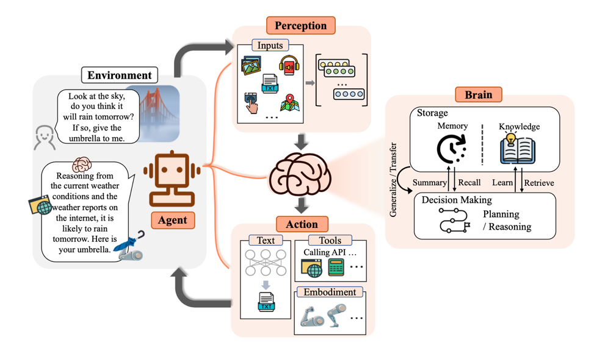

## Overview Structure
| Section | Title |
|---------|-------|
| | [Project acronyms](#project-acronyms) |
| **1** | [Introduction](#introduction) |
| **2** | [Foundations of AI Models](#foundations-of-ai-models) |
| 2.1 | [Generative AI Models Overview](#generative-ai-models-overview) |
| 2.2 | [AI Model Architectures and Adaptation](#ai-model-architectures-and-adaptation) |
| 2.2.1 | [Model Fine-Tuning](#model-fine-tuning) |
| 2.2.2 | [Retrieval Augmented Generation](#retrieval-augmented-generation) |
| 2.2.3 | [Agentic Approaches and Multi-Agent Systems](#agentic-approaches-and-multi-agent-systems) |
| 2.3 | [Benchmarking and Model Evaluation](#benchmarking-and-model-evaluation) |
| 2.3.1 | [Benchmarking Platforms and Leaderboards](#benchmarking-platforms-and-leaderboards) |
| 2.3.2 | [Evaluation Suites and Datasets](#evaluation-suites-and-datasets) |
| 2.3.3 | [Evaluation Metrics for Code LLMs](#evaluation-metrics-for-code-llms) |
| 2.3.4 | [Limitations and Outlook](#limitations-and-outlook) |
| **3** | [Cross-Cutting Concerns Using AI](#cross-cutting-concerns-using-ai) |
| 3.1 | [Safety and Security](#safety-and-security) |
| 3.1.1 | [EU AI Act and Other Regulations](#eu-ai-act-and-other-regulations) |
| 3.1.2 | [Bias and Ethical Background](#bias-and-ethical-background) |
| 3.1.3 | [AI Guardrails](#ai-guardrails) |
| 3.2 | [Data Handling and Governance](#data-handling-and-governance) |
| 3.2.1 | [Regulations](#regulations) |
| 3.2.2 | [Cloud Data Handling Services](#cloud-data-handling-services) |
| 3.2.3 | [On-Premises Data Handling](#on-premises-data-handling) |
| 3.3 | [Data Aggregation and Preprocessing](#data-aggregation-and-preprocessing) |
| 3.3.1 | [Cloud Services for Data Aggregation and Preprocessing](#cloud-services-for-data-aggregation-and-preprocessing) |
| 3.3.2 | [Open-Source Tools and Frameworks (On-Premise Alternatives)](#open-source-tools-and-frameworks-on-premise-alternatives) |
| 3.3.3 | [Anonymization](#anonymization) |
| 3.4 | [Intuitive Human-AI Collaboration](#intuitive-human-ai-collaboration) |
| 3.4.1 | [Interaction Methods for AI During Coding Activities](#interaction-methods-for-ai-during-coding-activities) |
| 3.4.2 | [Specialised Software Engineering Activities](#specialised-software-engineering-activities) |
| 3.4.3 | [Limitations of the State of the Art in Human-AI Interaction for Software Engineering](#limitations-of-the-state-of-the-art-in-human-ai-interaction-for-software-engineering) |
| 3.5 | [Sustainability in AI](#sustainability-in-ai) |
| 3.5.1 | [The Growth and Environmental Impact of AI](#the-growth-and-environmental-impact-of-ai) |
| 3.5.2 | [Sustainability Challenges of GenAI](#sustainability-challenges-of-genai) |
| **4** | [Requirements Analysis and Document Processing](#requirements-analysis-and-document-processing) |
| 4.1 | [Representation, Knowledge Management, and Artifact Extraction](#representation-knowledge-management-and-artifact-extraction) |
| 4.1.1 | [Knowledge and Artifact Extraction from Documents](#knowledge-and-artifact-extraction-from-documents) |
| 4.1.2 | [Knowledge Representation and Relations](#knowledge-representation-and-relations) |
| 4.1.3 | [Contextualization & Traceability](#contextualization-traceability) |
| 4.2 | [Requirements Generation and Harmonization](#requirements-generation-and-harmonization) |
| 4.2.1 | [LLMs for Requirements Generation](#llms-for-requirements-generation) |
| 4.2.2 | [Prompt Engineering in RG](#prompt-engineering-in-rg) |
| 4.2.3 | [Human-in-the-Loop in RG](#human-in-the-loop-in-rg) |
| 4.2.4 | [Constraints in RG](#constraints-in-rg) |
| 4.2.5 | [Model Selection Considerations for RG](#model-selection-considerations-for-rg) |
| 4.3 | [Requirement Analysis and Verification](#requirement-analysis-and-verification) |
| 4.3.1 | [Completeness and Ambiguity Detection](#completeness-and-ambiguity-detection) |
| 4.3.2 | [Consistency and Compliance Checking](#consistency-and-compliance-checking) |
| 4.4 | [Summary](#summary) |
| **5** | [System Design and Code Development](#system-design-and-code-development) |
| 5.1 | [AI-Assisted Software-Conformance and Adaptation](#ai-assisted-software-conformance-and-adaptation) |
| 5.1.1 | [Checking and Synchronizing Conformance of Code Artifacts to Requirements](#checking-and-synchronizing-conformance-of-code-artifacts-to-requirements) |
| 5.1.2 | [Architectural Refactoring via Code Analysis & Domain-Driven Design](#architectural-refactoring-via-code-analysis-domain-driven-design) |
| 5.1.3 | [Assisted Code-Adaptation based on an Evolving Test-Suite](#assisted-code-adaptation-based-on-an-evolving-test-suite) |
| 5.2 | [Next‑Generation Code Generation & Documentation](#nextgeneration-code-generation-documentation) |
| 5.2.1 | [Foundation Models for Code: Architectures & Capabilities](#foundation-models-for-code-architectures-capabilities) |
| 5.2.2 | [Multilingual Code Synthesis across Abstraction Levels (APIs → Components → Services)](#multilingual-code-synthesis-across-abstraction-levels-apis-components-services) |
| 5.2.3 | [Automated Documentation (comments, API specs, rationales)](#automated-documentation-comments-api-specs-rationales) |
| 5.2.4 | [Continuous Learning from Repositories](#continuous-learning-from-repositories) |
| 5.2.5 | [Quality‑Aware Generation](#qualityaware-generation) |
| 5.2.6 | [Repository‑Aware Multi-Agent Code Generation](#repositoryaware-multi-agent-code-generation) |
| 5.3 | [AI-Driven Quality Analysis of Code & Architecture](#ai-driven-quality-analysis-of-code-architecture) |
| 5.3.1 | [Static & Dynamic Analysis with Large Models](#static-dynamic-analysis-with-large-models) |
| 5.3.2 | [AI Security and Vulnerability Management (Standards Alignment)](#ai-security-and-vulnerability-management-standards-alignment) |
| 5.3.3 | [Architectural Consistency and Performance Bottleneck Identification](#architectural-consistency-and-performance-bottleneck-identification) |
| **6** | [Quality Assurance and Maintenance](#quality-assurance-and-maintenance) |
| 6.1 | [Architectural Quality Assurance](#architectural-quality-assurance) |
| 6.2 | [Automated Unit Test Generation](#automated-unit-test-generation) |
| 6.2.1 | [Explainer: Requirements-based vs Regression Test Generation](#explainer-requirements-based-vs-regression-test-generation) |
| 6.2.2 | [Requirements-Based Test Generation](#requirements-based-test-generation) |
| 6.2.3 | [Regression (Code-Based) Test Generation](#regression-code-based-test-generation) |
| 6.2.4 | [Mental model: Automated Test Generation Pipeline](#mental-model-automated-test-generation-pipeline) |
| 6.3 | [State of the art in unit test generation](#state-of-the-art-in-unit-test-generation) |
| 6.4 | [Automated Test Generation for Web Services](#automated-test-generation-for-web-services) |
| 6.5 | [Automated System Functionality Test Generation](#automated-system-functionality-test-generation) |
| 6.6 | [Automated UI Test Generation](#automated-ui-test-generation) |
| 6.7 | [Automated Oracle Generation](#automated-oracle-generation) |
| 6.8 | [Automated Security Test Generation](#automated-security-test-generation) |
| 6.9 | [Test Prioritisation and Optimisation - Smart Test Selection](#test-prioritisation-and-optimisation---smart-test-selection) |
| **7** | [Next Step: GENIUS Technology Hub](#next-step-genius-technology-hub) |

# Contributors 
Editors:
- Benedikt Dornauer (WP2, University of Innsbruck)
- Robin Gröpler (Project Leader, IFAK)
- Jari Siukonen (WP3, M-Files)
- Şebnem Köken (WP4, Dakik)
- Mohammad Reza Mousavi (WP5, King\'s College London)

Contributors:
- Abhishek Shrestha (Fraunhofer FOKUS)
- Adam Krafczyk (University of Hildesheim)
- Ali Sencer Irmak (Turkcell Technology)
- Andreas Dreschinski (Akkodis)
- Bilge Özdemir (Dakik)
- Carsten Wenzel (University of Hildesheim)
- Christian Wolf (EKS InTec)
- Doruk Tuncel (Siemens)
- Egon Wuchner (Cape of Good Code)
- Eva Catarina Gomes Maia (ISEP)
- Fabian Schmid (EKS InTec)
- Hakan Kilinc (Orion Innovation)
- Jack Johns (British Telecom)
- Jan-Henrik Böttcher (University of Hildesheim)
- Johannes Albertus Noppen (British Telecom)
- Johannes Viehmann (Fraunhofer FOKUS)
- Klaus Schmid (University of Hildesheim)
- Mateen Ahmed Abbasi (University of Jyväskylä)
- Maximilian Ehrhart (CASABLANCA)
- Marcus Hellberg (Vaadin)
- Matti Kurittu (M-Files)
- Mayuri Kaul (GoCodeGreen)
- Karina Dennia (GoCodeGreen)
- Gunel Jahangirova (KCL)
- Eric Zie (GoCodeGreen)
- Metin Tekkalmaz (IOTIQ)
- Mircea-Cristian Racasan (c.c.com)
- Paul Crane (Diffblue)
- Peter Schrammel (Diffblue)
- Robert Kühnen (Fraunhofer FOKUS)
- Robin Gröpler (IFAK)
- Şebnem Köken (Dakik)
- Tim Schürmann (IOTIQ)
- Tina Mersch (EKS InTec)
- Tommi Mikkonen (University of Jyväskylä)
- Pyry Kotilainen (University of Jyväskylä)
- Yongjian Tang (Siemens)
- Yuriy Yevstihnyeyev (Vaadin)
- Selin Şirin Aslangül (Arçelik)

# Project acronyms

| Acronym | Description |
|---------|-------------|
| AI | Artificial Intelligence |
| AIOps | Artificial Intelligence Operations |
| API | Application Programming Interface |
| CI/CD | Continuous Integration/Continuous Delivery |
| CPT | Continual Pre-Training |
| DataOps | Data Operations |
| DevOps | Development and Operations |
| DoS | Denial of Service |
| DSL | Domain-specific Language |
| GDPR | General Data Protection Regulation |
| GenAI | Generative Artificial Intelligence |
| GPT | Generative Pre-trained Transformer |
| IAM | Identity and Access Management |
| IDE | Integrated Development Environment |
| LDAP | Lightweight Directory Access Protocol |
| LLM | Large Language Model |
| MFA | Multi-Factor Authentication |
| ML | Machine Learning |
| MLOps | Machine Learning Operations |
| NLP | Natural Language Processing |
| OIDC | OpenID Connect |
| OWASP | Open Web Application Security Project |
| PII | Personally Identifiable Information |
| PLM | Product Lifecycle Management |
| RAG | Retrieval-Augmented Generation |
| RBAC | Role-Based Access Control |
| SAML | Security Assertion Markup Language |
| SDLC | Software Development Life Cycle |
| SE | Software Engineering |
| SRS | Software Requirements Specification |
| SSO | Single Sign-On |
| TISAX | Trusted Information Security Assessment Exchange |
| UML | Unified Modelling Language |

# Introduction

Since the launch of ChatGPT in late 2022, interest in AI has grown
rapidly, as evidenced by trending search terms such as Generative AI, AI
agents, RAG, and LLMs[^1]. Since then, research activities have
increased significantly, as evidenced by the proportion of scientific
and scholarly research[^2].

Nowadays, the integration of artificial intelligence into software
engineering has transformed the field and continues to do so. AI is
being leveraged to enhance both the development process and the quality
of the resulting software, driving improvements in efficiency, accuracy,
and innovation[^3]. Each of the emerging solutions relies on key
foundational techniques and knowledge, including, for instance,
appropriate model selection, consideration of security implications,
evaluation of environmental impact, or incorporation of agentic
thinking.

**Figure 1: Google Search Term Trends from 2021-01 to 2025-09**

This deliverable of the GENIUS project provides a current knowledge
platform for the latest AI topics, merging knowledge from both industry
and academia. Furthermore, it includes a state-of-the-art literature
search conducted by the work packages, each focusing on specific areas
of SE interest.

Therefore, Deliverable D2.2 State-of-the-art Study on Using Generative
AI in Software Engineering presents the current state of the art on
overarching topics in Sections 2 and 3, followed by in-depth
investigations conducted by individual Work Packages, each focusing on
specific aspects, as reported in Sections 4, 5, and 6.

# Foundations of AI Models

For the realization of various AI-based solutions, multiple concepts and
approaches have been developed. Accordingly, this section provides a
general overview of the latest AI models, introduces common
architectural patterns, and discusses how such tools can be benchmarked.

## Generative AI Models Overview 

Generative AI (GenAI) models -- large language models (LLMs) and related
multimodal models -- have rapidly advanced in their ability to generate
code, reason about software, and interact using natural language. Modern
GenAI systems like OpenAI's GPT-4, Anthropic's Claude, Google's Gemini,
and open models such as Meta's LLaMA/Code Llama and Mistral's Mixtral
are being applied across the entire Software Development Life Cycle
(SDLC). From requirements engineering through architectural design,
implementation, testing, deployment, debugging, documentation, and
maintenance, GenAI is transforming software engineering practices. This
section provides a technical review of state-of-the-art GenAI
integration into each SDLC phase, comparing both proprietary (e.g. GPT,
Claude, Gemini) and open-weight (e.g. LLaMA/Code Llama, Mixtral,
StarCoder, WizardCoder, GitHub Copilot's underlying models) solutions.
It will highlight each model's architecture, capabilities, scalability,
and relevant software development features, supported by empirical
findings from recent literature and industry evaluations.

**OpenAI GPT-4 and GPT-4.1**

GPT-4.1, released in April 2025, represents a significant advancement
over GPT-4 by incorporating a 1 million-token context window, structured
function calling, and enhanced instruction-following fidelity. It
achieves 54.6% accuracy on the SWE-bench Verified benchmark, which
measures performance on real-world GitHub issues and pull requests.
Additionally, GPT-4.1 registers substantial gains on the MultiChallenge
benchmark suite, indicating its strength in diverse code reasoning
tasks. Notably, OpenAI released Mini and Nano variants that retain high
coding precision while reducing latency and cost by approximately
one-third, thus improving deployment feasibility for enterprise
scenarios. The model remains a closed-source dense Transformer,
accessible exclusively through OpenAI's own API and the Azure OpenAI
Service, making it an important tool for advanced codebase analysis,
automated implementation planning, and architectural guidance.

**Anthropic Claude 3.5 and Claude 4 (Sonnet/Opus)**

Anthropic's Claude 4, launched in May 2025, builds upon the capabilities
of Claude 3.5 with significant upgrades in reasoning, tool integration,
and coding workflows. Claude 4 Opus is aligned using Constitutional AI
and comprises an estimated 100 billion parameters. It demonstrates high
performance on SWE-bench (72.5%) and Terminal-bench (43.2%), emphasizing
its ability to solve open-ended tasks involving command-line and
development operations. Opus enables multi-hour, tool-augmented
workflows and parallel tool invocation for handling complex engineering
pipelines. Claude 3.5 Sonnet supports up to 200,000 tokens in context
and includes lightweight variants optimized for lower-latency
applications. These models are hosted through Anthropic's API as well as
partner platforms such as Amazon Bedrock and Google Vertex AI.

**Google Gemini 1.5, 2.0 and 2.5**

Google DeepMind's Gemini family employs a sparse Mixture-of-Experts
(MoE) Transformer architecture, combining efficiency with a big scaling
potential. Gemini 1.5 introduced native support for multimodal inputs,
allowing synchronous processing of text, images, audio, and video, while
sustaining a 1 million-token context window. Building on this, Gemini
2.0 enhanced reasoning capabilities through its distinct variants,
introducing a faster decoding head and tool-use refinements, or
extending context window to 2 million tokens and previewed long-horizon
agentic workflows, setting the foundation for complex planning and
multi-step problem solving. Building on this, Gemini 2.0 enhanced
reasoning capabilities through its distinct variants, introducing faster
decoding head and tool-use refinements, or extending context window to 2
million tokens and previewed long-horizon agentic workflows, setting the
foundation for complex planning and multi-step problem solving. Gemini
2.5 Pro further refined code reasoning, achieving 63.8% on SWE-bench
Verified. The model demonstrated high retrieval fidelity (99% accuracy)
on long documents exceeding 500K tokens and showcased strong in-context
learning performance. Google has optimized Gemini 2.5 for enterprise
workflows through variants like \"Flash,\" which increases chat
throughput. The model is available via Vertex AI and Google AI Studio
and integrates tightly with the Android and Google Workspace development
ecosystems.

**Meta LLaMA 3 & LLaMA 4 Maverick**

Meta's LLaMA 3 (70B), launched in 2024, was one of the most capable
open-weight models in its class for general-purpose and code-centric
tasks. It belongs to a broader LLaMA 3 family, spanning versions 3.1 to
3.3 and model sizes from 7B (community-pruned) to 405B parameters, with
variants optimized for instruction-following, vision, and multilingual
reasoning. These models support long-context processing (up to 128K
tokens) and are widely adopted across both research and production
environments. By 2025, the LLaMA 4 \"Maverick\" model introduced a
research-preview 10 million-token context window and improved STEM
reasoning capabilities, achieving an ELO score of 1417 on the LMSys
Arena leaderboard. It outperforms earlier open-source models in
structured code generation, long-context retention, and multilingual
understanding. The \"Scout\" variant, optimized for edge devices,
enables inference at reduced resource loads. Both are released under the
LLaMA Community License, support fine-tuning, and are currently
deployable via Cloudflare's Workers AI platform.

**Mistral Mixtral 8×22B**

Mixtral, developed by Mistral AI, is an open Sparse Mixture-of-Experts
model that activates only a subset (2 of 8) of its 22B expert layers per
token, totaling 39B active parameters per step. With a 64K-token context
window, Mixtral supports fill-in-the-middle tasks, function calling, and
structured output generation in JSON or DSLs. It demonstrates high
accuracy in math, symbolic reasoning, and code benchmarks while
maintaining efficient inference on standard GPU clusters. Mixtral is
released under the permissive Apache 2.0 license, allowing extensive
community adaptation and enterprise integration.

**xAI Grok-3**

xAI's Grok-3 builds upon the 314B-parameter sparse MoE architecture of
Grok-1 by integrating vision modalities and deeper tool-use
capabilities. Though technical details remain limited, Grok-3 is
positioned for high-autonomy reasoning tasks, with a focus on dialog
systems embedded in social platforms. The model supports multi-agent
collaboration workflows and is tightly integrated with X (formerly
Twitter) as a context-aware assistant. Its context window remains
comparatively limited (∼8K), restricting its applicability in some
full-codebase SDLC scenarios.

**Inflection-2.5**

Inflection-2.5 is a dense Transformer model designed for conversational
and empathetic responses in programming contexts. It achieves
GPT-4-level coding support on standard evaluation tasks while consuming
significantly fewer training resources. Inflection models emphasize
emotional intelligence and dialog alignment, which can be advantageous
for onboarding, education, or customer support in development tools. The
Pi assistant deploys Inflection-2.5 in production.

**StarCoder**

StarCoder, an open-source code generation model co-developed by Hugging
Face and ServiceNow, was an early response to Codex. Although limited to
15B parameters, it pioneered effective instruction tuning for
developer-facing tasks.

**Qwen3**

Qwen3 is the latest model in the Qwen LLM family built by Alibaba Cloud.
The model has many versions in different sizes ranging from large models
competing with other state of the art models, to smaller models suitable
for local inference. The largest version is a mixture-of-experts model
with 22B parameters active at a time out of 235B. It is of note that the
models are released with Apache 2.0 license permitting use, modification
and distribution for commercial purposes.

**DeepSeek R1**

Deekseek R1 is large first-generation "reasoning" model developed by
DeepSeekAI. This model also employs a mixture-of-experts approach, with
37B parameters active out of 671B. The model performs comparably to
OpenAI-o1 in coding. The group published their pipeline for training the
model, and the model itself has been released under the MIT license
allowing modifications and commercial use. The group also published
smaller models distilled from the large base model suitable for local
inference.

**OLMo 2**

OLMo 2 is the best performing fully open LLM, meaning that the model,
its training code, and the training dataset are publicly available. The
model is a dense autoregressive transformer. While the model does not
compete with state of the art models, it is noteworthy for enabling
researchers to scrutinize all parts of the pipeline, and try out new
techniques.

The following entries represent only a **selection of notable models
available as of 2025**---many more exist, each offering distinct
trade-offs in architecture, capabilities, and licensing terms to suit a
wide range of use cases.

**Table 1: Key Capabilities of Generative AI Models (Proprietary vs Open)**

| **Model / Modalities** | **Architecture & Size** | **Notable Features** | **Deployment & Fine-tuning** |
|-------------------------|-------------------------|----------------------|-------------------------------|
| **GPT-4.1 (OpenAI)**   *Text, Vision, Audio (input); Text/Voice (output)* | Dense Transformer   Parameters not public   Successor to GPT-4 | True multimodal processing (all input types handled simultaneously) • 54.6% SWE-bench on code tasks • Handles very long documents and conversations • Structured function calling | Available via OpenAI and Azure APIs • No self-hosting • Supports custom fine-tuning via OpenAI API |
| **Claude 4 (Opus/Sonnet) (Anthropic)**   *Text (with tool-use for web search & code execution)* | Dense Transformer   ~100B params (est.)   Aligned via Constitutional AI | "Instant" vs. "extended thinking" modes • SWE-bench 72.5% on real-world code tasks • Supports multi-step, long-duration reasoning • Tool integration during reasoning | API-only via AWS Bedrock & Google Vertex AI • No public weights • No fine-tuning; customization via prompt or assistant config |
| **Claude 3.5 (Anthropic)**   *Text only* | Claude 4-style Transformer   Smaller & faster | Faster "Haiku" variant • Improved coding & reasoning over Claude 3 • Early support for tool use (e.g., computer control) | Cloud/API access via Anthropic and partners |
| **Gemini 2.5 Pro / Flash (Google DeepMind)**   *Multimodal* | Sparse Mixture-of-Experts (MoE) Transformer   Mid-size multimodal | MoE enables efficiency & scalability • 63.8% SWE-bench on code tasks • 99% retrieval on 500K-token docs • Strong in-context learning • Real-time multimodal API for spatial/audio/video tasks • Tool integration (e.g., Google Search) | API-only via Google Vertex AI, Bard, etc. • No fine-tuning • Domain adaptation via API tiers: Ultra / Pro / Flash |
| **Mixtral 8×22B (Mistral AI)**   *Text (multilingual), Code* | Sparse MoE Transformer   8 experts × 22B = 141B total   ~39B params active per token | Fully open-source under Apache 2.0 • Faster & more capable than prior open models • Strong in math/code reasoning • Supports function calling, structured outputs | Self-hostable on GPUs • Available on AWS • Supports community fine-tuning via JumpStart and similar |
| **LLaMA 3 → 3.3 (Meta AI)**   *Text (multilingual), Code; Vision variant available* | Dense Transformer   8B → 405B   LLaMA 3.2 Vision 90B adds image understanding | High-tier code generation among open models (81.7% HumanEval for LLaMA 3) • Instruction-tuned for safer output | Open-source under Meta research license • Fine-tuned by community • Locally deployable or via cloud VMs |
| **Other 2025 Models** | -- | Inflection-2 • xAI Grok | -- |

\* **Notes:** "*code*" modality indicates model is trained on
programming languages and can generate code, though not a separate
input/output modality. Open-source models often support context
extension via fine-tuning or architectural tweaks by the community
(e.g., position interpolation). Modalities for proprietary models
reflect officially supported inputs/outputs (e.g., GPT-4o accepts image
uploads and voice input natively).

## AI Model Architectures and Adaptation

Language modeling started with statistical approaches in the 1990s[^4].
Early statistical models, such as n-gram models, estimated the
probability of the next word based on its preceding words. These models
were simple and interpretable, but they struggled to capture long-range
dependencies due to limited context windows. The later improvements like
the introduction of Hidden Markov Models (HMMs) and maximum entropy
models enhanced performance, but language understanding remained
shallow, largely reliant on hand-crafted features and constrained by
computational limitations. In the early 2010s, the advent of neural
language models, such as Recurrent Neural Networks (RNNs) and later Long
Short-Term Memory (LSTM) architectures, enabled models to learn richer,
distributed word representations and better capture context[^5].

A notable breakthrough came with the attention mechanism and the
transformer architectures in 2017[^6]. Among all LLMs developed during
this period, BERT stands out as a widely adopted model, featured by its
ability to learn context-aware word representations[^7]. Its
"pre-training and fine-tuning\" mode has inspired numerous follow-ups
works, including RoBERTa, PRCBERT, and NoRBERT for a wide range of
downstream tasks across diverse domains. This foundation led to the era
of large-scale language models (LLMs)[^8]. Well-known examples include
OpenAI\'s GPT family and Meta's Llama series, which provide us with more
problem-solving possibilities, such as in-context learning and advanced
reasoning about human language.

To further democratize the use of LLMs, researchers have developed a
range of techniques to improve both efficiency and accessibility.
Parameter-Efficient Fine-Tuning (PEFT) methods, such as adapters and
LoRA, allow models to be trained with fewer resources[^9].
Retrieval-Augmented Generation (RAG) combines generative models with
information retrieval systems, enabling LLMs to dynamically access
external knowledge bases - centralized collection of structured and
unstructured knowledge, represented in a machine-readable format -
during response generation[^10]. Meanwhile, Multi-Agent Systems (MAS)
leverage collaborative interactions among multiple specialized LLMs,
which facilitate more complex reasoning and problem-solving[^11]. These
innovations have expanded the accessibility and practical applications
of LLMs across various domains. We will investigate these techniques in
the following subsections.

### Model Fine-Tuning 

Fine-tuning refers to the process of further training a pre-trained
model for a specific task and/or dataset. During fine-tuning the model
is provided with additional knowledge that it has not received. This can
be particularly useful for providing the pre-trained model with new
domain knowledge. It can also provide the model with knowledge for
processing specific downstream tasks. As a result, models often show
significantly better performance in handling the respective tasks. In
particular, modern LLMs rarely perform optimally for more complex
software engineering tasks "out of the box." Instead, adaptation is
needed and relies on fine-tuning---sometimes on billions of lines of
code, domain-specific documents, or user feedback. Powerful LLMs have
many billions, sometimes even several hundred billion parameters. The
full fine-tuning of all parameters is therefore very computationally and
memory-intensive and is thus a huge challenge in terms of its practical
realization. As an example, the StarCoder 15.5b model has been
pre-trained on over 80 programming languages with 1 trillion tokens
using Tesla A100 GPUs. It was then fine-tuned with 35 billion Python
tokens. The pre-training required 320,256 GPU hours while the
fine-tuning required 11,208 GPU hours.[^12]

In general, different categories of fine-tuning techniques can be
distinguished. For example, Wu et al.[^13] differentiate:

- (Continual) Pre-Training: adding factual information, in particular,
  adding domain knowledge.

- (Continual) Instruction-Training: updating LLMs to be better at
  executing certain tasks.

- (Continual) Alignment: adapting LLMs to better follow certain (social
  and ethical) norms.

All of these approaches require significant data sets and, thus, also
significant computing effort. One possibility to reduce this huge effort
is the application of parameter-efficient fine-tuning (PEFT). PEFT [^14]
comprises various methods where instead of updating all parameters, only
a small subset of parameters or additional "adapter layers" are updated.
This reduces hardware demands and allows for deployment in
resource-constrained environments. Models that have been fine-tuned in
this way achieve performances that are comparable to fully fine-tuned
models. Low-Rank Adaptation (LoRA), a PEFT method, freezes the weights
of the pre-trained model and injects trainable rank decomposition
matrices into each layer of the transformer architecture [^15]. This
significantly reduces the number of trainable parameters for downstream
tasks. The original weights of the pre-trained model are not adjusted
during finetuning. QLoRA [^16] extends LoRA by quantizing the parameters
of the pre-trained model during finetuning. This significantly reduces
memory usage, enabling the finetuning of LLMs with less hardware
resources. In addition to the low-rank approaches mentioned, there are
also other PEFT methods. [^17]

While LLMs are fine-tuned for complex and diverse domain-specific
downstream tasks and thus lead to performance improvement on the one
hand, inference performance on historical tasks can dramatically
decrease on the other hand, which is known as the catastrophic
forgetting problem [^18]. This phenomenon has been investigated in a
number of studies in the context of neural networks and LLMs and can be
traced back to the overwriting of parameters during fine-tuning.

Recent research has increasingly focused on continuous fine-tuning and
lifelong learning. Studies from 2024-25 report improved pipelines for
"continuous learning", in which models learn incrementally from user
feedback, project-specific code or evolving documentation without
catastrophic forgetting.[^19]

In terms of potential software engineering tasks, multimodal and
multilingual adaptation could be relevant. SOTA models (e.g. Gemini 2.5,
GPT-4o) now support fine-tuning to paired modalities (code+image,
code+UML) and different natural languages, enabling adaptation to UI/UX
design, code-from-diagram and international development teams.

### Retrieval Augmented Generation 

Large Language Models have become a powerful assistant in several of our
daily tasks. However, classical LLMs have some limitations. With only
LLMs, the knowledge that was involved in the model's training process is
included. In most cases, an out-of-the-box model is therefore
insufficient, as internal or domain-specific information is needed to
satisfy a user's requests or otherwise leading to hallucination.

To address this, fine-tuning can be applied, where a pre-trained model
is further trained on a specific dataset to adapt it to a particular
task or domain (see 2.2.1). However, this has two main disadvantages:

**Computational Cost:** Fine-tuning requires significant computational
resources, especially when working with large pre-trained models.

**No-update information:** Following 1), the rapid adoption of new data
is hindered due to high costs.

In recent years, one of the key advancements in AI, has been
*Retrieval-Augmented Generation*, also known as *RAG*. Introduced by
Lewis et al. in 2020[^20], the approach has gained popularity with its
transformative technique, and been applied in several use cases,
including question-answering, summarization, and knowledge-based
tasks[^21].

**Figure 2: Example RAG implementation**

#### Typical steps of the Realizations of a RAG 

The RAG implementation follows a high-level process that begins with
representing the available data in a structured form, enabling the
subsequent identification of relevant information. To achieve this,
various methods are employed to store and manage both structured and
unstructured data, thereby supporting semantic search and retrieval.
Apart from the traditional vector representations often used,
supplementary knowledge structures, such as graphs, keyword search, and
ontologies, are also integrated. In recent research, hybrid
combinations, such as those of Vector DBs and Knowledge Graphs, are
feasible[^22].

Secondly, having the data ready, the user's input is considered,
provided through a prompt, to extract and identify relevant information
based on the request and incorporate it into the context. This retrieval
process, namely the **Retriever**, involves querying the representations
to identify the closest matches in the DB, thereby enabling the
selection of contextually important documents or knowledge fragments.
This includes:

1.  **Encodes** the user prompt into an embedding compatible with the
    stored representations.

2.  Performs a **similarity search and ranks** the retrieved candidates
    based on their contextual relevance.

3.  Returns **the top-ranked documents or knowledge fragments** for
    downstream processing or reasoning.

The Retrievers can be split mainly into two categories[^23]:

- A **Sparse Retriever** uses keyword-based methods like **BM25** or
  **TF-IDF** to retrieve documents based on term matches. It is fast and
  interpretable, but less effective at capturing semantic meaning.

- **A Dense Retriever in RAG (Retrieval-Augmented Generation)** refers
  to a method for retrieving relevant documents from a knowledge base by
  leveraging dense embedding vector representations. In this approach,
  both queries and documents are embedded into a shared vector space
  using neural encoders. Relevant top k documents are then retrieved
  using nearest-neighbor search algorithms based on similarity measures
  such as cosine similarity or dot product.

- **or retriever related to knowledge graphs.**

Finally, after retrieving the top *k* elements, the **Generator**
completes its task and takes over to produce the final output based on
the retrieved information.

- **Processes** the retrieved documents or knowledge fragments to
  integrate relevant context.

- **Synthesizes** this information with the user's prompt to generate
  meaningful answers.

For the Generator, several architectures exist, such as Transformer,
LSTM, Latent Diffusion Model, and GAN.

#### RAG Application Overview beyond Text Generator 

In most cases, Retrieval-Augmented Generation (RAG) is primarily applied
to text generation tasks, such as question answering, summarization,
fact verification, and commonsense reasoning. However, many emerging use
cases extend beyond textual domains, including applications of RAG for
code generation and image-related tasks. In their systematic literature
review, Zhao et al. [^24] provide a comprehensive overview of these use
cases, provided in the Table taken from their paper. For details, please
refer to this paper.

**Figure 2: Application of RAG split into different categories[^25]**

### Agentic Approaches and Multi-Agent Systems 

#### **Software Agents**

The two influential works by Franklin & Graesser (1996)[^27] and
Wooldridge & Jennings (1995)[^28] together form a sound theoretical and
practical basis for the understanding and development of software
agents.

Franklin & Graesser\'s contribution focuses on the clear distinction
between conventional programs and real agents. They define an agent as:
"An autonomous agent is a system situated within and a part of an
environment that senses that environment and acts on it, over time, in
pursuit of its own agenda."

According to this definition, the key characteristics of a software
agent are autonomy, persistence, purposefulness, reactivity, and
proactivity. Franklin & Graesser also propose a multidimensional
taxonomy to classify different types of agents according to criteria
such as reactivity, learning ability, mobility, planning ability, and
communication behavior. Wooldridge & Jennings extend this conceptual
perspective through a structured analysis of the research field of
intelligent agents. They divide the field into three core areas:

1.  agent theory - formal models such as BDI (Beliefs, Desires,
    Intentions)

2.  agent architectures - practical software designs from simple
    reactive to complex deliberative systems

3.  Agent languages and platforms - technological foundations for
    programming and implementing agent-based systems

Both works emphasize that software agents are increasingly used in
practice - for example in intelligent user interfaces, information
filters, automated online services or multi-agent systems for
distributed problem solving. Software agents are not just automated
programs, but systems with their own scope of action and goal
orientation. Franklin & Graesser\'s definition and taxonomy provide a
conceptual basis, while Wooldridge & Jennings show concrete
implementation paths and application scenarios. Together they provide a
comprehensive understanding of the theory and practice of intelligent
software agents.

#### **Large Language Model Based Agents**

Recent advances in large language models (LLMs) such as GPT have ushered
in a new paradigm in artificial intelligence---**LLM-based software
agents**. Unlike traditional AI systems that are often rigid and
narrowly specialized, these agents leverage the deep contextual
understanding and generative capabilities of LLMs to act autonomously,
perceive their environment, plan, and execute actions across diverse
applications[^29].

**Core Architecture:**\
At the heart of these agents lies a modular framework comprising three
essential components:

- **Brain:** The LLM serves as the central decision-making and planning
  unit, interpreting input and orchestrating tasks.

- **Perception:** Interfaces that collect and process environmental
  data, which can include textual input, web content, APIs, and sensor
  signals.

- **Action:** The mechanisms through which agents interact with external
  systems---this may involve invoking APIs, operating software tools, or
  manipulating digital environments.

**Figure 4: Conceptual framework of LLM-based agent with three components: brain, perception, and action. Serving as the controller, the brain module undertakes basic tasks like memorizing, thinking, and decision-making[^30]**

This design enables LLM-based software agents to operate flexibly via
natural language commands and integrate seamlessly with a wide range of
external applications such as web browsers, calendars, and databases.

**Single vs. Multi-Agent Systems:**

While individual agents can perform tasks autonomously---ranging from
automated web browsing to scheduling and data analysis---the potential
of multi-agent systems is particularly promising. Collections of
specialized agents, or "agent societies," can collaborate and
communicate through language, simulating social dynamics and cooperative
problem solving akin to human teams.

**Significance and Future Directions:**

LLM-powered software agents represent a major step toward **Artificial
General Intelligence (AGI)** by providing a versatile, language-centric
interface for automation and interaction. Their adaptability and natural
language grounding allow for unprecedented flexibility in software
behavior, making them suitable for a wide range of domains.

However, with these opportunities come significant challenges, including
ensuring robustness, explainability, security, and ethical compliance.
Addressing these issues will be critical for the safe deployment and
societal acceptance of these agents.

The rise of LLM-based software agents signals a shift from rigid,
hand-coded AI towards adaptable, language-driven autonomous systems.
These agents are poised to transform automation, augment human
capabilities and foster new forms of human-machine collaboration, but
they demand careful design and governance to realize their full
potential responsibly.

#### Multi-Agent Systems in Software Engineering

A recent comprehensive literature review by He et al. (2024)[^32]
analyzes how LLM-based multi-agent systems (LMA) are being applied in
software engineering. Unlike single-agent setups, LMA systems coordinate
multiple specialized agents to collaboratively tackle complex
development tasks such as requirements analysis, code generation,
testing, and maintenance.

The authors evaluate 41 peer-reviewed studies and demonstrate that LMA
systems offer distinct advantages over solo LLM agents, including
improved robustness, division of labor, error mitigation, and autonomous
task planning. Notably, they explore how these agents simulate team-like
dynamics by communicating through natural language and assigning roles,
much like agile human teams.

Two empirical case studies (e.g., implementing Snake and Tetris using
ChatDev) highlight both the potential and limitations of current LMA
systems. While promising results were achieved, challenges
remain---especially coordination, stability, and real-world scalability.

The paper concludes with a research agenda focusing on:

1.  Enhancing individual agent abilities (e.g., reasoning, interaction);

2.  Improving coordination mechanisms between agents;

3.  Ensuring trustworthiness, explainability, and practical
    applicability in complex software environments.

Building on this development, Alliata et al. (2025)[^33] explore a
specific application of LLM-based agents in agile project management.
Their paper, *"The AI Scrum Master"*, investigates how LLMs can automate
core responsibilities traditionally held by human Scrum Masters. This
includes generating sprint reports, managing product backlogs,
moderating stand-ups and retrospectives, and even refining user stories.

By integrating LLMs into agile workflows, the authors demonstrate
notable productivity gains---especially in repetitive coordination
tasks. The AI agents act as facilitators and documentation assistants,
automatically summarizing meeting content, tracking sprint goals, and
suggesting task prioritization based on team input. A modular agent
design supports various Scrum roles (allowing for adaptive interaction
through natural language.

While the approach shows promise in improving consistency and reducing
administrative load, the study also emphasizes current limitations. LLMs
still struggle with project-specific context sensitivity, emotional
intelligence, and stakeholder alignment---qualities that remain
essential for human leadership. Therefore, the authors advocate for
hybrid models where AI agents augment rather than replace Scrum Masters,
acting as supportive tools embedded within agile teams.

In conclusion, the integration of LLM-based agents "both individual and
multi-agent settings" redefines the boundaries of intelligent software
systems. Whether through autonomous code development, collaborative
problem solving, or agile project facilitation, these agents mark a step
toward more dynamic, scalable, and human-aligned AI. At the same time,
their adoption requires careful consideration of responsibility,
oversight, and system transparency to ensure they enhance---rather than
compromise---software development practices.

## Benchmarking and Model Evaluation

Benchmarking and evaluating Generative AI (GenAI) models in software
engineering remains a challenging and evolving area, particularly due to
the non-deterministic nature of large language models (LLMs) and the
diverse tasks across the Software Development Life Cycle (SDLC).
Effective benchmarks provide standardized tasks and metrics that allow
researchers and practitioners to compare model capabilities, track
progress over time, and identify areas of strength or weakness. For
practitioners, these evaluations offer critical insights into whether a
model can reliably integrate into development workflows, meet quality
standards, and support key phases of the software development life cycle
(SDLC). Given the diversity of tasks, programming languages, and project
contexts in software engineering, benchmarking is not only a scientific
necessity but also a practical prerequisite for deploying GenAI tools in
real-world environments.

### Benchmarking Platforms and Leaderboards

A variety of open platforms now track and compare code-focused LLM
performance. Prominent examples include:

- **Hugging Face Open LLM Leaderboard**[^34]: An automated evaluation
  system that ranks models on multiple tasks. It covers general NLP
  benchmarks but also code problems for a comparative view of coding
  ability. The Open LLM Leaderboard (on Hugging Face Spaces) allows any
  model to be evaluated under the same conditions, ensuring
  reproducibility. Users can sort models by their coding task scores to
  see how general models stack up against specialized code models.

- **Big Code Models Leaderboard**[^35]: An open platform on Hugging Face
  that evaluates and compares large language models specifically on code
  generation tasks using standardized benchmarks. It features a wide
  variety of models, including popular architectures and their variants,
  with detailed performance metrics. The leaderboard supports community
  submissions, enabling transparent and reproducible comparisons under
  uniform conditions. This platform fosters open science by providing
  researchers and developers with a collaborative space to track
  progress and select the best code models for practical applications.

- **LMArena Leaderboard**[^36]: A dynamic, community-driven platform for
  benchmarking large language models (LLMs) and AI chatbots through
  crowdsourced, head-to-head user evaluations. Users compare anonymous
  model responses to the same prompt, and their preferences are
  aggregated using advanced statistical models to produce robust,
  up-to-date rankings. The leaderboard covers specialized
  arenas---including text, web development, vision, search, and coding
  assistant tasks---offering granular insights into model strengths
  across domains. By reflecting real-world user preferences, LMArena
  provides a transparent and practical perspective on the evolving
  capabilities of leading AI models.

- **Galileo Agent Leaderboard:** A comprehensive, multi-domain platform
  for benchmarking the real-world performance of AI agents and large
  language models (LLMs) on Hugging Face. Unlike traditional model
  benchmarks focused solely on technical ability, this leaderboard
  emphasizes practical, agentic capabilities---assessing how well models
  use external tools and APIs to solve complex business and
  domain-specific scenarios. It aggregates performance using Galileo's
  proprietary Tool Selection Quality (TSQ) metric, reflecting each
  model's skill in handling dynamic, multi-step real-world tasks.

In addition to these major leaderboards, there are also numerous others
that focus specifically on evaluating models such as **EvalPlus**[^37]
using individual datasets or highly specialized tasks.

### Evaluation Suites and Datasets

Benchmark datasets and competitions provide the testbeds for model
evaluation. Some of the most influential include:

- **HumanEval (OpenAI)**[^38]**:** A cornerstone for code generation
  evaluation, introduced by OpenAI in 2021. HumanEval contains *164*
  coding problems (each a Python function to implement) along with unit
  tests. Models are given a docstring prompt and must generate the
  correct implementation. It made evaluation easy (a single function,
  deterministic tests) and became widely used; e.g. papers report pass@1
  and pass@k on HumanEval to compare models. However, concerns have
  grown that HumanEval is too simple and possibly leaked. Many tasks
  focus on basic algorithms that don't reflect full software development
  (no use of external APIs, GUIs, etc.). Top models (GPT-4, etc.) are
  approaching or exceeding \~80--90% pass@1 on HumanEval, making it a
  near-saturated benchmark. This spurred the creation of more
  challenging suites. **HumanEval Plus** (HumanEval+) is an enhanced
  version of the original HumanEval benchmark.

- **SWE-bench**[^39]: is a benchmark that evaluates large language
  models on their ability to resolve real-world software engineering
  issues by generating code patches for actual GitHub problems,
  requiring models to understand and modify complex codebases. It tests
  practical engineering skills in authentic development environments,
  with solutions validated through automated unit tests for
  reproducibility and reliability.

- **APPS (Hendrycks et al.)**[^40]**:** The **Automated Programming
  Progress Standard (APPS)** is a large-scale benchmark from academia.
  It consists of 10,000 Python coding problems scraped from online
  sources. Problems range from one-liner tasks to complex algorithmic
  challenges, each with a natural language spec and multiple hidden test
  cases. Models are evaluated by running their generated code against
  these test cases, similar to how coding competition submissions are
  judged. APPS introduced *difficulty tiers* (introductory, interview,
  competition-level problems) to better differentiate model competency.
  For example, GPT-3 in 2021 could only solve \~20% of the easiest APPS
  problems. APPS is a key academic benchmark for code generation
  accuracy, providing a broad measure of algorithmic coding ability.

- **CodeXGLUE**[^41]**:** CodeXGLUE is a collection of many datasets
  covering a spectrum of software engineering tasks. Notable sub-tasks
  in CodeXGLUE include: *code-to-text* (code summarization in natural
  language), *text-to-code* generation (e.g. Concode, a context-to-code
  dataset), *code refinement* (bug fixing on small snippets), *clone
  detection* (identifying semantically similar code), *defect detection*
  (bug presence classification), *code translation* (one programming
  language to another), and others. For each, an evaluation suite and
  metric is defined. CodeXGLUE's leaderboard tracks state-of-the-art on
  each sub-task, and it drove much research in specialized models.
  CodeXGLUE is a reference benchmark collection for any new code model
  to demonstrate broad competence beyond just generation.

- **MBPP**[^42]: ManyBasicPythonProblems (MBPP) dataset contains
  approximately 1,000 crowd-sourced Python programming problems, each
  designed to be solvable by entry-level programmers and focused on
  programming fundamentals and standard library usage. Every problem
  includes a task description, a reference code solution, and three
  automated test cases, with a subset of the data hand-verified for
  quality.

- **MultiPL-E**[^43]**:** Multi-Programming Language Evaluation of Large
  Language Models of Code (MultiPL-E) is a system and benchmark suite
  for evaluating large language models (LLMs) on code generation tasks
  across multiple programming languages. It works by translating
  well-known Python code generation benchmarks---specifically HumanEval
  and MBPP---into 18 or more other programming languages, enabling
  standardized, unit test-driven evaluation beyond Python. MultiPL-E
  provides tools for generating code completions with LLMs, executing
  and evaluating those completions in containerized environments (using
  Docker or Podman), and supports easy extension to new languages by
  adding translation scripts and execution harnesses.

- **CodeContests**[^44]: CodeContests is a competitive programming
  dataset used by AlphaCode, containing problems along with their
  corresponding input and output test cases. Models are tasked with
  generating full program solutions that must pass rigorous evaluation
  using both example and hidden test cases, closely mirroring real-world
  competitive programming environments. The dataset\'s design, including
  extensive generated tests and strict filtering, significantly reduces
  false positives and ensures that models cannot solve problems by
  simply memorizing or outputting trivial answers

- **LeetCode**[^45]**:** Challenges---especially those categorized as
  \"hard\"---are widely used to assess performance on difficult
  algorithmic tasks that require advanced problem-solving skills, deep
  understanding of data structures, and the ability to optimize for time
  and space complexity. These problems often combine multiple
  algorithmic patterns and demand creative solutions, making them a
  rigorous benchmark for both human candidates and AI models.

- **LiveCodeBench**[^46]: curates new contest problems *over time* to
  evaluate coding LLMs without training-data contamination. This "live"
  benchmark tested 50+ models on 600 fresh problems, revealing that many
  models had likely overfit older benchmarks. The trend is towards
  continually refreshed problem sets (e.g. yearly competition problems)
  to keep evaluations honest and difficult.

### Evaluation Metrics for Code LLMs

Evaluating GenAI models for software engineering tasks requires a mix of
natural language metrics and software quality metrics[^47]. Key metrics
in use include:

- **pass@k:** This metric assesses the probability that at least one of
  the top-*k* generated code completions passes all test cases
  associated with a given problem. It is the de facto standard for
  evaluating code generation tasks, especially in benchmarks like
  HumanEval and APPS. It reflects functional correctness under
  stochastic decoding conditions and is sensitive to sampling strategy
  and model variance. While pass@1 represents deterministic performance,
  higher-*k* values give insight into the model's potential when
  multiple attempts are permitted.

- **BLEU / CodeBLEU:** BLEU (Bilingual Evaluation Understudy) measures
  the textual similarity between generated and reference outputs based
  on n-gram overlap. While originally designed for natural language
  tasks, it has been widely used in code summarization and translation
  benchmarks. However, BLEU is limited in capturing syntactic and
  semantic equivalence in code. CodeBLEU improves upon this by
  incorporating structural, syntactic, and semantic features such as AST
  similarity and data flow, yielding better correlation with human
  judgment of code quality.

- **Precision / Recall / F1 Score:** These metrics are standard in
  classification tasks, such as defect detection, clone detection, or
  issue triaging. Precision measures the proportion of correct positive
  predictions, recall measures the proportion of actual positives
  identified, and the F1 score balances the two. They are particularly
  useful for evaluating GenAI models on non-generative tasks where
  decision accuracy is critical. These metrics help quantify the
  reliability of models in discrete software engineering decision
  scenarios.

- **Execution Accuracy / Functional Test Success Rate:** This metric
  checks whether the generated code compiles (if applicable) and
  successfully passes a predefined suite of test cases. It is often used
  in conjunction with or as a component of pass@k but is also meaningful
  in deterministic generation settings. Execution-based metrics directly
  reflect the functional validity and runtime robustness of code,
  offering a strong indicator of real-world utility. However, their
  effectiveness depends on the completeness and quality of the
  associated test suite.

- **Static Analysis Scores:** Static analysis tools (e.g., SonarQube,
  Pylint) provide structured assessments of code quality, including
  maintainability, reliability, code smells, and security
  vulnerabilities. These scores are useful for capturing quality
  attributes not covered by functional correctness, such as stylistic
  adherence or safe usage patterns. They help evaluate whether generated
  code is production-ready or needs manual review. Integration of static
  metrics is especially relevant in industrial pipelines where code
  safety and maintainability are critical.

- **Cyclomatic Complexity:** Cyclomatic complexity quantifies the number
  of independent paths through a program's control flow graph. It serves
  as a proxy for code maintainability and cognitive load; simpler code
  generally has lower complexity and is easier to test and debug.
  Evaluating complexity across model outputs provides insight into
  whether a model tends to produce overly convoluted or clean, modular
  code. This metric complements correctness by targeting software
  engineering best practices.

- **Test Coverage (e.g., Line, Branch):** Primarily used in evaluating
  test-case generation, this metric measures the proportion of code that
  is exercised by the generated tests. Line coverage tracks which lines
  are executed, while branch coverage checks decision points such as
  if-statements or loops. Higher coverage indicates more thorough
  validation and potentially better fault detection. In practice,
  combining coverage with mutation testing or test adequacy metrics can
  yield more robust assessments.

In addition to the core metrics outlined above, a wide range of more
specialized metrics exist reflecting the growing need for fine-grained
and task-specific evaluation in diverse software engineering contexts. A
comprehensive evaluation typically combines these metrics to ensure that
GenAI-generated code is not only correct but also usable, secure, and
maintainable in practical development contexts.

### Limitations and Outlook

Despite broad adoption, current evaluation frameworks suffer from:

- **Data Leakage & Overfitting:** Static benchmarks like HumanEval risk
  model overfitting due to training set contamination, inflating
  real-world applicability.

- **Limited Scope:** Most tasks involve isolated functions with clean
  specifications. Real-world code requires handling ambiguous,
  multi-file contexts and partial information.

- **Simplistic Tasks:** Benchmarks rarely test iterative refinement,
  debugging, or full-system comprehension. They favor algorithmic
  puzzles over practical engineering challenges.

- **Non-Determinism:** LLM output variability complicates
  reproducibility. Studies recommend multiple runs and reporting
  confidence intervals.

- **Metric Shortcomings:** Metrics like BLEU and pass@k may miss
  edge-case failures or overestimate semantic correctness without
  dynamic validation.

Crucial gaps persist in benchmarking test-case generation,
design/architecture conformance, multi-turn debugging, and issue
triaging. Current benchmarks do not adequately assess model performance
on DevOps tasks, explainability, or long-term maintenance activities.
Moreover, evaluations often lack coverage for large-scale industrial
codebases, multilingual scenarios, and reliability concerns like
security or regulatory compliance.

Looking ahead, advancing GenAI for software engineering requires
community-driven efforts toward dynamic, realistic, and reproducible
benchmarks. Integration into CI/CD pipelines, support for
explainability, and improved trust mechanisms (e.g., rigorous testing,
static analysis, auditability) are essential. Future benchmarks must
reflect the full diversity of SDLC tasks to ensure meaningful evaluation
and trustworthy deployment.

# Cross-Cutting Concerns Using AI 

While certain challenges in software development are specific to
individual phases of the Software Development Life Cycle (SDLC), others
cut across all stages and impact the entire process. For instance, tasks
like code generation from specifications may differ technically from
test generation from the same inputs, but both raise similar overarching
concerns when driven by generative AI. These include critical topics
such as safety and security, proper data handling and governance, and
the quality and transparency of preprocessing steps.

This chapter explores these cross-cutting concerns, beginning with the
safety and security implications of deploying Large Language Models
(LLMs) in high-stakes domains. It then addresses key areas of data
governance, including regulatory compliance, deployment strategies
(e.g., cloud vs. on-premises), and data preparation techniques such as
aggregation and anonymization.

In addition, two closely related aspects are discussed in dedicated
chapters: Human-AI Collaboration, which considers how to effectively
integrate AI into human workflows while preserving control,
accountability, and trust; and Sustainability, which highlights the
environmental and resource-related impacts of AI-assisted development.

## Safety and Security

Large Language Models (LLMs) have been rapidly adopted in many
industries such as healthcare, finance, law, and education, and have
played an important role in the transformation of artificial
intelligence with their capabilities such as natural language
understanding, code generation, and complex reasoning. However, with the
widespread adoption of these technologies, it has become a major
challenge for LLMs not only to produce accurate answers, but also to
comply with **safety, security, ethics and fairness principles**.
Therefore, one of the most important goals of LLM providers is to ensure
that models operate in a reliable and responsible manner[^48].

The terms *safety, truthfulness, fairness, robustness, ethics, security*
are often used interchangeably in the context of AI systems, yet they
refer to fundamentally different concerns. Especially, understanding the
distinction between safety and security concepts is essential for
designing effective mitigation strategies and developing responsible AI
systems.

Although safety and security are often mentioned together in the
software world, they are actually two separate topics that focus on
different threats and require different measures. However, there are
some commonalities between them. This is also true for LLMs, and the
growing influence of LLMs brings with it new safety and security
concerns.

While safety is the ability of software to operate without causing harm
due to its own internal faults or in the face of unintended
consequences, security refers to the protection of software against
malicious attacks. The goal of safety is to prevent harm to people, the
environment or the system, focusing on internal, software and user
errors. Security, on the other hand, focuses on external threats,
cyber-attacks, unauthorized users and malware to prevent unauthorized
access, data leakage, system manipulation. It is possible to use both
concepts together in their common aspects, namely risk management,
reliability, from design, testing and validation.

In the field of AI safety, a major focus has been on the risk that LLMs
in particular may produce **biased, offensive, harmful or misleading
outputs**; such biases may reinforce social inequalities and pose
ethical and legal risks[^49]. According to AI Index\'s recent research,
there is a lack of standardization in safety and security assessments of
LLMs[^50]. Organizations working on LLM models test against different
criteria, and this fragmented approach makes it difficult to compare the
risks of models systematically.

Safety in LLMs primarily refer to the prevention of harmful or
undesirable behaviors that arise during the model's use, whether
intended or unintended[^51]. A few of the most common are the following.

- **Toxicity** encompasses disrespectful or hostile statements that may
  discourage people from participating in a conversation, while severe
  toxicity refers to highly offensive and aggressive comments,
  especially those that have the effect of silencing or alienating
  people.

- **Hallucination** is the tendency to produce information that appears
  believable and can mislead users but is not true.

- **Misinformation** refers to inaccuracies that are not intentionally
  created by malicious users with harmful intent. Such misinformation
  arises unintentionally from LLMs due to their limitations in providing
  factually accurate information.

- **Bias** means that the model produces biased, unfair or incorrect
  conclusions about certain individuals, groups or ideas based on
  characteristics such as gender, occupation, religion, race, etc.,
  reflecting systematic trends or imbalances found in educational data.
  They are considered a safety problem, especially when they produce
  socially and ethically harmful outcomes.

Security in LLMs focuses on protecting the model, its users and the
underlying system from intentional misuse, manipulation or abuse.
However, at the hardware, operating system, software, network and user
levels, the attack space that can be realized using LLM is very
large[^52]. Figure 5 illustrates the vulnerabilities and threats arising
from the nature and architecture of LLMs.

One of the most notable works on this topic is the OWASP Top 10 list for
LLM, which lists the 10 most critical vulnerabilities commonly found in
LLM applications and highlights their potential impact, ease of
exploitation and prevalence in real-world applications[^53]. Figure 6
shows the comparison between 2023 and 2025. As can be seen, Prompt
Injection has maintained its position at the top of the list. In second
and third place, respectively, are Sensitive Information Disclosure and
Supply Chain. It has moved up the list compared to 2023. However, Data
and Model Poisoning and Inappropriate Output Handling declined. These
results are driven by improvements in model testing.

**Figure 5: Taxonomy of Threats and the Defenses[^9]**

**Figure 6: OWASP Top 10 for LLMs 2025: AI Security Trends[^54]**

Key issues in LLM security are:

- **Adversarial attacks** refer to a set of techniques and strategies
  carried out with malicious intent and used to intentionally manipulate
  or deceive machine learning models by exploiting vulnerabilities in
  their behaviour.

According to OWASP Top 10 2025 list. the most commonly used techniques
are LLM 01: Prompt Injection and LLM 04: Data & Model Poisoning.
Attackers use adversarial inputs, i.e. prompts that manipulate system
messages, to bypass the model\'s original instructions or to make the
model produce unwanted outputs. With data poisoning, the data on which
the model is trained is intentionally manipulated. This ensures that the
model gives the desired inaccurate responses to targeted prompts.

When we examine the OWASP Top 10 2023 list[^56], we see two techniques
that are not on the list 2 years later: LLM O4: Model Denial of Service
which causes resource exhaustion and LLM 07: Insecure Plugin Design
which manipulates the ecosystem. LLM04: Model Denial of Service (DoS)
attack attempts to render the model inoperable with overly complex,
dense or infinitely looping inputs. These attacks also include
adversarial inputs. LLM07: Insecure Plugin Design attack, adversarial
data can be presented in the model\'s integrations such as search
engines and data sources, causing the system to generate false
information.

- **Inference and extractions attacks:** In inference attacks, the
  attacker aims to extract statistical or direct information from the
  data on which the model is trained by making specific queries or
  observations to the model, while extraction attacks aim to directly
  extract the data on which the model is trained (user data, secrets,
  PII, etc.), i.e. to leak information from the model\'s "memory".
  Extraction attacks and inference attacks are similar but differ in
  their specific focus and objectives.

In the OWASP Top 10 2025, with LLM01: Prompt Injection, attackers can
extract data and disclose sensitive information, especially through
instruction injection. LLM02: Sensitive Information Disclosure aims to
extract information from training data. LLM04: Data and Model Poisoning
manipulates the model\'s predictions by inserting malicious or
manipulative data into the data on which the model is trained. LLM05:
Improper Output Handling aims to leak sensitive data such as secret keys
or personal data through the model\'s output.

### EU AI Act and Other Regulations

The European Union has taken a leading role in shaping a robust
regulatory environment for artificial intelligence, with the aim of
ensuring safety, trust, and accountability in its development and
use[^57]. Central to this effort is the AI Act (Regulation (EU)
2024/1689), which adopts a risk-based approach to governing AI systems.
It distinguishes between levels of risk, imposing proportionate
obligations depending on the potential impact of the system in question.
High-risk applications---such as those used in healthcare, employment,
law enforcement, and critical infrastructure---must meet demanding
criteria related to technical robustness, human oversight, traceability
of processes, and mitigation of vulnerabilities and unintended
outcomes[^58].

The regulation also addresses the growing importance of general-purpose
AI systems, particularly large language models[^59]. These models, which
underpin a wide range of downstream applications, are subject to
dedicated transparency requirements. Developers must provide meaningful
information about the model's design, training data sources,
capabilities, and known limitations. In cases where a model is deemed to
present a systemic risk due to its scale or market reach, providers must
comply with enhanced obligations that include independent model
evaluations, reporting of serious incidents, documentation of
environmental and cybersecurity impacts, and effective content
moderation mechanisms to reduce the risk of generating illegal or
harmful outputs.

This regulatory framework is reinforced by complementary legal
instruments that collectively enhance the EU's digital resilience. The
Cyber Resilience Act introduces mandatory cybersecurity requirements
across the lifecycle of digital products, ensuring that AI-enabled
software and hardware are developed with security integrated from the
outset[^60]. At the same time, the EU Cybersecurity Act establishes a
harmonized structure for certification schemes across the Union,
enabling trusted third-party assessments of AI components and services
while strengthening the role of ENISA as the central coordinating
authority in cybersecurity matters[^61]. The NIS2 Directive further
deepens these obligations by requiring entities operating in critical or
strategically important sectors to implement and maintain both technical
safeguards and organizational processes to protect digital
infrastructure, including systems driven by AI[^62].

Translating legal principles into effective practice requires more than
regulation alone. A range of international standards has emerged to
guide the secure and responsible development of AI systems in line with
these legal expectations. Among the most significant is ISO/IEC
42001[^63], which establishes a comprehensive management system for AI,
helping organizations integrate governance, accountability, and
continuous improvement across the AI lifecycle. ISO/IEC 42007[^64]
supports this by offering guidance on assessing the social, ethical, and
legal impacts of AI, ensuring that potential harms are considered during
development and deployment. Complementing these, ISO/IEC 27090[^65]
provides targeted recommendations for securing machine learning systems,
addressing model-specific threats such as adversarial manipulation,
poisoning, and information leakage.

These standards are part of a broader technical ecosystem that also
includes frameworks such as ISO/IEC 27001[^66] for information security
management, ISO/IEC 25010[^67] for software quality assurance, and
well-established cybersecurity controls defined in NIST SP 800-53[^68].
Alongside these, ENISA's sector-specific guidance for AI systems plays a
crucial role in operationalizing the cybersecurity principles outlined
in EU legislation[^69]. Together, these instruments offer practical
tools for achieving compliance, improving resilience, and supporting
auditability throughout the AI development pipeline.

In the case of large language models, these legal and technical measures
are increasingly vital. As these systems grow in complexity and impact,
ensuring their transparency, robustness, and alignment with human values
becomes not only a technical challenge but also a matter of legal and
ethical significance.

### Bias and Ethical Background 

Large Language Models (LLMs) can inadvertently inherit and even amplify
societal biases present in their massive training data. These biases
often manifest as stereotypes along dimensions like gender, race,
culture, or socio-economic status[^70]. In recent literature,
researchers distinguish several categories of bias in LLMs -- notably
representational, allocative, and measurement biases[^71]. Each type has
distinct origins and impacts on how an LLM behaves and affects users.

- **Representational Bias**: When an LLM's outputs reinforce or reflect
  unfair stereotypes and misrepresent certain groups. For example, a
  model might portray a profession or trait as predominantly male or
  align certain ethnicities with negative attributes, mirroring
  historical stereotypes[^72]. Such bias can demean or erase
  marginalized communities, yielding representational harms that
  perpetuate social prejudices. Studies have documented persistent
  biased tendencies in LLM responses, indicating that these models can
  reproduce discriminatory patterns present in their data[^73].

- **Allocative Bias**: Bias that affects the allocation of resources or
  opportunities to different groups. This occurs when LLM-driven
  decisions or recommendations systematically favor or disadvantage
  certain demographics. For instance, if an LLM-powered screening system
  or content moderator treats one group more harshly than another, it
  leads to unfair outcomes[^74]. Such allocative harms can translate
  into tangible discrimination -- e.g., denying services or information
  -- thereby exacerbating inequality in society. Representational and
  allocative biases are interconnected; stereotypes in model outputs can
  influence decisions that ultimately withhold opportunities from
  specific groups^50^.

- **Measurement Bias:** Bias arising from how data is collected,
  labeled, or evaluated. LLMs learn from human definitions of abstract
  concepts like "toxicity" or "fairness," which may be inconsistently
  measured. A systematic error in labeling or defining these concepts --
  for example, subtle slang from one culture being misclassified as
  toxic -- is termed measurement bias. Measurement bias in benchmarks or
  feedback loops means the model is trained or evaluated with skewed
  standards, potentially causing it to favor certain norms and overlook
  others. In short, flawed proxies or labeling practices can introduce
  hidden biases that lead to harm despite ostensibly fair
  algorithms[^75].

Ethical Implications. The presence of these biases in LLMs raises
serious ethical concerns. **Social harm** is a primary risk: biased
outputs can stigmatize individuals or groups, normalize derogatory
language, and reinforce harmful stereotypes in public discourse.
Researchers have warned that LLMs might amplify societal prejudices,
contributing to polarization and marginalization if deployed
unchecked[^76]. **Discrimination** is another concern -- allocative
biases can translate into unjust treatment of people in applications
like hiring, education, or law, potentially violating
anti-discrimination principles[^77]. Indeed, biased AI decisions have
legal and reputational ramifications, as unfair outcomes erode the
principle of equality and could prompt regulatory action. Furthermore,
unchecked bias in AI erodes trust: users and stakeholders lose
confidence in an LLM that produces discriminatory or unreliable results.
This erosion of trust can hinder the adoption of AI solutions and reduce
the willingness of the public to rely on them for information or
services. Recent guidelines underscore that managing "harmful bias" is
essential to maintaining AI systems that are seen **as fair and
trustworthy**[^78] In sum, bias in LLMs not only causes direct harm to
affected groups but also undermines the overall credibility and social
license of AI technologies.

### AI Guardrails

#### Guardrails in LLMs: Definition and Necessity

The hitherto fully untapped potential of LLMs to process and produce
text has already proved their undeniable usefulness in areas such as
e-commerce[^79], customer service[^80], education[^81], media,
journalism[^82], and software development[^83], making them
indispensable.

But, despite their usefulness, they also introduced considerable risks,
which effectively made them agents of chaos[^84]. Abuse can range from
spreading disinformation[^85], to inciting hatred[^86], to aiding
criminal activity[^87], to disrupting business processes[^88], leaking
confidential information[^89], and even destabilizing democratic
institutions[^90].

Because of their drawbacks, which have sometimes delayed their
adoption[^91][^92][^93], the necessity for guardrails has become more
apparent, and in recent years, various strategies have been
investigated, evaluated, and put into practice[^94][^95].

Though guardrails in the context of LLMs are not only about preventing
harmful, biased, or unintended outputs, their purpose is also to align
model outputs with legal and ethical standards on the corporate or even
national level. Maintaining the consistency and predictability of
language models behavior is one other area where guardrails are
employed[^96].

#### Types of Guardrails in LLM Systems

Based on where and how they are being used in the LLM processing
pipeline, guardrails for LLMs can be divided into different categories.
Important kinds of guardrails consist of:

- **Input Filtering** -- Before the query entered by the user is sent to
  the model for processing, it is first analyzed for questionable or
  prohibited content. Should the sanitizing process detect such content,
  it could either filter out anything unwanted and send the adapted
  query to the model, or it could deny further processing altogether by
  pointing out which part of the query is problematic, asking the user
  to rephrase it on their own[^97].

- **Output Filtering** -- Trillions of tokens from diverse and not
  uncommonly even dubious sources are used to train large language
  models, which may produce unexpected results. At this point, output
  filtering is used to evaluate the generated text and remove any
  unwanted content. This procedure is either carried out after the
  entire text has been produced, in which case the user receives the
  text after it has undergone review, or it is assessed in real-time,
  increasing the possibility that the user may be partially exposed to
  harmful content. If the response was flagged, it is either discarded
  and the user is notified of the policy violation, or it is
  automatically edited and possibly even regenerated[^98].

- **Behavioral Constraints** -- Depending on the use-cases in which the
  LLMs are used for, guardrails must enforce organizational and national
  guidelines. Those guidelines can cover requirements regarding the
  style, domain or actions allowed for a model to take. The style
  defines the tone of the answer (e.g. helpful, informative) or even the
  structure (e.g. bullet lists, tables, JSON)[^99].

#### Strategies and Techniques

The implementation of the aforementioned guardrails requires a range of
technical mechanisms, which are outlined here.

- **Prompt Engineering** -- One of the simplest ways, although not very
  effective in implementing guardrails[^100], is to enhance the chat
  history with instructions about tone, style, expected results and
  allowed topics. It is usually added to the chat history as so-called
  "system instructions" at the beginning of the prompt. This approach
  allows the quick development and refinement of guiding rules and does
  not require much resources or deep technical skills. For critical
  applications, prompt engineering is usually used along other more
  reliable guardrail methods [^101].

- **Rule-Based Systems** -- While not as easy to apply as prompt
  engineering, since it requires the deployment of additional tools, it
  can be more precise and more powerful then Prompt Engineering if used
  properly. It can be used to vet not only the user query but also the
  inferred output of the model, by defining patterns that could trigger
  a response in the tool. If for example blacklisted words (e.g. racial
  slurs, sexual explicit content) were selected then the input or the
  output could be invalidated and any further processing stopped. Some
  tools like NIVDIA NeMo Guardrails even provide a scripting language
  that can be used to implement IFTTT (If This Then That) type of logic
  to define workflows steering the conversation with chat bots[^102].

- **Control Vectors** -- This technique allows more precise and
  structured control of the behavior of a model than the only prompt
  engineering. It uses carefully selected prompts or inputs to activate
  specific patterns in the model and then captures these activations as
  numerical vectors. These vectors function as modular extensions that
  guide the model in specific directions without changing the weight of
  the core model. One of the main advantages is their composability:
  multiple control vectors can be dynamically combined, enabled or
  disabled to meet different use cases. Due to their fine influence, the
  use of control vectors often requires greater technical expertise. In
  addition, they are typically specific to the model architecture and
  version they have been generated with, limiting portability[^103].

- **Moderation APIs and Classifier Models** -- Instead of relying on
  lengthy, hard-coded, and difficult-to-maintain lists of forbidden
  terms, classifier model and moderation API providers use their
  specialized models to analyze the meaning, context, and intent of
  content. *Llama Guard*, a model developed by Meta AI, is designed to
  help detect potentially hazardous inputs and outputs in large language
  models. It makes moderation more flexible and effective by identifying
  hate speech, violent crimes, and sensitive topics, even when the
  language is vague or indirect[^104].

- **Reinforcement Learning from Human Feedback (RLHF) and Fine-Tuning**
  -- Among all the other approaches, this is the most
  resource-intensive, as it builds guardrails directly in the model from
  the outset. It requires advanced technical expertise and large amounts
  of computational resources, which often take several months to process
  large datasets. Before training, data sources are curated either
  automatically or with human involvement to establish the baseline of
  desired behavior and output quality[^105]. In addition to organic data
  (e.g. books, code, web crawls, and other human-generated content), the
  training data is enriched with synthetic data to further improve the
  base model, especially the guardrails. Once the base model was
  generated, it undergoes the actual alignment phase using methods such
  as RLHF and supervised fine-tuning by instructions. Using the latter,
  the model is further trained on example dialogues or turns that
  include helpful answers on allowed questions and refusals to forbidden
  topics. With RLHF, the model learns from iterative feedback. For each
  query, different responses are generated by the model itself, which
  are then evaluated by humans, and only the optimal one will be used to
  retrain it, thus enforcing safe behavior[^106].

#### Conclusion & Ongoing Challenges

Guardrails have become essential components of any high-quality LLM
system, rather than being optional features. It has been observed that
without input and output filters, behavioral constraints, or more
advanced interventions like control vectors and RLHF, these models can
and do generate harmful, misleading, or otherwise undesirable
content[^107]. The current array of techniques---ranging from basic
prompt engineering to advanced fine-tuning---offers a multi-layered
approach, enabling companies to select from various trade-offs between
speed, accuracy, and resource expenditure.

Yet the very existence of sophisticated jailbreaks and abliteration
attacks means that building truly reliable guardrails remains an open,
fast-moving research frontier. Jailbreaks exploit prompt-injection and
adversarial tricks to slip harmful or disallowed instructions past
filters, forcing us to develop more resilient, context-aware detection
and real-time monitoring techniques [^108]. Abliteration --- where
safety features are surgically disabled at the model-weight level ---
challenges us to rethink deployment architectures, tamper-proofing, and
verifiable inference[^109].

Because attackers continually invent new ways to bypass or erase
protections, researchers must balance robustness against flexibility,
build systems that explain their decisions, and architect frameworks
that adapt policy enforcement as norms and regulations evolve. This
interplay of adversarial machine learning, security engineering,
interpretability, and policy compliance makes the study of LLM
guardrails not just a matter of incremental improvement, but a vivid,
multidisciplinary area where theory, practice, and ethics collide ---
and where each breakthrough reshapes what "safe" and "aligned" AI can
mean.

## Data Handling and Governance 

Recent advances in Generative AI have reshaped how development teams
collect, manage, and validate data for model training and inference.
Large language models (LLMs) are increasingly used as high-level
interfaces for data pipelines: they can parse, interpret, and generate
information from documents or databases using natural-language prompts.
For example, Bellomarini et al. note that LLMs "have gained significant
attention due to their ability to process text with human-like fluency,"
enabling them to perform diverse data-related tasks (e.g., extraction,
transformation, summarization) within end-to-end pipelines. In practice,
teams leverage LLMs to automate complex data operations: one study
showed that generative models can extract structured information,
classify text, and transform large corpora in an "unsupervised" mode
without human-in-the-loop. Such prompt-driven pipelines lower the
barrier to entry for non-experts, since domain specialists need not
write custom code but simply describe data tasks in natural language.
These capabilities are especially valuable when processing heterogeneous
or messy data, as LLMs can generalize across different formats (e.g.
logs, documents, tables) and suggest parsers or cleaners on the fly.

### Regulations

Data handling must also ensure quality, security, and compliance. In
this context, several ISO/IEC standards provide relevant guidance:

- **ISO/IEC 25012 (Data Quality Model):** Defines data quality
  characteristics (e.g. completeness, consistency, accuracy) and their
  measures. It helps in assessing and improving dataset quality, which
  is critical for reliable AI training data.

- **ISO/IEC 5259 (AI -- Data Quality):** A new series (2024) that builds
  on 25012 specifically for AI, outlining how to evaluate and ensure
  data quality throughout the AI data life cycle.

- **ISO/IEC 27001 (Information Security Management):** Specifies
  requirements for an Information Security Management System (ISMS). It
  guides organizations in protecting data confidentiality, integrity and
  availability across storage, transfer and processing, which is vital
  for sensitive GenAI datasets.

- **ISO/IEC 42001 (AI Management System):** Outlines how to establish
  and maintain an AI governance system. It covers policies and roles for
  handling data ethically and securely in AI projects.

- **ISO/IEC 38507 (Governance of IT -- AI):** Provides governance
  guidance for boards and executives on using AI. It helps ensure
  oversight of data governance and risk management in AI initiatives.

- **ISO/IEC 22989 (AI Concepts and Terminology):** Defines standard AI
  terminology and concepts. It promotes consistency in how data-related
  AI processes are described across teams and standards.

- **ISO/IEC TR 27550 (Privacy Engineering):** A technical report that
  integrates privacy principles (e.g. data minimization, anonymization)
  into system design. It emphasizes "privacy-by-design" practices such
  as data minimization when handling datasets, which underpins many
  GenAI data policies.

These standards inform data-handling best practices: for instance,
ISO/IEC 25012's data quality criteria can be mapped to GenAI needs (e.g.
ensuring training data completeness and absence of contradictory
samples), while ISO/IEC 27001 requires risk assessments of data stores
and pipelines. Taken together, they help organizations build secure,
well-governed data workflows that meet regulatory and ethical
requirements (e.g. GDPR, HIPAA) in the AI development lifecycle.

In addition to these standards, the EU Data Act (Regulation (EU)
2023/2854)[^110] plays a crucial role in shaping data handling practices
within the EU. The Act aims to enhance the EU\'s data economy by making
data, particularly industrial data, more accessible and usable,
encouraging data-driven innovation, and increasing data availability. It
ensures fairness in the allocation of the value of data among the actors
in the data economy and clarifies who can use what data and under which
conditions.

The **EU Data Governance Act** complements existing standards by
providing legal frameworks that address data accessibility, sharing, and
protection. I**t** enhances trust in data sharing and promotes the
availability of data across sectors, supporting AI development through
access to diverse datasets.

By incorporating these regulations into data handling practices,
organizations can build secure, well-governed data workflows that meet
regulatory and ethical requirements in the AI development lifecycle.

#### Challenges and efforts

A series of recent studies highlights the growing concern among
organizations---particularly small and medium-sized enterprises (SMEs)
---regarding the implications of emerging AI regulations, notably the EU
AI Act. A study by proALPHA[^111] reveals that 38% of German
manufacturing SMEs perceive the Act as an innovation barrier, 34% are
contemplating relocating production abroad, and 32% believe it
undermines Germany\'s international competitiveness.

Accenture's Responsible AI Readiness Report (2022) already identified
key challenges in operationalizing responsible AI: only 6% of
organizations had fully implemented such frameworks, 69% had taken
initial steps, and 25% had yet to establish any meaningful capabilities.
Although three years old, these findings remain highly relevant, as the
difficulties associated with scaling responsible AI and navigating
regulatory uncertainty persist today.[^112]

Omdia's 2024 AI Market Maturity Survey[^113] adds that fewer than half
of enterprises are compliant with current AI regulations or actively
working toward compliance, with 35% citing regulatory issues as a major
obstacle to AI adoption.

Research from the Brookings Institution further underscores how
knowledge of AI regulations can increase managerial uncertainty and slow
down AI adoption. Across the board, the cost of compliance---ranging
from developing Responsible AI systems and conducting rigorous testing,
to hiring specialized staff and maintaining extensive
documentation---poses a significant burden, especially for SMEs. These
demands can divert resources from innovation and growth, leading many
companies to delay AI projects or consider shifting operations to
jurisdictions with more favorable regulatory climates. Collectively,
these findings illustrate how regulatory complexity and uncertainty are
fostering a cautious and restrained approach to AI adoption, potentially
impeding both technological progress and competitive positioning.[^114]

Recent studies from 2024 provide updated insights into the challenges
European small and medium-sized enterprises (SMEs) face regarding AI
adoption and regulatory compliance. A comprehensive survey of over
12,000 EU-based SMEs found that while digital and innovation
capabilities are crucial for AI adoption, external regulatory support
has limited impact. The EU AI Act, intended to ensure ethical AI
development, has been criticized for its complexity and potential to
stifle innovation, particularly among SMEs.[^115]

Additionally, SMEs often struggle with the dual compliance demands of
the General Data Protection Regulation (GDPR) and the AI Act, leading to
increased administrative burdens and potential hindrances to
innovation.[^116] To address these issues, the EU has introduced
initiatives like regulatory sandboxes to help SMEs navigate compliance
more effectively. Despite these efforts, the cumulative effect of
regulatory complexity and resource constraints continues to foster a
cautious approach to AI adoption among SMEs, potentially impacting
technological advancement and competitiveness.

#### Domain-Specific Frameworks

In addition to overarching national and international regulations,
domain-specific frameworks play a crucial role in addressing
industry-specific data handling requirements. One prominent example is
TISAX (Trusted Information Security Assessment Exchange), a standardized
assessment and exchange mechanism developed by the German Association of
the Automotive Industry (VDA) and managed by the ENX Association. TISAX
is designed to ensure a uniform level of information security across the
automotive industry and its supply chain, focusing on the secure
processing of information from business partners, protection of
prototypes, and data protection in accordance with the General Data
Protection Regulation (GDPR).

For engineering firms and SaaS providers, especially those serving
automotive clients, TISAX compliance signifies a commitment to stringent
data handling practices. This includes implementing robust Information
Security Management Systems (ISMS) aligned with ISO/IEC 27001 standards,
tailored to the specific needs of the automotive sector. Key aspects
involve the separation of knowledge, ensuring that sensitive information
is compartmentalized and accessible only to authorized personnel,
thereby mitigating risks of data breaches or industrial espionage.

The TISAX assessment process evaluates organizations across various
criteria, including information security policies, identity and access
management, prototype protection, and data protection measures.
Assessment levels range from basic self-assessments to comprehensive
external audits, depending on the sensitivity of the information
handled. Achieving TISAX certification not only facilitates smoother
collaborations with automotive manufacturers but also streamlines
compliance efforts by reducing the need for multiple, redundant audits.

In essence, TISAX serves as a critical framework for organizations
aiming to demonstrate their dedication to information security and data
protection, fostering trust and reliability within the automotive
industry\'s complex supply chains.

#### Conclusion about data regulations and data governance

While AI regulations aim to ensure ethical and responsible use of
technology, they also present significant challenges for businesses. The
increased compliance efforts, associated costs, and regulatory
uncertainties can slow down AI adoption, particularly among SMEs.
Organizations must balance the imperative for compliance with the need
for innovation, potentially by investing in robust Responsible AI
frameworks and seeking clarity on regulatory expectations.

### Cloud Data Handling Services

Major cloud providers supply fully managed, scalable data platforms that
streamline every stage of the data lifecycle for generative AI
workloads, from ingestion and storage to cataloging and security. The
following paragraphs can only give a rough and incomplete overview of
what\'s available as service, ready to use and which high maturity.

On AWS, Amazon S3 serves as the foundational storage layer for training
and inference datasets, providing virtually unlimited object storage
with fine-grained security controls.[^117]

AWS Glue offers serverless extract-transform-load (ETL) capabilities,
automating schema discovery and job orchestration to prepare data at
scale without infrastructure management.[^118] For governance and
discovery, Amazon DataZone enables centralized data cataloging and
policy enforcement, while AWS Lake Formation simplifies the provisioning
and access control of secure data lakes [^119] [^120].

Amazon Bedrock provides a unified API to access and fine-tune multiple
foundation models against private datasets, with built-in connectors
that seamlessly integrate S3, Glue, and DataZone metadata for
Retrieval-Augmented Generation (RAG) pipelines [^121]. Complementing
this, Amazon Q Developer embeds natural-language-driven ETL
assistance---auto-generating SQL or Python scripts, troubleshooting data
workflows, and connecting to over 20 data sources---accelerating data
preparation through conversational.[^122]

On Microsoft Azure, many services are ready to use Azure Data
Factory[^123] orchestrates hybrid data pipelines across on-premise and
cloud stores, enabling code-free ingestion, transformation, and
scheduling of structured and unstructured datasets. Azure Synapse
Analytics unifies data warehousing and big data analytics, offering
serverless and provisioned SQL pools alongside Spark engines to process
massive data volumes with integrated security and compliance features.
Azure AI Document Intelligence leverages OCR and machine-learning models
to extract text, tables, and key-value pairs from documents, enriching
unstructured sources before model training. Azure OpenAI On Your Data
allows enterprises to query GPT-4 directly over designated Azure data
assets via REST APIs or SDKs---ensuring data never leaves the customer's
tenant and remains under Azure's compliance umbrella.

Google Cloud's data ecosystem similarly empowers GenAI applications.
BigQuery integrates generative-AI functions and RAG patterns via SQL
extensions (e.g., AI.GENERATE and embedding functions) directly on
petabyte-scale tables, enabling model-driven analytics without data
movement[^124]. Vertex AI unifies model development and deployment,
offering Model Garden for managed foundation models, AutoML, and Agent
Builder to construct AI agents grounded in enterprise data[^125].
Dataplex and Dataflow handle data cataloging, governance, and stream or
batch processing---ensuring consistent metadata, lineage, and policy
enforcement across cloud-native and hybrid environments[^126]. Finally,
BigQuery DataFrames 2.0 brings Python-native, multimodal data processing
to the warehouse, simplifying the path from raw tables to AI-ready
features within familiar data-science workflows[^127].

Additionally, NVIDIA's data flywheel[^128] and its microservices provide
infrastructure to optimize the continuous collection, curation, and
feedback-looping of data to enhance AI model performance. This approach
is especially useful in domains requiring constant refinement and
high-throughput pipelines. Other solutions, such as those from
Databricks or open-source frameworks like Flyte and Ray, also support
scalable and modular data orchestration, providing a diverse set of
options for different enterprise needs.

### On-Premises Data Handling

Companies that have their servers and all their data self-hosted
on-premises solutions have even greater challenges to make their company
AI-ready and to unlock the full potential of GenAI.

#### Breaking data silos

As enterprises increasingly adopt Generative AI (GenAI) to enhance
software development processes, a significant hurdle emerges: the
fragmentation of data across diverse, often legacy, systems. These data
silos---isolated repositories resulting from outdated technologies,
departmental boundaries, or incompatible platforms---impede the seamless
flow of information necessary for effective AI model training,
retrieval, and decision-making.

In the context of the Software Development Life Cycle (SDLC),
organizations utilize a myriad of specialized tools and platforms, such
as IBM DOORS for requirements management, Siemens Polarion for
application lifecycle management, PTC Integrity for systems engineering,
Salesforce for customer relationship management, custom SharePoint
solutions for document management, and various coding and testing
environments. Each of these systems often operates in isolation, leading
to data silos that hinder the integration and accessibility of critical
information across the development pipeline.

The consequences of these silos are multifaceted:

- **Data Inaccessibility**: Siloed data restricts access, leading to
  incomplete datasets that compromise AI model accuracy.
- **Inconsistent Data Formats**: Disparate systems often store data in
  varying formats, complicating data preprocessing and integration
  efforts.
- **Delayed Decision-Making**: The time required to consolidate and
  cleanse data from multiple sources slows down the decision-making
  process, undermining the agility that GenAI aims to provide.

Addressing these challenges necessitates a strategic approach focused
on:

- **Data Integration**: Implementing data warehousing solutions and
  middleware to aggregate information from various sources into a
  unified, AI-ready dataset.
- **Data Governance**: Establishing robust data governance frameworks to
  ensure data quality, consistency, and compliance with regulations such
  as GDPR and industry-specific standards like TISAX.
- **Modernization of Legacy Systems**: Gradually updating or replacing
  outdated systems to facilitate better interoperability and data flow.

By dismantling data silos and fostering an environment of integrated,
governed, and accessible data, organizations can unlock the full
potential of GenAI within the Software Development Life Cycle, driving
innovation and efficiency across their operations.

##### Tool landscaoe

The landscape of on-premise data handling and governance tools is
intricate and continually evolving. This section provides a high-level
overview of select tools that exemplify current capabilities in
enterprise-scale data management. It is important to note that this is
not an exhaustive list but rather a snapshot of representative
solutions.

##### Enterprise-Grade Data Storage & Management

TrueNAS: TrueNAS is an open-source storage platform based on OpenZFS,
designed for enterprise environments. It offers high availability, data
protection, and scalability, making it suitable for mission-critical
applications. TrueNAS provides real-time resilience and federal-level
security, ensuring data integrity and compliance with stringent
regulations.[^129]

MinIO: MinIO is a high-performance, S3-compatible object storage
solution optimized for AI and machine learning workloads. It supports
features like erasure coding, bitrot protection, encryption, identity
management, and continuous replication. MinIO\'s scalability and robust
data management capabilities make it ideal for enterprises seeking
efficient and secure object storage. [^130]

##### Identity and Access Management (IAM)

Keycloak: Keycloak is an open-source IAM solution that supports single
sign-on (SSO), LDAP integration, and fine-grained authorization. It
enables enterprises to add authentication to applications and secure
services with minimal effort, providing features like user federation,
strong authentication, and user management.[^131]

ZITADEL: ZITADEL is a modern IAM system offering features such as
multi-factor authentication, audit logging, and support for protocols
like OIDC and SAML 2.0. Designed for scalability and ease of
integration, ZITADEL provides flexible deployments and extensive
integration options, making it suitable for complex enterprise
environments.[^132]

*Remark*: In contemporary systems, not only users but also autonomous
agents require identity management and access control. These agents
perform actions on behalf of users, necessitating robust IAM solutions
that can handle both human and machine identities.

##### Metadata Management & Data Catalogs

###### Open-Source Solutions

Apache Atlas: Apache Atlas provides scalable metadata management and
governance capabilities, including data lineage and classification. It
offers features like metadata types and instances, classification,
lineage tracking, search/discovery, and security/data masking, making it
suitable for complex enterprise data ecosystems.[^133]

DataHub: DataHub is an open-source metadata platform enabling data
discovery, observability, and governance. It provides a 360º view of all
technical and logical metadata, allowing enterprises to find and use all
available data effectively. DataHub supports integrations across various
data tools and platforms, enhancing data management capabilities.[^134]

WhereHows: Originally developed by LinkedIn, WhereHows is an open-source
data discovery and lineage portal that creates a central repository for
processes, people, and knowledge around data.

###### Commercial Enterprise-Grade Solutions with Self-Hosting Options

IBM Watson Knowledge Catalog: Available as part of IBM\'s Cloud Pak for
Data, this solution can be deployed on-premises, offering a data catalog
to automate data discovery, quality management, and protection,
supporting AI and machine learning initiatives.[^135]

Informatica Axon Data Governance: Offers a collaborative platform for
defining glossaries, policies, processes, and stakeholders to create
trusted data. It can be deployed on-premises, empowering data stewards
with better access to data, enabling them to act more quickly and manage
evolving governance requirements effectively.[^136]

Collibra Data Governance: Provides a comprehensive data governance
platform that can be deployed on self-hosted Kubernetes environments,
operationalizing workflows and processes for greater understanding and
reduced data risk.[^137]

Talend Data Fabric: A unified platform that integrates, cleans, governs,
and delivers data across the organization. Talend offers on-premises
deployment options, simplifying all aspects of working with data and
ensuring that the right data is delivered to the right users.[^138]

#### Data Quality & Validation

Great Expectations: Great Expectations is an open-source tool for
validating, documenting, and profiling data to maintain quality and
improve communication between teams. It allows for the definition of
expectations for data, ensuring that datasets meet specified criteria
before being used in downstream processes.[^139] [^140]

Deequ: Deequ is a library built on top of Apache Spark for defining
\"unit tests for data.\" It enables the calculation of data quality
metrics, definition and verification of data quality constraints, and
monitoring of changes in data distribution, making it suitable for
large-scale data quality assessments.[^141]

##### Data Lineage & Observability

OpenLineage: OpenLineage is an open platform for the collection and
analysis of data lineage. It tracks metadata about datasets, jobs, and
runs, providing users with information required to identify the root
cause of complex issues and understand the impact of changes in data
pipelines. [^142]

Marquez: Marquez is an open-source metadata service for the collection,
aggregation, and visualization of a data ecosystem\'s metadata. It aids
in data governance and lineage tracking by maintaining the provenance of
how datasets are consumed and produced, offering global visibility into
job runtime and dataset access. [^143]

##### Workflow Orchestration & Pipelines

Apache Airflow: Apache Airflow is a platform to programmatically author,
schedule, and monitor workflows. It has a modular architecture and uses
a message queue to orchestrate an arbitrary number of workers, making it
scalable and suitable for managing complex data pipelines in enterprise
environments. [^144]

Argo Workflows: Argo Workflows is an open-source container-native
workflow engine for orchestrating parallel jobs on Kubernetes.
Implemented as a Kubernetes Custom Resource Definition (CRD), it is
suitable for complex data processing pipelines, especially in
cloud-native environments. [^145]

##### Data Versioning & Experiment Tracking

DVC (Data Version Control): DVC is an open-source version control system
for machine learning projects, enabling tracking of experiments, data,
and models. It integrates seamlessly with Git, allowing for the
management of large data files and ensuring reproducibility in ML
workflows.[^146]

LakeFS: LakeFS is an open-source data version control system that
enables Git-like operations on data lakes. It facilitates
reproducibility and collaboration by allowing users to create versions
of data via commits, supporting complex data workflows in enterprise
settings.[^147]

##### Data Governance Frameworks

Egeria: Egeria is an open-source project providing a set of open APIs,
types, and interchange protocols to connect tools, catalogs, and
platforms, promoting metadata exchange and governance. It defines an
open metadata standard schema for over 800 types of metadata needed by
enterprises to manage their digital resources.[^148]

Magda: Magda is a data catalog system that provides a single place to
discover, access, and manage an organization\'s data assets, supporting
data governance initiatives. It enhances data quality, builds trust, and
ensures compliance by providing comprehensive metadata management
capabilities.[^149]

#### Pros and Cons

##### Pros of On-Premises Deployment

Deploying these tools on-premise gives organizations full control over
data: sensitive datasets never leave local servers, reducing compliance
risks. On-prem systems allow arbitrary custom integrations and
fine-grained security configurations (e.g. on-prem LDAP, firewalls).
There are no vendor lock-in concerns, and network latency can be low
within the data center. Costs can be predictable after initial capital
investment, and teams avoid per-query or per-GB cloud charges.

##### Cons of On-Premises Deployment

Achieving high scalability can be challenging: scaling pipelines
requires buying and maintaining additional servers or clusters.
On-premise setups require dedicated DevOps resources to install,
configure, and update software; patches and hardware failures become
internal responsibilities. Initial capital costs (servers, storage,
networking) are high, and horizontal scaling has limits. In contrast,
cloud-based data services (AWS Glue, Databricks, BigQuery, etc.)
auto-scale elastically and offer managed upkeep, though at the expense
of ongoing usage fees, potential data egress charges, and less control
over multi-tenant infrastructure.

In summary, self-hosted tools trade off operational overhead for greater
control and privacy, while cloud platforms trade reduced maintenance for
ongoing vendor dependence and potentially higher long-term cost.
Organizations must weigh these trade-offs: regulated industries often
favor on-prem data handling to meet compliance, whereas startups or
dynamic teams may prefer cloud agility for rapid scaling and feature
evolution.

## Data Aggregation and Preprocessing 

Aggregating and preprocessing training data for GenAI involves combining
sources, cleaning, labeling and augmenting datasets. A key recent trend
is the use of synthetic data to bolster scarce or sensitive data.
Studies report that generative models themselves are widely used as
auxiliary data generators during AI pipelines. For instance, Kapania et
al. observe that "auxiliary models \[are\] now widely used across the AI
development pipeline," where one generative model produces synthetic
examples to train or evaluate another. Practitioners describe synthetic
data as crucial for addressing data scarcity and evaluation at scale --
tasks which would be infeasible with only manual data collection.
However, challenges remain in ensuring the synthetic data faithfully
represents real distributions; issues include controlling LLM outputs to
cover underrepresented groups and scaling validation checks that have
traditionally been manual.

In practice, advanced pipelines combine prompt-engineered LLM steps,
data stores, and validation tools. For example, Salesforce researchers
introduced APIGen-MT, an end-to-end pipeline that generates multi-turn
conversational data by first having an LLM "blueprint" a dialogue task,
then simulating the full agent-human interaction. Their agentic pipeline
iterates between LLM actors and reviewers to produce rich synthetic
dialogues; the resulting high-quality data allowed them to train
mid-sized agent models that match or exceed larger baselines. This
illustrates a broader point: carefully orchestrated LLM workflows can
automate data creation tasks (labelling, augmentation, transformation)
which traditionally required extensive human effort.

Ensuring data quality in aggregation also draws on standards and models:

- **ISO/IEC 25012/5259 (Data Quality):** As with Data Handling, data
  aggregation must meet quality criteria (accuracy, timeliness,
  provenance). The newer ISO/IEC 5259 series explicitly targets data
  quality practices in AI, providing a framework to assess data at each
  pipeline stage (collection, preprocessing, labeling).
- **ISO/IEC 42001 (AI Management):** Covers governance for data
  processes (e.g. policies on data collection, annotation workflows,
  versioning). It ensures consistency and accountability across
  preprocessing steps.
- **ISO/IEC 27001:** Requires risk management for data storage and
  transfer. In preprocessing, this means securing databases and
  intermediate datasets, applying access controls, and encrypted
  transport.
- **ISO/IEC 38507:** Emphasizes oversight of data practices. For
  example, executives might use its guidance to set enterprise-wide data
  governance policies (data cataloging, audit) that GenAI projects must
  follow.

### Cloud Services for Data Aggregation and Preprocessing

Major cloud vendors extend their data handling platforms with
specialized services for data aggregation and preprocessing, offering
managed ETL orchestration, automated data preparation, and labelling
capabilities that eliminate much of the infrastructure overhead. On AWS,
**Glue** provides a serverless ETL service that discovers and connects
to over 100 data sources while visually authoring Spark-based pipelines
for large-scale transformation without managing servers. Complementing
Glue, **AWS Glue DataBrew** is a code-free data preparation tool
offering more than 250 built-in transformations---such as anomaly
detection, standardization, and invalid-value correction---to clean and
normalize datasets up to 80% faster than hand-coded pipelines[^150].
Azure's offering, **Data Factory**, similarly enables hybrid data
ingestion and transformation through a web-based, code-free authoring
environment integrated with Azure Synapse and CI/CD pipelines, making it
easy to orchestrate both on-prem and cloud workflows at scale[^151].
Google Cloud's **Dataflow** leverages Apache Beam to provide unified
batch and streaming pipelines with horizontal autoscaling---dynamically
adjusting the number of worker instances based on CPU utilization and
pipeline parallelism---so organizations can process fluctuating
workloads without manual tuning[^152]. For Spark workloads specifically,
**Dataproc (and Dataproc Serverless)** lets teams submit Spark jobs
without provisioning clusters, automatically managing compute resources
and billing only for execution time[^153].

Beyond pure transformation, these platforms integrate human-in-the-loop
and machine-assisted labeling services. Amazon SageMaker Ground Truth
offers comprehensive annotation workflows---combining automated
labeling, human review, and quality-control metrics---to generate
high-quality training datasets for text, image, and video tasks[^154].
In the Azure ecosystem, Machine Learning Data Labeling projects support
both image and text labeling via an integrated console, where
administrators coordinate tasks, track progress, and export labeled data
into Azure Machine Learning datasets[^155]. Likewise, Vertex AI Data
Labeling lets users import data into BigQuery or Cloud Storage and
create custom labeling UIs directly in the Google Cloud console,
streamlining annotation for a variety of media types[^156]. Industry
solutions such as Databricks, or NVIDIA's flywheel components, can also
be integrated to automate and scale preprocessing workflows.

While the "Cloud Data Handling Services" subsection above focuses on
storage, cataloging, and governance layers, this
aggregation-and-preprocessing section highlights services that actively
transform and enrich data. These managed offerings abstract away server
management, provide built-in transformations and labelling pipelines,
and tie directly into metadata catalogs and security controls described
earlier. For teams that require rapid development and elastic scaling,
cloud aggregation services deliver turnkey solutions; for more control
and privacy, see the corresponding on-premise alternatives.

### Open-Source Tools and Frameworks (On-Premise Alternatives)

There are many self-hosted tools for data ingestion, transformation and
search. For data pipelines, apart from Airflow (mentioned above), tools
like Apache NiFi and Apache Beam provide on-prem ETL capabilities. For
data versioning and lineage, DVC and MLflow work offline. For search and
retrieval in textual data, open-source frameworks like Haystack (Python
library for building search systems) or Elasticsearch (on-prem search
engine) can replace cloud search APIs. Weaviate or Milvus are vector
search engines for embedding-based retrieval. Libraries like SpaCy,
NLTK, or Transformers (Hugging Face) enable text preprocessing on local
infrastructure. For synthetic data and augmentation, tools such as SDV
(Synthetic Data Vault) provide a privacy-aware way to generate tabular
data, and Faker for generating fake but realistic PII when needed.

Pros of On-Premises Deployment: Hosting these tools in-house lets teams
ensure all raw data remains under their control, crucial when data is
sensitive or subject to strict regulations. On-prem pipelines can
integrate directly with internal databases and compute clusters,
reducing latency. Teams can customize code at will (e.g. adding
proprietary preprocessing rules) and avoid vendor lock-in. There is also
no per-use pricing, so heavy batch jobs incur no incremental cost once
infrastructure is owned.

Cons of On-Premises Deployment: Again, scalability is limited by
hardware: running massive Spark jobs or multi-node searches requires
significant cluster capacity. Setting up distributed systems (e.g.
multi-node Kubernetes for Kubeflow) can be complex. Maintaining on-prem
software stacks demands in-house DevOps expertise; applying updates or
patches (for Spark, Elasticsearch, etc.) is manual. Cloud-based
alternatives (AWS Glue, Azure Data Factory, Google BigQuery, managed
Elasticsearch) offer near-infinite scalability and pay-as-you-go
convenience, at the cost of data egress charges, potential lock-in to
API formats, and less transparency into internal operations. In
practice, hybrid approaches are common: for example, an organization
might use on-premise ETL to ingest data, then export to a cloud data
lake for large-scale analytics, carefully managing costs and compliance.

In summary, on-prem tools give flexibility and control in
aggregation/preprocessing, but require sufficient engineering resources.
Cloud pipelines trade engineering effort for elastic resources and
integrations (e.g. AI search and generative services) but entail higher
ongoing spend and governance considerations.

#### Data Aggregation & Preprocessing for Uncommon and Binary Formats

In enterprise environments, data isn\'t limited to structured databases
or text files. Organizations frequently deal with diverse data types,
including:

- Audio Files: Formats like .wav or .mp3 used in voice recordings or
  acoustic analyses.

- Proprietary Model Files: Such as MathWorks Simulink .slx files, which
  represent system models in engineering applications.

- Compiled Libraries: Binary files like .dll or .so that contain
  executable code.

Processing these formats requires tailored approaches:

- Audio Processing: Utilize libraries like Librosa or PyDub to extract
  features such as spectrograms or MFCCs for machine learning models.

- Model File Parsing: Employ domain-specific tools or APIs provided by
  the software vendor (e.g., MATLAB Engine API for Python) to interpret
  and extract data from proprietary model files.

- Binary Analysis: Use reverse engineering tools or debuggers to analyze
  compiled libraries, though this can be complex and may raise legal
  considerations.

While major cloud services offer robust tools for data preprocessing,
handling uncommon or binary formats---such as audio files, proprietary
model formats like MathWorks .slx, or compiled libraries---often
necessitates custom solutions. These specialized formats typically
require tailored extraction logic, domain-specific tools, and
preprocessing steps to make the data accessible and usable for AI
applications.

For instance, processing audio data might involve feature extraction
techniques like spectrograms or MFCCs, utilizing libraries such as
Librosa. Proprietary model files may require vendor-specific APIs or
tools to parse and extract relevant information. While cloud platforms
offer scalable solutions for general data preprocessing tasks, they may
not provide out-of-the-box support for these specialized formats.
Therefore, integrating these preprocessing steps into your data pipeline
ensures that all relevant data types are accessible and usable for AI
applications, enhancing the comprehensiveness and effectiveness of your
models. However, this integration often requires custom solutions,
including specific processing steps and extraction logic tailored to the
unique characteristics of the data formats in question.

### Anonymization 

Anonymization in GenAI covers techniques that protect individual privacy
and sensitive attributes in training data. This includes classic methods
(k-anonymity, l-diversity, t-closeness) and modern approaches like
differential privacy (DP), secure enclaves, and synthetic data. Recent
research reflects a shift toward integrating generative models into
privacy workflows. For example, Cirillo et al. explore how LLMs can
augment anonymized datasets: they develop prompt-engineered strategies
to "enrich anonymized data sources without affecting their anonymity".
Their experiments on real-world data show LLMs can add context or
plausible missing values to anonymized records while still satisfying
k-anonymity or other privacy metrics. In other words, generative models
can help recover utility lost by anonymization without exposing PII, by
filling in realistic but non-identifying detail. This points to a new
paradigm: using AI not just on raw data, but on already-anonymized data
to improve its utility.

Differential privacy remains a cornerstone of algorithmic anonymization.
Recent papers analyze DP in the context of synthetic data generation.
Ganev et al. compare graphical vs. deep generative models under DP for
tabular data. They find that model choice affects how privacy budgets
are spent: graphical models distribute the budget "horizontally" across
rows and struggle with wide tables, whereas deep models allocate budget
iteratively per training step, which can generalize better with more
features. Such studies chart the privacy-utility landscape, helping
practitioners pick suitable models under a given privacy budget.
Complementing this, Hassan et al. provide an overview of deep generative
models for synthetic tabular data with DP, highlighting both the promise
and challenges (e.g. normalization, privacy risks, evaluation metrics)
of these methods.

Building on these insights, new architectures aim to improve DP
synthesis. Truda (2023)[^157] introduces TableDiffusion, a
differentially-private diffusion model for tabular data. By leveraging
attention and reversible tabular representations, TableDiffusion
significantly outperforms prior DP-GAN approaches: it generates
higher-fidelity synthetic tables, avoids mode collapse, and achieves
state-of-the-art privacy-utility trade-offs. These advances show that
the diffusion paradigm (common in image synthesis) can be effectively
adapted for privacy-preserving data synthesis in software engineering
and healthcare domains.

Beyond DP, cryptographic techniques are also being fused with generative
models. A recent work called HE-Diffusion applies homomorphic encryption
to the inference phase of Stable Diffusion. The authors design a novel
"min-distortion" partial encryption scheme that encrypts only key parts
of the image tensor, reducing computation overhead. In practice,
HE-Diffusion is able to perform encrypted image generation 500× faster
than naive homomorphic methods, while maintaining nearly identical
accuracy to unencrypted diffusion. This demonstrates that even
computationally heavy generative models can be made privacy-preserving:
sensitive prompts and outputs need never be revealed to a server, yet
users still get high-quality results. Secure multi-party computation and
trusted execution (e.g. Intel SGX) are also active research areas for
federating model training without sharing raw data, but those are
generally used in tandem with the above techniques.

Relevant ISO/IEC standards guide anonymization and privacy:

- **ISO/IEC TR 27550 (Privacy Engineering):** Although a technical
  report, it codifies privacy-by-design principles such as data
  minimization, purpose limitation and the use of privacy-enhancing
  techniques. It suggests practices like anonymization and encryption
  early in the system design, which directly apply to GenAI pipelines
  handling PII.

- **ISO/IEC 27701 (Privacy Information Management):** An extension of
  27001, it provides requirements for establishing a Privacy Information
  Management System (PIMS). It covers how to identify and document
  processing of PII, conduct impact assessments, and manage consent --
  all critical when anonymizing or pseudonymizing data.

- **ISO/IEC 29100/29151 (Privacy Framework and PII Protection):** 29100
  defines a privacy framework (principles and actor roles), while 29151
  specifies controls for protecting PII. They help organizations decide
  which data fields require masking or encryption.

- **ISO/IEC 27001:** Again, its ISMS requirements apply. For
  anonymization, it mandates risk assessments that would flag
  re-identification risk, and controls (e.g. encryption, logging) to
  mitigate unauthorized de-anonymization.

- **ISO/IEC 23894 (AI -- Risk Management):** The AI risk management
  standard (2023) explicitly addresses AI-specific risks such as bias,
  explainability, and data privacy. It guides teams to evaluate if
  training data contains sensitive biases or hidden identifiers, and to
  apply techniques (like differential privacy or auditing for fairness)
  as part of the AI lifecycle.

- **ISO/IEC 38507:** While focused on governance, it reinforces
  accountability for data stewardship. For example, boards should ensure
  GenAI systems comply with privacy laws and use standards-based
  anonymization.

In sum, anonymization in GenAI involves a toolkit of methods (classical
k-anonymity, differential privacy, homomorphic encryption, federated
learning, and synthetic data) underpinned by standards that enforce a
systematic approach to data privacy.

#### Cloud Services for Anonymization

Major cloud vendors offer fully managed services to discover, classify,
and de-identify sensitive data, abstracting complex privacy techniques
into turnkey pipelines. On AWS, **Amazon Macie** [^158] uses machine
learning and pattern matching to automate the discovery and
classification of PII in Amazon S3, while integrations with **AWS
Database Migration Service**[^159] (DMS) and AWS Lambda enable masking
or redaction of sensitive fields during data migration and
transformation workflows. AWS also provides reference architectures in
its Solutions Constructs library that tie together Macie, Amazon Key
Management Service (KMS), and DMS to orchestrate end-to-end
anonymization pipelines at scale, complete with audit logging and
automated remediation steps.

In the Microsoft Azure ecosystem, **Microsoft Purview Information
Protection**[^160] automatically scans and labels sensitive data across
Azure Data Lake, Azure SQL Database, and Microsoft 365 repositories,
applying sensitivity labels and encryption policies according to
configurable rulesets. **Microsoft Purview Compliance Manager**[^161]
then assesses your compliance posture against data-privacy regulations,
offering built-in control mapping, continuous assessments, and risk
dashboards to ensure anonymization and pseudonymization policies are
enforced throughout your data estate. For generative AI use cases,
**Purview Data Security Posture Management for AI**[^162] provides
one-click policies that detect and block oversharing of PII in AI
prompts and responses, integrating seamlessly with Copilot and custom AI
endpoints to maintain privacy-by-design safeguards in real time.

On Google Cloud, the **Sensitive Data Protection** suite (formerly Cloud
DLP)[^163] delivers an API-driven approach to de-identification: it can
mask characters, tokenize values, bucket numerical data, and apply
custom surrogate transformations across both unstructured text and
structured tables -- all via simple JSON calls or client libraries in
Dataflow and BigQuery pipelines. Sensitive Data Protection also supports
streaming data inspection, enabling real-time redaction or
pseudonymization as records flow through Pub/Sub or Dataflow, so that
applications only ever see anonymized outputs.

These cloud anonymization services encapsulate advanced
techniques---such as format-preserving encryption, k-anonymity, and
differential privacy---into managed offerings, dramatically reducing the
engineering effort compared to on-premise implementations. For
organizations requiring full data control or operating under strict
regulatory regimes, the on-premise open-source tools outlined in the
corresponding subsection remain viable alternatives, albeit with greater
operational and scaling complexity.

#### Open-Source Tools and Frameworks (On-Premise Alternatives)

Numerous open-source projects enable self-hosted anonymization and
privacy-preserving pipelines. **Microsoft Presidio**[^164] is an on-prem
NER engine for identifying and masking personal data in text. **FHE
libraries** (e.g. Microsoft SEAL, PALISADE, or HElib) can be used with
on-prem models to support homomorphic encryption. [^165] [^166] [^167]
**SmartNoise (OpenDP)** [^168] [^169] provides DP mechanisms and
synthesis tools (differential privacy libraries for Python). **PySyft /
OpenMined** [^170] is a community project offering PyTorch/TensorFlow
extensions for federated learning and encrypted computation (e.g.
training models without centralizing raw data). **TensorFlow Privacy**
[^171]and **PyTorch Opacus** [^172] are libraries that add DP to model
training. For synthetic data, tools like **ARX Data Anonymization Tool**
(for tabular data) [^173] and **sdv** (Synthetic Data Vault) [^174]
allow private data generation on-prem.

##### Pros of On-Premises Deployment

Self-hosted privacy tools ensure sensitive data never leaves the
organizational boundary. For instance, running Presidio or Opacus on
local servers means all PII detection and DP noise addition happens
in-house. Organizations retain complete control over cryptographic keys
when using HSMs or local FHE libraries. Because they manage the
infrastructure, they can satisfy stringent compliance (e.g. all
processing in-country) and customize configurations (e.g. stricter DP
budgets or policy enforcement). No dependency on cloud vendors means
avoiding potential supply-chain attacks or cloud-side misconfigurations
exposing data.

##### Cons of On-Premises Deployment

Privacy-preserving computation is computationally intensive. On-prem
hardware may struggle with the overhead of encryption or secure
multi-party protocols. For example, homomorphic encryption for large
models typically requires GPU or specialized chips; organizations must
provision this capacity. Keeping pace with rapidly evolving privacy
libraries requires dedicated engineering effort, whereas cloud providers
sometimes offer integrated solutions (e.g. AWS Macie for PII detection,
or Google's DP Libraries in Dataflow). Cost of scaling can be higher:
each additional data scientist using DP or FHE methods may need separate
isolated resources. Cloud services often amortize these costs and handle
transparent scaling, but at the cost of transmitting some data outside.

Overall, deploying anonymization tools on-premise maximizes privacy and
regulatory control, but imposes significant demands on infrastructure
and engineering. Cloud-based privacy services offer ease-of-use and
elasticity (for example, ingesting data into a secure cloud enclave with
built-in DP) but require trust in the provider's security posture and
compliance mechanisms.

## Intuitive Human-AI Collaboration

Human and AI collaboration in software engineering has evolved
significantly, leveraging AI to enhance productivity, accuracy, and
innovation[^175]. This section explores the latest advancements,
results, and limitations in this field, focusing on established
interaction methods like code completion and chat, as well as
specialized mechanisms such as whiteboard interaction and voice
recognition[^176].

### Interaction Methods for AI During Coding Activities

AI-powered code completion tools, such as GitHub Copilot, are now well
established in industry and use machine learning models to predict and
suggest code snippets as developers type. These tools significantly
speed up coding, reduce syntax errors, and help developers learn new
APIs and libraries[^177]. However, they may suggest incorrect or
insecure code, requiring human oversight[^178]. Code completion is
particularly beneficial for activities such as code writing, debugging,
and learning new technologies[^179].

A natural evolution of this are AI chatbots, like ChatGPT, that assist
developers by answering questions, providing documentation, and even
generating code snippets. They offer instant support, reduce the need
for extensive documentation searches, and facilitate learning[^180].
Despite these benefits, chatbots may provide outdated or incorrect
information and lack deep understanding of complex queries[^181]. They
are most useful for troubleshooting, learning, and documentation
activities[^182].

### Specialised Software Engineering Activities

Beyond support for coding activities, AI-enhanced digital whiteboards
allow for real-time collaboration, diagramming, and brainstorming with
features like shape recognition and automated diagram generation[^183].
These tools enhance remote collaboration, improve the clarity of complex
ideas, and streamline the design process[^184]. Whiteboard interaction
is particularly beneficial for system design, architecture planning, and
brainstorming sessions[^185]. This can be complemented further by voice
recognition technology that enables hands-free coding, debugging, and
command execution, improving accessibility and multitasking [^186]. This
enhances productivity, especially in environments where typing is
impractical, and supports developers with disabilities[^187]. However,
voice recognition systems may have difficulty with accents, background
noise, and technical jargon.

Within this space also the increasing shift towards asynchronous and
agentic modes of operation. This includes, for example, code generation
happening in the background rather than at the explicit request of the
developer, and it in turn surfacing as a merge request. This mode of
interaction is much more akin to having a virtual software developer
rather than a coding assistant. This can be seen as a shift in the
interactions patterns where the AI is a pro-active rather than a
reactive participant in the software delivery lifecycle.

### Limitations of the State of the Art in Human-AI Interaction for Software Engineering

Current AI systems face fundamental challenges in accurately recognizing
and interpreting diagrams and parsing instructions. These limitations
hinder the seamless integration of AI into software engineering
workflows. For instance, diagram recognition involves understanding
various shapes, symbols, and their spatial relationships, which is
crucial for tasks like UML diagram interpretation. Similarly,
instruction parsing requires AI to comprehend and execute complex,
context-specific commands given by developers.

For AI to provide accurate and relevant support in activities such as
whiteboarding, it must possess a deep semantic understanding of the
software engineering process. This includes comprehending why certain
tasks are performed and the goals developers aim to achieve. Without
this understanding, AI systems may offer suggestions that are
technically correct but contextually irrelevant, leading to
inefficiencies and potential errors. Complex problem solving in software
engineering, such as architectural optimization, requires AI systems to
support multiple modes of interaction. This includes the ability to
engage in dialogue, interpret sketches on a whiteboard, and
cross-reference with existing codebases and design patterns. Effective
collaboration in such scenarios demands that AI systems can seamlessly
integrate these interaction modes to provide coherent and contextually
appropriate assistance. For example, an AI might need to understand a
developer\'s verbal explanation while simultaneously interpreting a
sketched diagram and suggesting relevant architectural patterns.

Currently, much of the research and development in human-AI interaction
focuses on addressing individual limitations, such as improving diagram
and character recognition or enhancing topic detection in live chat.
While these advancements are essential, they often address isolated
aspects of the broader interaction challenges. A more holistic approach
is needed to integrate these improvements into a cohesive system that
can effectively support the complex and dynamic nature of software
engineering tasks.

## Sustainability in AI

### The Growth and Environmental Impact of AI

Artificial Intelligence is now a foundational pillar of digital
transformation, but its rise has brought with it a significant
environmental cost. The training of large-scale AI models - particularly
generative models such as large language models (LLMs)---requires
immense computational resources. These demands translate into
substantial carbon emissions and resource usage that are often hidden
within data centres and global supply chains. For example, Strubell et
al. estimated that training a single transformer model with neural
architecture search could emit over 284,000 kg CO₂e---comparable to the
lifetime emissions of five average cars[^188]. More recent work has
shown that model scaling trends continue to outpace efficiency gains,
raising concerns about the long-term sustainability of AI
development[^189].

As generative AI (GenAI) is used more in software engineering to create,
improve, test, and document code, the related emissions could become
common and widespread unless we actively track and reduce them.

### Sustainability Challenges of GenAI 

GenAI systems like GitHub Copilot, TabNine, and foundation model
platforms like ChatGPT are increasingly augmenting software development.
These tools are designed to enhance developer productivity by
generating, refactoring, and testing code in real time. While the
promise of faster delivery is widely acknowledged, the environmental
cost of this transition remains largely unmeasured and poorly
understood.

The research undertaken by the GENIUS consortium will quantify the
differential carbon impact of GenAI-assisted versus manual software
development workflows. We believe, based on earlier experiments and new
studies, that using GenAI in different development use cases can result
in much more energy for each unit of functionality delivered compared to
manual methods.

A recent empirical study completed by two members of the GENIUS
consortium, *Comparative Analysis of Carbon Footprint in Manual vs.
LLM-Assisted Code* *Development*[^190] *,* found that LLM-assisted
programming can result in an average 32.72× higher carbon footprint than
manual coding approaches. The findings, consistent across twelve
real-world programming tasks, revealed a statistically significant
relationship between task complexity and emissions disparity.

Three interrelated dynamics are expected to drive this sustainability
challenge:

1.  **Inference Overhead**: Each LLM prompt generates server-side computational load. The
referenced study found that in 75% of the tasks, the LLM required the
maximum five prompt iterations before partial success, often followed
by further human-guided queries. Even when partial code is produced,
additional correction and prompting cycles are typically
required[^191].

2.  **Context Expansion and Prompt Recursion**: Unlike traditional IDE workflows, LLMs must reprocess the full input
context with every query. This context window---often exceeding
4,000--8,000 tokens---includes prompt history, code fragments, and
test results. The recursive nature of error-driven querying---test,
fail, re-prompt---amplifies energy usage without guaranteeing
correctness[^192].

3.  **Continuous Integration Risk**: As GenAI tools become embedded in integrated development environments
(IDEs) and CI/CD pipelines, there is a risk of uncontrolled
invocation. Without emission constraints, these tools may be triggered
automatically at each commit or test cycle, embedding emissions
overhead into routine development workflows.

The breakdown of carbon attribution in the study was equally revealing.
For manual development, 90.61% of emissions arose from actual code
production, with minimal impact from testing and debugging. In contrast,
98.68% of emissions in the LLM-assisted workflows were linked solely to
LLM queries. Only 1.33% resulted from human-in-the- loop activity. This
implies that the energy burden stems less from task complexity or
developer effort, and more from the intrinsic operational characteristics
of GenAI tools.

These insights challenge the common assumption that GenAI, by enabling
faster delivery, is inherently more sustainable. The evidence suggests
otherwise. Without robust measurement or lifecycle awareness, software
teams risk embedding energy-intensive processes into every build cycle.
These patterns suggest a need for intervention. To address these
challenges, the GENIUS research programme will:

- Benchmark and repeat comparative studies across a broader set of
  real-world software tasks.

- Measure emissions across the full software development lifecycle, not
  just inference.

- Identify saturation points where additional model use or parameter
  scaling delivers diminishing returns.

- Propose boundaries for sustainable GenAI usage within engineering
  environments.

This work will be critical to aligning GenAI adoption with digital
sustainability goals. It will also enable organisations to make informed
decisions about tool selection, usage frequency, and model complexity.

A further critical area of research will compare the well-established
sustainability interventions in digital infrastructure---such as data
centre efficiency (PUE), cloud optimisation, and hardware refresh
cycles---with the newer, less visible impacts of GenAI. Preliminary
modelling suggests that 80% of emissions may result from a narrow subset
of factors---including architectural design, training frequency, and
fine-tuning methods---validating a Pareto principal approach to
emissions reduction. This insight will guide the development of
sustainability-by-design frameworks for AI-assisted software
engineering. This approach builds on concepts developed in **Decarbonise
Digital: Sustainable AI** -[^193], where the case is made for embedding
emissions governance directly into software and model lifecycle
management.

**Figure 7: Hypothetical trade-off curve illustrating the relationship between resource usage and sustainability in AI models.**

# Requirements Analysis and Document Processing 

## Representation, Knowledge Management, and Artifact Extraction 

The automatic detection and configuration of requirements found in
documents is critical in modern software and system development
processes. Many industrial projects still rely on numerous specification
files written in natural language with irregular formats, which
complicates search, reuse, and verification activities. Automatic
requirement extraction increases the efficiency of developers and
verification teams by providing speed, consistency, and traceability.

This work examines methodological approaches to extracting requirements
and related artifacts from documents: from rule-based methods to
statistical/learning-based models, multimodal document understanding,
and finally generative approaches based on large language models (LLMs).
The advantages, limitations, and recommendations for practical
implementation of each method will be discussed. Additionally, modern
approaches such as traceability, knowledge graphs, and
Retrieval-Augmented Generation (RAG) will be addressed in document-based
inference workflows.

### Knowledge and Artifact Extraction from Documents 

Extracting requirements and related artifacts from documents is a
challenging task in requirements engineering. It involves identifying
formal requirement statements, their metadata and contextual information
from **unstructured or semi-structured sources** like PDF
specifications, Word documents, or even scanned images of printed text.
This process is highly relevant in industry because large volumes of
requirements reside in natural language documents, and manual extraction
is time-consuming, error-prone, and inefficient, often leading to
project delays or missed information. Engineers spend a significant
portion of their time searching through documents for relevant
information. Automating requirements extraction promises to accelerate
the development lifecycle by quickly retrieving relevant requirements,
reducing human effort, and improving consistency in how requirements are
captured.

However, the task comes with major challenges: the language in
requirements documents can be **complex and varied**, documents may have
tables, diagrams or non-linear layouts, and in the case of scanned
documents, text must be correctly recognized via OCR (Optical Character
Recognition). Moreover, distinguishing requirement statements from other
informational text is non-trivial -- requirements are often expressed in
modal language ("shall", "should", etc.), but not every sentence with
such words is a true requirement, and some requirements lack obvious
linguistic evidence. The diversity of document formats, from
well-structured templates to free-form prose, means any automated
approach must handle a **wide range of layouts and writing styles**.
Ensuring accuracy in this context, so that requirement details are not
missed and not falsely identified, is an ongoing concern[^194].

In the following, we present an overview of the major methodological
approaches to requirements extraction -- from rule-based systems,
through statistical and machine learning techniques, to Generative AI
and Large Language Models (LLMs), and most recently, multi-agent
approaches that dynamically combine several of these paradigms. We
discuss the advantages and limitations of each approach category and
provide a brief survey of notable tools available for automating
requirements extraction.

#### Rule-Based Approaches

Early and still widely used methods for extracting requirements from
documents rely on **rule-based algorithms**. These approaches use
manually defined **patterns, heuristics, and linguistic rules** to
identify requirements. A classic rule-based strategy is to search for
**modal verbs and keywords** that often signal requirements. By
codifying such patterns, e.g. using regular expressions or parsing
rules, a rule-based tool can flag sentences as requirements when they
match the criteria. In practice, rule-based systems often incorporate
basic **NLP preprocessing** -- tokenizing sentences, part-of-speech
tagging, and lemmatization -- to make the patterns more general. They
may also use **structural information** like section headings or
formatting[^195][^196][^197].

The advantage of rule-based approaches is that they are **transparent
and domain-tunable**. Engineers can understand why a text was classified
as a requirement because it matched a known rule, and rules can be
adapted to the technical language or style conventions of a particular
organization. They also do not require large training datasets -- the
knowledge is encoded by experts in the rules. This made rule-based
methods popular in industrial tools and earlier research prototypes. In
requirements engineering, rule-based checkers are also used to enforce
writing guidelines, e.g., flagging use of ambiguous terms or multiple
requirements in one sentence, although that borders on quality assurance
rather than pure extraction.

However, rule-based approaches have significant limitations. They tend
to be **fragile and lack generalization**. A rule set that works well on
one document structure may fail on another that uses different wording
or layout. A rule-based system is effective if the requirements all
follow a template, but if some requirements are written in a different
voice, the rules can miss those. Conversely, rules might misclassify
some statements as requirements simply because they contain a keyword,
i.e., high false positives if context isn't considered. This trade-off
is common: rules can be made strict (yielding high precision, low
recall) or loose (higher recall, at the expense of precision). Scaling
up to large, diverse document sets becomes unmanageable, as maintaining
an **exhaustive rule base** is labor-intensive. Additionally, rule-based
methods struggle with complex, "layout-rich" documents like tables or
forms. For these reasons, the field began to explore more automated,
learning-based approaches that could infer patterns from data rather
than rely solely on human-crafted rules.

#### Statistical and Machine Learning Approaches

To overcome the inflexibility of manual rules, researchers turned to
**statistical and machine learning (ML) techniques** for requirements
extraction. In this paradigm, the problem is typically modeled as a text
classification or sequence labeling task: the algorithm is trained on
examples of requirement statements versus non-requirement statements
(and possibly other categories of text) so that it can predict which
sentences in a new document are requirements. Early ML approaches
applied algorithms like **Naive Bayes, Support Vector Machines (SVM)**
or **Decision Trees** using handcrafted features -- for example,
features indicating the presence of certain words (shall, must, etc.),
sentence length, passive voice usage, or part-of-speech patterns. Over
time, more advanced natural language processing pipelines were used to
derive features; for instance, identifying the grammatical subject and
action can hint if a sentence is phrased as a requirement. Unsupervised
or semi-supervised techniques have also been explored, such as
clustering sentences or using topic modeling to group requirement-like
statements, but in general the supervised learning paradigm with
annotated data has yielded better performance.[^198]

A significant development around late 2010s was the introduction of
**deep learning and pre-trained language models**. Instead of relying on
manually defined features, models like **recurrent neural networks** or
**transformers** can automatically learn textual patterns indicative of
requirements. In particular, fine-tuned transformer models have shown
strong results. BERT (Bidirectional Encoder Representations from
Transformers) and its variants can be fine-tuned on a labeled dataset of
requirement vs. non-requirement sentences. These models bring general
language understanding, having been pre-trained on large text corpora,
and can capture nuanced linguistic information. The SVM and BERT were
able to maintain both high precision and recall. This illustrates how ML
can reduce some biases of rules, capturing a broader set of
requirements[^199].

Key advantages of ML approaches include their ability to **learn complex
patterns**, potentially picking up subtle cues that humans might not
encode as explicit rules, and their **adaptability to new data** --
given enough annotated examples from a new domain, a model can retrain
or fine-tune to that context. Over the years, a variety of
requirement-focused ML techniques have emerged: from classical
classifiers to more specialized ones, like approaches to identify
use-case scenarios, quality requirements, etc. There are also **hybrid
pipelines** where ML is used after some preprocessing, e.g., first
identify candidate requirement sections with rules, then apply an ML
classifier for fine judgment.

However, limitations still exist. Supervised ML **requires annotated
data** -- preparing training corpora of requirements documents labeled
at the sentence level is labor-intensive. Some datasets exist, e.g., the
PURE dataset of public requirements documents, or the PROMISE repository
data[^200], but they do not cover every domain or document style, and in
practice many teams have to curate their own training data[^201]. If an
ML model is trained on one type of document, it might **not generalize
well** to another without retraining, because the vocabulary and style
differ. This leads to a cold-start problem in domains where labeled data
is scarce. Additionally, while deep learning models outperform older
methods in accuracy, they are often **opaque** -- unlike rule-based
systems, a BERT model doesn't explain why it classified something as a
requirement, which can reduce trust for engineers who need to vet the
output. There is also a risk that ML models will identify false
correlations. To mitigate these issues, researchers have been exploring
hybrid methods, combining rules and ML, and focusing on
interpretability, but it remains a challenge. Furthermore, standard ML
models usually treat the document as a sequence of text and may ignore
formatting details that could be informative -- this is where
layout-aware models come into play, bridging into the next topic of
advanced AI techniques.

#### Generative AI and LLM-Based Techniques

**Generative AI**, especially **Large Language Models (LLMs)**, has
opened a new frontier for requirements extraction. Unlike traditional
models that classify or label text, generative models can be prompted in
natural language to perform complex extraction tasks. One can prompt an
LLM followed by a document passage, and the model will attempt to output
the requirement statements or even format them in a structured way. This
approach differs fundamentally from prior methods: it leverages the
model's **broad knowledge and reasoning ability** gained from
pretraining on vast text data, rather than domain-specific supervised
training. Recent work has shown that LLMs can achieve impressive results
in information extraction **without task-specific fine-tuning** --
essentially using zero-shot or few-shot prompting. A study by Hu et al.
demonstrated an LLM-based pipeline for key information extraction from
documents, purely through prompting and without fine-tuning[^202].
Notably, this approach outperformed some dedicated multimodal models on
unseen documents, indicating **strong generalization ability**. In the
requirements domain, practitioners have started experimenting with
GPT-based extraction on things like RFPs (Requests for Proposals) or
technical standards. Experiments showed how ChatGPT (GPT-4) can be used
to parse a lengthy contract or RFP document and list requirement
statements, especially when guided with an appropriate prompt and broken
into chunks[^203].

A major development facilitating LLM use on documents is the rise of
**layout-aware and multimodal models** for document understanding.
Traditional LLMs like GPT-4 (text-only) have a fixed text input length
and no inherent notion of document structure beyond what can be encoded
in text order. To apply them to long documents, recent techniques chunk
the document into smaller pieces, e.g., splitting by sections or
paragraphs, and often injecting some structural markup. Colakoglu et al.
explored representing document layout in Markdown format to **preserve
headings, lists, and other structural information** when feeding text
into an LLM[^204]. They also examined how chunk size affects LLM
performance, finding a trade-off between including more context versus
not exceeding token limits. Another line of progress is multimodal LLMs
that can directly process document images or PDFs. GPT-4, for example,
has a vision mode (GPT-4V) that allows it to analyze images;
theoretically, one could show it a scan of a requirements document and
prompt it to extract requirements. Meanwhile, **specialized document AI
models** combine visual and textual information: models like LayoutLM,
LayoutLMv2, DocFormer, and others are pre-trained on document images to
understand spatial layout alongside text content[^205]. These aren't
generative models in themselves; rather they are used for classification
or extraction in a more traditional way. But there is a convergence
happening -- for example, the concept of LayoutLLM has emerged, where a
document-specific encoder capturing layout is paired with a generative
decoder to produce structured outputs. Such approaches aim to get the
**best of both worlds**: the layout sensitivity of document models and
the fluent output and reasoning of LLMs[^206]. **Instruction-tuned
LLMs** take in not just plain text but text annotated with bounding box
positions, enabling it to "see" the layout of forms and extract data
more accurately. These developments are particularly relevant for
extracting requirements from scanned documents or from PDFs where
formatting (tables, bullet levels, etc.) convey important context --
something a plain text analysis might lose.

Using LLMs for requirements extraction offers several notable benefits.
First, **minimal training** is needed -- a powerful LLM can be used
out-of-the-box with prompting, which is great for domains with little or
no labeled data. This ties to the concept of few-shot learning: one can
include a few examples of requirement sentences in the prompt as a
guide, and the model will generalize from those. Second, LLMs can be
instructed to **output structured results**, such as JSON or XML
containing extracted fields, thereby skipping the need for separate
post-processing. Third, LLMs incorporate a vast amount of **world
knowledge and context understanding**. Some studies also note that LLMs
can catch implied requirements or clarify ambiguities. A generative
model might even be used in an interactive setting -- e.g., after
extraction, an engineer could ask about the meaning of a requirement,
and the LLM can paraphrase or explain it, assisting understanding.

Despite the excitement, LLM-based techniques also have important
limitations. One major issue is **reliability**: LLMs may produce
incorrect or hallucinated information. If prompted to extract
requirements, an overeager LLM might "identify" a requirement that isn't
explicitly stated or combine fragments of text into something that looks
like a requirement but isn't exactly in the source. This risk means that
outputs often **need human verification**. There is ongoing research
into making LLM extraction **more trustworthy**, such as requiring the
model to cite the exact text supporting each extracted requirement.
Another limitation is **context length** -- many specifications are
long, exceeding the token limits of current models. The straightforward
approach of feeding the entire document into an LLM will fail for large
documents. Solutions like chunking and retrieval (vector databases)
help, but they introduce complexity. This works for question-answering
or specific queries, but for exhaustively extracting all requirements,
one might still have to iterate over all chunks. Ensuring the model
doesn't miss a requirement due to chunking boundaries is tricky -- some
recent research chunks with overlap or based on sections to mitigate
this. Also, LLM APIs often run in the cloud, raising **data privacy
concerns**: feeding confidential documents into a third-party service
may violate regulations like GDPR unless proper agreements and
anonymization are in place. This has driven interest in local LLMs,
open-source models running on-premises, for sensitive applications.
Projects have reported using smaller open-source LLMs fine-tuned for
extraction, though typically their performance lags behind giant models.
Finally, the **computational cost** is a consideration -- running a
large model over hundreds of pages can be slow and expensive, so
cost-benefit must be evaluated.

We see a trend of **combining LLMs with document understanding
techniques**: whether it's using OCR and then prompting an LLM to
interpret the text or training multimodal encoders that feed into LLMs.
This synergy is moving the field closer to solutions that can take a raw
document and automatically produce a set of well-structured
requirements. However, to fully trust and integrate these into real
engineering workflows, further work is needed to address their
weaknesses.

#### Multi-Agent Approaches

A recent development in automated requirements extraction involves the
use of **multi-agent systems (MAS)**, where several specialized AI
agents collaborate to process complex document analysis tasks. In
contrast to monolithic models, a multi-agent architecture decomposes the
overall extraction workflow into distinct subtasks handled by
cooperating agents -- for instance, one for **OCR and layout parsing**,
another for **requirement classification**, a third for **semantic
validation** and yet another for **knowledge integration or reasoning**.

These systems often integrate the strengths of the previously discussed
paradigms: a **rule-based agent** may enforce domain heuristics, an **ML
agent** applies trained classifiers for accurate labeling, while an
**LLM-based agent** interprets ambiguous passages or reformulates
extracted requirements. Coordination between agents is typically
achieved through shared context memories or communication protocols such
as message passing frameworks (e.g., LangChain Agents, AutoGen,
AgentGPT).

The key advantage of multi-agent approaches lies in their
**context-adaptive flexibility** -- depending on the document's
characteristics, the system can dynamically select the most appropriate
extraction strategy. This orchestration enables hybrid reasoning
pipelines that combine deterministic precision (from rules and ML) with
generative interpretability (from LLMs). Furthermore, supervisor or
evaluator agents can be used to **verify and refine** the outputs of
other agents, leading to improved robustness and reduced hallucination
risks.

Nonetheless, several challenges remain. Designing effective coordination
mechanisms among heterogeneous agents is non-trivial, especially when
they rely on different representations or operate at different
granularities of the document. Maintaining **consistency, traceability
and computational efficiency** is an active research area. Despite these
challenges, early studies suggest that multi-agent collaboration could
represent the **next evolutionary step** toward reliable, scalable and
explainable requirements extraction systems capable of dealing with
complex, multimodal and heterogeneous engineering documents.

#### Tools and Services for Requirements and Document Extraction

In industrial practice, a wide range of **commercial and proprietary
tools** are employed for the automated processing of specification and
requirements documents. These include both **domain-specific
solutions**, explicitly designed for requirements extraction or

**Table 2: Representative Knowledge Retrieval Techniques[^232]**

![Table 2: Representative Knowledge Retrieval Techniques[^232]](imgs/media/image9.png)

specification decomposition, and **general document-understanding or
information-extraction systems** such as OCR- and AI-based platforms.
The following provides a non-exhaustive overview of such tools and
services that support or claim capabilities for extracting, structuring,
or classifying requirements-related content from diverse document
formats. While many of these solutions are actively used in industrial
workflows, it should be noted that there is no publicly available,
peer-reviewed benchmark comparing their performance under uniform
conditions. Consequently, the descriptions below focus on their intended
purpose and functionality rather than quantitative capability
assessments.

- **Google Document AI:** A cloud-based document understanding platform
  combining OCR, layout, and entity extraction. It can be trained or
  customized to extract requirement-like fields from specifications,
  RFPs, and technical documents.[^207]

- **OpenAI ChatGPT / GPT‑5 (with Tools):** A generative AI model
  applicable to any text document; experimentally used for extracting
  requirements or constraints from specifications, contracts, and RFPs.
  Offered via OpenAI API or Azure OpenAI Service for enterprise
  use.[^208]

- **Amazon Textract:** A machine learning--based OCR and layout
  extraction service identifying text, tables, and key-value pairs from
  scanned or digital documents; often used as a preprocessing step for
  requirements extraction workflows.[^209]

- **Microsoft Azure AI Document Intelligence:** A general document data
  extraction service (formerly Form Recognizer) that processes forms,
  reports, and unstructured documents---including requirements documents
  in Word or PDF---using customizable AI models.[^210]

- **Docparser:** A rule- and pattern-based document parser with
  integrated OCR capabilities. Produces structured outputs (JSON, XML,
  Excel) and APIs suitable for extracting requirement-related data from
  structured or semi-structured documents.[^211]

- **IBM Engineering Requirements Quality Assistant (RQA):** An
  AI-assisted add-on for IBM DOORS focused on assessing the quality of
  written requirements (e.g., ambiguity, completeness). Although not an
  extractor per se, it supports linguistic analysis within requirements
  workflows.[^212]

- **PTC Integrity / Windchill (AI-enhanced modules):** Enterprise PLM
  and requirements management suites offering AI-assisted text analytics
  (e.g., smart import, semantic ingestion) to interpret and map
  requirements documents into structured repositories.[^213]

- **Siemens Polarion (with importer or AI plugin):** Requirements
  management environment that imports Word and PDF specifications and
  uses integrated or partner-provided AI plugins to identify and
  structure individual requirements.[^214]

- **Atlassian Jira + AI plugins:** Several commercial add-ons for Jira
  and Confluence embed AI/NLP modules that scan specification documents
  or wiki pages, proposing candidate requirements or user stories for
  review and import.[^215]

- **ReqSuite RM:** A requirement management and analysis solution
  supporting document import, semantic analysis, and structured
  extraction of requirements for integration with downstream engineering
  tools.[^216]

- **ReqMan®:** A requirements management suite that automatically
  imports and decomposes PDF, Word, and Excel specifications into atomic
  requirements. Provides a profile-based configuration interface and
  supports ReqIF export for RM tool integration.[^217]

### Knowledge Representation and Relations 

If information retrieval is required, e.g. in the context of
requirements engineering, classical approaches such as Vector Search or
BM25 are practical for single-hop questions. When it comes to deriving
and connecting information from multiple sources, knowledge graphs
increase their effectiveness for multi-hop questions[^218]. Knowledge
Graphs (KGs) provide a structured abstraction of entities and their
relations, which can enhance RAG workflows by enabling more
sophisticated reasoning over data through fact-linked connections among
entities[^219]. In a KG, **nodes** can represent documents, passages,
chunks, or text. In contrast, **edges** represent relationships, e.g.,
semantic relation (e.g., similar topic), structural links (e.g., A
derives from B), or similarity relation (e.g., embedding
similarity).[^220] Overall, extracting nodes and edges from unstructured
data and then constructing their representations presents two
challenges, which are elaborated upon in the subsection. Current state
of the art provides various approaches to effectively incorporate KGs
with LLMs.

#### Knowledge Graph Construction 

To construct Knowledge Graphs for GraphRAG, three main paradigms are
identified: Index-based GraphRAG, Knowledge-based GraphRAG, and Hybrid
GraphRAG based on this survey[^221]. Index-based GraphRAG uses graphs
primarily as indexing structures, connecting related text chunks to
improve semantic retrieval and enable more context-preserving lookups.
For example, GraphCoder[^222] organizes the raw code snippets by
building a statement level multi-graph combining three program analysis
structures. However, building and maintaining such index graphs
introduces challenges such as ensuring conciseness and relevance
(avoiding redundant connections) and consistency and conflict resolution
when retrieved texts contain contradictory information. Knowledge-based
GraphRAG, in contrast, treats the graph as the explicit carrier of
knowledge, transforming unstructured text into structured knowledge
graphs that support structured fact retrieval, coherent multi-step
reasoning, and entity resolution across diverse terminologies. For
instance, GraphReader[^223]and StructRAG[^224] construct attributed
knowledge graphs from text corpora, while medical systems like
MedRAG[^225] apply domain-specific relations to improve reasoning in
healthcare. Yet, these methods face challenges including the limited
availability of high-quality knowledge graphs, efficiency--effectiveness
trade-offs, variations in ontologies and high costs when relying on
LLM-driven summarization[^226]. Finally, Hybrid GraphRAG combines the
advantages of both approaches by linking text chunks through index
graphs while also representing structured knowledge as nodes and edges.
A notable example is MedGraphRAG[^227], which connects medical documents
to controlled vocabularies for evidence-based responses, and
CodexGraph[^228], which links source code symbols (modules, classes,
functions) to structured information together with the raw source-code.
Nevertheless, progress is constrained by the low reliability of current
KG-RAG benchmarks, which hampers fair comparison across methods[^229].

Wu et al.[^230] investigate how different representations of knowledge
graphs affect multi-hop reasoning and propose encoding KGs as Python
code to improve grounding and interpretability. Authors argue that since
LLMs are already trained on programming data, they can naturally parse
and reason over code syntax and semantics. Further, programming
languages provide a structured and unambiguous way to represent complex
relations. Authors then compare several KG integration methods like
graph embeddings, semantic parsing, natural language conversion, and
their proposed code-based representation and show that Python-based KGs
with fine-tuning outperform natural language and JSON formats across
zero-shot, one-shot, and fine-tuned settings. However, the experiments
are limited to simple 2 and 3 hop Wikidata relations, which may restrict
generalization to more complex, domain-specific knowledge graphs.

#### Knowledge Graph Retrieval Process 

Once the knowledge graph has been constructed and organized, we need
retrieval methods that can, given a query, extract the most relevant
information from it. The Table from the GraphRAG survey[^231] gives a
good overview of the categories of techniques with the input,
implementation Details and the various outputs.

**Table 3: Representative Knowledge Retrieval Techniques (from[^232])**

![Table 3: Representative Knowledge Retrieval Techniques (from[^232])](./imgs/media/image10.png)

Knowledge Graph-Guided Retrieval Augmented Generation (KG2RAG)[^234]
introduces a framework that enhances retrieval-augmented generation by
integrating KGs to capture symbolic relationships among text chunks.
KG2RAG starts as a standard RAG pipeline where documents are split into
chunks; however, it then performs a KG-Chunk association, representing
each chunk as triplets (head, relation, tail). During retrieval,
semantically similar chunks to a user query are identified and expanded
through m-hop graph traversal to include related chunks, followed by a
KG-based context organization step that filters redundant information
and arranges chunks into coherent paragraphs using Maximum Spanning
Trees (MST). This organized, KG-based context is then fed to the LLM for
response generation. Experiments on HotpotQA[^235] dataset show that
KG2RAG achieves better response and retrieval quality compared to
LLM-only, Semantic RAG[^236], Hybrid RAG[^237], GraphRAG[^238], and
LightRAG[^239]. However, the efficiency depends on the accuracy of KG
triplet representations. Further, the experiments focus on single-turn
fact-based question answering and avoid multi-turn scenarios.

Zhang et al.^192^ conduct a comprehensive survey of GraphRAG. The
authors argue that GraphRAG enhances traditional RAG by integrating
graph-structured knowledge representation and graph-based retrieval into
LLM workflows, enabling more effective multi-hop reasoning, richer
contextual understanding, reduced hallucination, and up to 26--97% fewer
tokens during generation. The paper also focuses on major challenges
relating to GraphRAG implementations, including the dependence on
high-quality, domain-specific KGs being computationally expensive to
construct, difficulties in integrating heterogeneous knowledge sources,
high computational demands during graph traversal, and information loss
during conversion of graph elements into textual prompt. Authors then
recommend future research directions towards automated KG refinement,
hybrid graph--vector retrieval, privacy-preserving graph reasoning, and
efficient subgraph extraction for robust and scalable domain-specific
applications.

Towards domain specific frameworks, DSRAG[^240] presents a multi-modal
KG driven RAG system. It integrates a multimodal knowledge graph (DSKG)
constructed from technical documents containing text, tables, images,
and code. The graph construction constitutes of building two different
layers: Concept Knowledge Graph (CKG) which abstracts domain concepts
like \"database configuration\" or \"query optimization\" using the
document's table of contents and summaries; and a Instance Knowledge
Graph (IKG) which captures fine-grained entities, attributes, and
relations like specific configuration parameters or syntax examples.
During retrieval, the CKG is first traversed to prune irrelevant
sections, after which the IKG is used to perform vector-based similarity
search within the refined context. While DSRAG supports limited
multi-hop reasoning through graph-based connections, it still remains a
single-turn system, lacking conversational context.

#### Latest Projects starred by Public Community

**GraphRAG (Graph-based Retrieval-Augmented Generation)** is an
extension of the standard RAG framework that integrates knowledge graphs
into retrieval. Instead of relying only on vector similarity search over
text chunks, GraphRAG extracts entities and relations from documents,
builds a graph structure, and often applies clustering and summarization
over communities of nodes. When answering a query, it combines graph
traversal (to connect related facts and support multi-hop reasoning)
with traditional embedding-based retrieval. This improves
explainability, context integration, and reasoning across disparate
information, though it comes with higher computational cost and
complexity in graph construction and maintenance.

**LightRAG (Lightweight Retrieval-Augmented Generation)** is a framework
that improves upon standard RAG by combining knowledge-graph structures
with traditional embedding-based retrieval. Unlike GraphRAG's heavy
clustering and summarization, LightRAG supports **incremental updates**,
making it more practical for dynamic datasets, though it may sacrifice
some of the deeper reasoning capabilities of full GraphRAG systems.
Instead of treating documents as flat chunks, it extracts entities and
relationships to build a knowledge graph, enabling context-aware and
coherent responses. Its main features include dual-level
retrieval---low-level for precise facts and high-level for broader
conceptual themes---hybrid retrieval that integrates graph traversal
with semantic similarity, and incremental updates so new data can be
added without rebuilding the entire index[^241].

**Table 4: LightRAG better than GraphRAG (from[^242])**

![Table 4: LightRAG better than GraphRAG (from[^242])](./imgs/media/image10.png)

**Graphiti:** Compared to LightRAG, Graphiti solves one of the critical
issues: continuous data integration. It supports hybrid retrieval (graph
queries, embeddings, text search), incremental updates, and customizable
schemas, enabling agents to answer temporal queries like "what was true
at time t" or "how did this relationship change." Graphiti has shown
strong performance on benchmarks for memory retention and temporal
reasoning, making it valuable for conversational agents, business
process tracking, and any application requiring reasoning over dynamic,
evolving knowledge.

**MiniRAG**: The main advancement of LightRAG is that miniRAG focuses on
extremely simple retrieval-augmented generation, primarily using small
language models. A semantic-aware heterogeneous graph indexing method
that unifies text chunks and named entities to reduce reliance on deep
semantic interpretation, combined with a lightweight topology-driven
retrieval strategy that leverages graph structures for efficient
knowledge discovery without advanced language processing, is the key
advancement[^244]. Overall, the performance relative to LightRAG is
shown in Table 5 below.

**Table 5: LightRAG vs MiniRAG (from [^244])**

### Contextualization & Traceability

Software and systems engineering activities are inherently contextual.
Every artifact created during development is interconnected: system
requirements evolve from customer needs and existing components,
architectures are derived from requirement specifications, and detailed
software designs build upon both specifications and architecture.
Similarly, all levels of validation and verification depend on their
associated requirements and specifications. To carry out engineering
tasks effectively, it is essential to understand the context surrounding
each artifact.

Historically, ensuring awareness of this context was largely the
responsibility of engineers. To manage the complexity of large-scale
projects---where no single individual could oversee all
information---structured development processes were introduced. These
processes decompose overall tasks into smaller, more manageable steps
and mandate the creation of trace links between artifacts to preserve
relationships throughout the lifecycle. See Figure 8[^245] as example
of a process model illustrating the requirements for traceability.

**Figure 8: Traceability in ASPICE**

Traditionally, these trace links were established and maintained
manually during development and later reviewed for accuracy. While
effective in principle, this approach was costly in terms of time and
effort. Additionally, reusing existing artifacts proved challenging due
to limited search functionality in traditional tools. Consequently,
relevant requirements, specifications, and design elements were often
overlooked, leading to redundant work, quality issues, and project
delays.

Modern Generative AI methods offer significant improvements[^246].
LLM-based tools can automatically propose trace links by searching
background repositories and identifying relevant artifacts, thereby
assisting engineers in not overlooking prior work. They can also support
reviews, provide explanations of links, and derive metrics that enable
quality management and trend analysis. By reducing the manual burden and
enhancing contextual awareness, Generative AI has the potential to make
traceability both more efficient and effective in complex engineering
projects.

In highly regulated domains, structured traceability is not merely a
best practice---it is a requirement. Standards such as ISO 26262 and
ASPICE in automotive, DO‑178C in aerospace, IEC 61508 in industrial
automation, and EN 50128 in railway systems explicitly mandate the use
of trace links to ensure completeness, safety, and auditability of
engineering processes. These regulations further underscore the critical
role of traceability and contextual awareness, making AI-assisted
approaches highly relevant for modern engineering projects.

Automated support for traceability initially emerged through information
retrieval (IR) techniques, which rank candidate links based on textual
similarity between artifacts. Methods such as vector-space models (VSM),
Latent Semantic Indexing (LSI), and probabilistic topic models have been
employed to suggest links between requirements, specifications, design
documents, and tests. While these approaches reduce manual effort
compared to fully human-generated links, they struggle with vocabulary
mismatches, structural differences, and heterogeneous artifact types
(e.g., diagrams, code, natural language).

Modern Application Lifecycle Management (ALM) tools provide additional
capabilities for managing trace links. IBM DOORS (Dynamic
Object-Oriented Requirements System) supports link creation, OSLC-based
integration with other lifecycle tools, and scripting through DOORS
eXtension Language (DXL). The Requirements AI assistant for DOORS Next
uses LLMs to create an AI assistant that supports Requirements Engineer
in their daily work.[^247] Meanwhile, Polarion ALM maintains versioned
links across requirements, tasks, test cases, and code repositories.
Polarion also offers AI-assisted features, such as semantic mapping of
new requirements to existing work items, automated link suggestions, and
dashboards for traceability visualization. These AI-based features
leverage modern retrieval approaches---such as embeddings and semantic
similarity---which will be discussed in detail in the following section
on advanced traceability techniques.[^248]

Retrieval[^249] is key to supporting the finding, maintaining, and
reviewing of trace links, as well as providing context for all tasks
that AI-based systems perform during SDLC activities (see also section
2.2.2 on retrieval-augmented generation). Traceability, as mandated by
standards like ISO 26262 and process models like ASPICE, or as
established best practices, serves as a solid foundation for the
contextualization needed for AI systems that support SDLC activities
performed by humans or autonomously. Traceability should allow
visibility into the context of artifacts, such as a code file, by
following links to requirements, architectural design documents, and
test cases. However, there are still many other factors and sources to
consider to perform tasks effectively. Human domain experts and
experienced software engineers possess the necessary knowledge or are
aware of the artifacts where missing information can be found.

To enable modern AI systems to collaborate closely with humans on SDLC
tasks, the following components are essential: 1) models that possess
domain understanding and comprehend SDLC principles and company-specific
requirements; 2) retrievers to dynamically access related artifacts,
including but not limited to other development artifacts, epics and user
stories, company guidelines, common domain rulesets, industry best
practices, (non)functional customer requirements, relevant standards,
and handbooks for used tools or APIs. The discipline of collecting all
necessary inputs for a specific task and formulating that into a prompt
for an LLM is termed "context engineering." Context engineering involves
delivering the right information, in the right format, at the right
time, to your LLM. Figure 9 illustrates the various aspects that
constitute context.[^250]

![Figure 9: Aspects of Context Engineering[^251]](./imgs/media/image13.png)

**Figure 9: Aspects of Context Engineering[^251]**

Mei et al. conduct a survey and present a taxonomy for context
engineering, as illustrated in  Table 5: Comparison of Prompt
Engineering and Context Engineering Paradigms. This figure highlights
the distinctions between prompt engineering and context
engineering.[^253]

**Table 6: Comparison of Prompt Engineering and Context Engineering Paradigms**

Two main challenges arise in the context of context engineering:

**Search Optimization**: How can information be searched effectively?
What criteria should be applied to select sources and formulate optimal
queries? Additionally, how can one determine when the search is
sufficiently complete? Incomplete or poorly selected information can
lead generative models to hallucinate, producing unreliable outputs. At
the same time, using excessively large context windows (e.g., greater
than 1 million tokens) can cause performance degradation.[^254] Simply
flooding the prompt with massive amounts of potentially irrelevant data
does not improve results. Context engineering, therefore, focuses on
delivering the right information at the right moment. This requires
intelligent orchestration within the agentic application surrounding the
generative model, including selective retrieval, summarization, and
prioritization of information relevant to the task at hand. Effective
context delivery directly impacts both the accuracy and efficiency of
downstream tasks.

**Complexity Management**: The wide variety of available tools, models,
and strategies creates numerous possible configurations, significantly
increasing overall system complexity. Given that existing legacy systems
cannot be replaced instantaneously, technical environments will remain
heterogeneous for the foreseeable future. Context engineering must
therefore ensure that retrievers and agents are adaptable, able to
operate across diverse systems and data formats. Managing this
complexity also involves maintaining robustness, traceability, and
scalability of the retrieval and context integration process, so that
changes in the environment or data sources do not degrade model
performance.

In the context of SDLC tasks, these challenges translate directly into
how generative AI systems are applied. For example, in ticket
processing, effective search optimization ensures that relevant
historical tickets or knowledge base entries are retrieved, reducing
errors and hallucinations. In code generation or requirement refinement,
complexity management enables the system to handle multiple
repositories, formats, and legacy systems without degradation in
performance. By carefully engineering context and orchestrating
retrieval, summarization, and prompt delivery, AI assistants can become
reliable partners across different stages of the software development
lifecycle.

Building upon the challenges of context engineering, integrating AI
agents with specialized tools is technically feasible but requires
substantial effort and specialized expertise. Emerging standards, such
as the Model Context Protocol (MCP)[^255], aim to simplify this
integration by allowing tools to function as retrievers that can:

- Read files and documents

- Connect to APIs and fetch data

- Perform SQL queries, and more

MCP serves as a standardized open-source protocol that enables AI agents
to interact with specific tools, APIs, and services. Unlike frameworks
that connect a single agent to numerous tools, MCP facilitates the
connection of specialized agents to dedicated tools, ensuring that each
agent can handle and utilize its equipped tools correctly and
efficiently. This approach enhances the precision and reliability of
AI-driven tasks by aligning agents with the tools best suited to their
capabilities.

However, this specialization introduces its own set of challenges. The
increased number of specialized agents and tools can lead to a more
complex system architecture, necessitating robust orchestration
mechanisms to manage interactions and dependencies effectively. Ensuring
seamless communication between agents, maintaining consistency across
tool integrations, and handling dynamic tool availability require
careful design and continuous oversight.

Additionally, prompts and prompt templates themselves exert a
significant influence on performance and require further research to
ensure reliability, reproducibility, and maintainability.[^256]

Towards search optimization, current state-of-the-art approaches
increasingly leverage knowledge graphs to provide richer and structured
context during retrieval. Frameworks such as KG2RAG[^257] combine
traditional RAG pipelines with symbolic reasoning powered by knowledge
graphs, enabling context expansion through explicit entity and
relationship reasoning. Knowledge graphs capture contextual
relationships, such as temporal, causal, and hierarchical links, that go
beyond simple semantic similarity. This can add richer context to the
query, for example, temporal relationships among data can improve
relevance in scenarios where newer information outweighs older data.
Frameworks like Graphiti[^258] support incremental graph updates,
efficient retrieval, and structured context management, making them
suitable for developing interactive and context-aware AI applications.

In professional environments, especially in mid-sized and large
enterprises, additional challenges emerge around user management,
including authentication and authorization, data privacy (e.g., GDPR
compliance), security and guardrails, data governance, and adherence to
AI regulations. Technical guidelines such as the OWASP Top 10 for LLM
Applications[^259] can serve as practical guidance for implementing
security and privacy guardrails in agentic systems. The OWASP framework
provides a taxonomy of LLM-specific risks such as data leakage,
excessive agency, and insecure output handling that directly support
enterprise efforts in access control and regulatory compliance. These
challenges are not only technical but also organizational, requiring
coordinated efforts across multiple disciplines. IT departments, AI
engineers, domain experts, and business stakeholders must collaborate
closely to design solutions that are robust, practical, and aligned with
business objectives.

The iceberg model in Figure 10 further highlights the tasks and
challenges underlying the core agentic functionality, demonstrating that
much of the complexity in AI-assisted systems lies beneath the surface.
By integrating well-engineered context, robust tools, and carefully
designed prompts, enterprises can develop AI systems that are both
powerful and reliable, capable of delivering measurable impact across
real-life SDLC tasks.

![Figure 10: Iceberg model showing hidden aspects in agentic applications[^260]](./imgs/media/image15.png)

**Figure 10: Iceberg model showing hidden aspects in agentic applications[^260]**

This understanding of context engineering\'s challenges and solutions
brings us to the **iceberg model**. It highlights that only a small
fraction of costs and tasks in agentic AI applications are immediately
visible, such as API bills, cloud compute, and developer salaries.
However, a much larger set of hidden efforts lies beneath the surface.
These hidden efforts, which largely stem from context engineering, are
crucial for connecting an agent to the rest of the world and to a
company's unique context---its data sources, user management, and
business logic.

At the waterline, the \"hidden\" portion begins with the production
reality of context engineering, which involves integrating the agent\'s
logic with external systems. This includes creating robust error
handling and validation loops to manage real-world variability and
ensuring secure context management so agents can safely access and
utilize sensitive information.

Further down, the integration layer delves deeper into context
engineering by connecting agents to custom APIs, legacy systems, and
proprietary data sources. This is where agents begin to perform
meaningful work within an enterprise environment. However, this also
introduces significant complexity, requiring thorough security reviews
to mitigate risks and protect valuable company data.

Human oversight---comprising domain experts, quality validation, and
ongoing feedback---is critical for maintaining the accuracy and
reliability of the agent's actions and the integrity of its context.
This oversight ensures that the agent\'s behavior remains aligned with
business goals and that it continues to operate safely and effectively.

Finally, the evolution of the system, including scope expansion, new use
cases, and infrastructure scaling, becomes possible only after these
foundational elements of context engineering and human oversight have
proven successful. This final stage is built on the stable, secure, and
reliable base that context engineering provides.

## Requirements Generation and Harmonization

This section addresses the role of large language models (LLMs) in
requirements generation processes, their benefits, risks, and
harmonization mechanisms. Modern requirements engineering encompasses
not only extraction but also the creation of new requirements and
ensuring their consistency with existing ones.

### LLMs for Requirements Generation

Requirement generation is the process of creating requirements that are
missing, derived, or predictive from sources such as stakeholder inputs,
project documents, or user stories. Thanks to their ability to process
the rich context of natural language, LLMs provide powerful automation
and suggestion support in this process.

Among the most advanced research prototypes, **ReqInOne**[^262]
exemplifies modular, agent-based SRS generation. The system decomposes
the complex task into three coordinated components that mimic a human
engineer's workflow: a ***Summary Task*** that drafts high-level
sections such as introductions and glossaries; a ***Requirement
Extraction Task*** that identifies and restructures requirement
sentences into standardized templates; and a ***Requirement
Classification Task*** that labels each requirement as functional or
non-functional, subdividing the latter into performance, security, or
usability categories. Each module is guided by specialized prompt
templates that constrain output form and vocabulary, improving factual
and stylistic consistency.

In evaluation, ReqInOne---implemented on GPT-4o, Llama 3, and
DeepSeek-R1---was compared with a baseline GPT-4 pipeline and SRSs
produced by entry-level human engineers. Three experts rated internal
consistency, completeness, and traceability; classification accuracy was
benchmarked on PROMISE and the newly created ReqFromSRS datasets.
Results show superior overall quality for LLM-generated documents,
particularly in traceability and format compliance, and classification
performance comparable to or better than state-of-the-art baselines. The
study demonstrates that multi-stage architectures can achieve
controllable and auditable outputs, reducing hallucination relative to
end-to-end generation[^263].

Beyond fully automated SRS generation approaches such as ReqInOne, there
is growing evidence that LLMs can also be integrated as collaborative
assistants in requirements generation. Rather than aiming for full
automation, these approaches emphasize the role of LLMs in supporting
analysts through interactive querying, summarization, and clarification
of requirement documents, allowing analysts to review and validate
responses generated by the model[^264]. Such hybrid perspectives may
reduce the risks of over-automation, mitigate single-model biases by
enabling multiple viewpoints, and provide stakeholders with a richer
design space of candidate requirements. Importantly, these
human-in-the-loop approaches help ensure that generated requirements
remain consistent with domain knowledge and project goals.

Industry practice in requirements management has shifted toward AI
augmentation rather than full automation, emphasizing analyst oversight
at every stage:

- **Storywise** supports this approach through functions that *"suggest
  user stories for each sentence of the original text"* and *"generate
  epics based upon information identified in the original sentences."*
  Its interface allows users to *"append acceptance criteria to epics,
  stories, and tasks,"* confirming that analysts remain responsible for
  approval and review[^265].

- **ReqSuite RM** (OSSENO) enhances requirements drafting with
  *"automatic checks, smart suggestions and specific assistance,"*
  automatically analyzing inputs to *"identify potential for improvement
  and offer precise suggestions for optimization."* It also assists in
  *"importing unstructured text into structured requirements,"* thereby
  improving consistency and completeness[^266].

- Within **IBM DOORS Next**, the Requirements Intelligence Assistant
  enables users to *"ask questions of \[their\] module in natural
  language"* using *"RAG-style prompting to limit the answers to the
  requirements text."* Its companion, the **Requisis ORCA copilot**,
  allows requirements to be *"analyzed, reformulated or newly created,"*
  provides a *"RAG Workspace"* for contextual retrieval, and lists
  *"automatic scoring according to INCOSE rules"* among upcoming
  features[^267].

- **Valispace's ValiAssistant** extends these ideas into
  systems-engineering contexts, where it *"generates a set of
  requirements from an inputted description,"* *"derives lower-level
  requirements from a high-level requirement,"* and *"identifies
  inconsistencies or duplications between requirements."* Users review
  and decide which AI-suggested requirements to include before
  finalizing[^268].

Together these tools illustrate a consistent pattern: the AI proposes
drafts, while human analysts evaluate, edit, and approve them ---
maintaining accountability and traceability while accelerating
authoring.

Controlled studies corroborate the benefits and limitations of LLM-based
assistance. Experiments comparing GPT-4 and Code Llama with junior
engineers show that LLMs can match entry-level SRS quality while
producing drafts 7--47 times faster[^269]. Independent assessments of
ChatGPT-generated user stories report outputs that are concise and
unambiguous but often lack contextual information and atomicity,
confirming the need for expert review[^270]. A 2023--2024 systematic
review of over 70 studies demonstrates a transition from NLP-based
analysis to LLM-based generation and synthesis across elicitation,
validation, and test-case design[^271].

Despite the promising potential for automation, the current academic
literature highlights several critical challenges and open research
areas when deploying LLMs for requirements generation. The most
prominent challenges revolve around quality assurance and
trustworthiness. Studies consistently show that while LLM-generated
specifications may be understandable and adhere to basic format
standards, issues with completeness and correctness are frequent[^272].
General-purpose LLMs struggle with domain ignorance and the pervasive
risk of hallucinations---generating seemingly plausible but factually
incorrect or inconsistent requirements---which is an especially severe
threat in complex or safety-critical domains[^273]. Furthermore,
integrating LLMs with existing domain-specific models (DSMs) remains a
difficult problem, demanding research into how LLMs can effectively
learn or be fine-tuned to adhere to rigid grammars and specialized
terminologies, such as those found in formal contract languages or
industry-specific standards[^274].

Open research work is therefore focused on developing methods to
overcome these limitations. A major area is the refinement of prompt
engineering guidelines and techniques specific to RE tasks, such as
developing specialized prompt templates or utilizing a critique-refine
loop where the LLM\'s output is iteratively checked and corrected[^275].
Researchers are also exploring hybrid architectures that combine the
generative power of LLMs with traditional, formal software engineering
tools for validation and verification (V&V). Finally, there is a strong
call for more real-world industry evaluations and the exploration of
less-studied RE activities, such as requirements retrieval,
prioritization, and traceability, to fully understand and expand the
influence of LLMs across the entire software development lifecycle.

### Prompt Engineering in RG

Prompt engineering is the craft of designing structured instructions
that steer large language models (LLMs) to produce accurate,
style-consistent, and verifiable requirements. Within requirements
generation (RG), it has become a key factor in improving the
**relevance, clarity, and consistency** of AI-generated requirements. By
carefully shaping role instructions, examples, and reasoning chains,
analysts can transform general-purpose models into task-specific
co-analysts capable of producing harmonized Software Requirements
Specifications (SRS) or agile user stories[^276]. For example;

> **Sample Input:**
>
> *{\"instruction\": \"Generate 5 functional system requirements for a
> secure payment processing system.\", \"constraints\": \[\"PCI-DSS
> compliance\", \"multi-factor authentication\", \"transaction
> logging\", "access control", "verification"\]}*
>
> **Sample Output: (from ChatGPT)**
>
> *PCI-DSS Compliance:*
>
> *The system shall encrypt all cardholder data in transit and at rest
> using PCI-DSS--approved cryptographic methods.*
>
> *Multi-Factor Authentication:*
>
> *The system shall require users with administrative or payment
> authorization privileges to authenticate using at least two
> independent factors (e.g., password and one-time code).*
>
> *Transaction Logging:*
>
> *The system shall log all payment transactions, including user ID,
> timestamp, transaction amount, and outcome, and securely store these
> logs for a minimum of 12 months.*
>
> *Access Control:*
>
> *The system shall restrict access to payment processing functions
> based on user roles and privileges, ensuring only authorized personnel
> can initiate, approve, or refund transactions.*
>
> *Integrity Verification:*
>
> *The system shall verify the integrity of transaction data before
> processing payments and generate alerts if any tampering or
> inconsistencies are detected.*
>
> **Sample Output: (from Gemini)**
>
> *Payment Processing and Verification: The system must securely accept,
> validate, and process credit/debit card, ACH, and other approved
> payment methods, ensuring that all payment data is verified for
> authenticity and availability of funds prior to authorization.*
>
> *PCI-DSS Compliant Data Handling: The system must store, process, and
> transmit cardholder data in compliance with the Payment Card Industry
> Data Security Standard (PCI-DSS), including encryption of sensitive
> data both in transit and at rest, tokenization, and regular security
> audits.*
>
> *Multi-Factor Authentication for System Access: All users with
> administrative or privileged access to the payment processing system
> and its sensitive configuration or data must be required to use
> multi-factor authentication (MFA) for login.*
>
> *Comprehensive Transaction and Security Logging: The system must
> maintain detailed, immutable transaction logging for every financial
> operation, including timestamps, amounts, statuses, and associated
> metadata. Furthermore, the system must log all security-relevant
> events, such as login attempts (success/failure), data access,
> configuration changes, and report generation attempts.*
>
> *Role-Based Access Control (RBAC): The system must implement granular
> access control based on defined user roles (e.g., Administrator,
> Auditor, Customer Service). Users must only be granted the minimum
> necessary permissions required to perform their duties (Principle of
> Least Privilege), and this access must be regularly reviewed and
> enforced.*

**Role-based prompting** increases contextual grounding by assigning a
professional persona, for example:

> "You are a requirements analyst for a financial system." Few-shot
> exemplars---short pairs of inputs and desired outputs---further align
> the model's responses with established specification syntax.

Two textual templates remain central to requirement phrasing:

- the EARS (Easy Approach to Requirements Syntax) pattern -- "If
  \<optional preconditions\> \<trigger\> the \<system name\> shall
  \<system response\>" [^277]

- and the agile user-story pattern -- "As a \<persona\>, I want
  \<feature\> so that \<benefit\>." Atlassian's Jira AI assistant
  employs this latter structure in its automated story-generation
  features[^278].

**Chain-of-Thought (CoT) prompting** improves reasoning by instructing
the model to identify actors, needs, and constraints before composing
the final text. This approach was implemented in **GeneUS**, a
GPT-4-based agent that automatically generates user stories and
test-case specifications. The authors report that CoT-guided prompting
*"enhances coherence and justification of generated artifacts"* compared
with direct one-shot generation[^279].

Beyond single prompts, modern RG pipelines use **multi-step prompt
chains**---*summarize → extract → rewrite → classify → harmonize →
verify*---reflecting modular LLM architectures such as **ReqInOne**.
Frameworks like **LangChain** and **PromptChainer** implement these
workflows, allowing intermediate validation and debugging of reasoning
steps. Dynamic chaining combined with **Retrieval-Augmented Generation**
ensures that each stage draws on authoritative project data, reducing
hallucinations and improving traceability between stakeholder inputs and
generated text.[^280]

Prompt engineering also enables **requirements harmonization**---the
unification of overlapping or conflicting statements. Prompts such as
*"Compare requirements A and B; merge if equivalent."* help eliminate
redundancy and enforce a consistent voice. Industrial assistants already
apply these principles: **Valispace's ValiAssistant** *"generates a set
of requirements from an inputted description," "derives lower-level
requirements from a high-level requirement,"* and *"identifies
inconsistencies or duplications between requirements"* [^281]; while
**ReqSuite RM's AI Quality Assistant** provides *"automatic checks,
smart suggestions and specific assistance"* for improving unclear or
inconsistent text[^282]. Prompts specifying linguistic style---e.g.,
*"Use shall statements; refer to the user as operator"*---help enforce
the controlled language demanded in safety- or compliance-critical
documentation.

Recent research investigates **prompt tuning**, in which optimized
"soft" prompt tokens are learned to stabilize responses without
retraining the model. While early studies show that tuned prompts
enhance stylistic consistency, **critique-and-refine loops**, where the
LLM reviews and corrects its own output, have been empirically shown to
increase completeness and correctness[^283].

**Prompt brittleness**---the sensitivity of output to small wording
changes---remains a persistent challenge. Even with domain-specific
fine-tuning, **hallucination** cannot be fully eliminated; it is a
mathematical limitation of generative models. Ongoing work explores
evolutionary prompt optimization, dynamic few-shot adaptation, and
formal verification coupling to improve stability, reproducibility, and
trust in LLM-assisted requirements generation.

### Human-in-the-Loop in RG 

Human oversight remains essential when applying LLMs to requirements
generation[^284]. As introduced in Section 3.4, Human-in-the-Loop
approaches emphasize collaboration between humans and AI systems. In the
context of RG, this interaction focuses on maintaining control,
validating outputs, and refining AI suggestions through iterative
feedback. While automated approaches can accelerate drafting and
harmonization, over-reliance on model outputs risks introducing
hallucinations, bias, or neglect of domain-specific constraints. A
human-in-the-loop (HITL) design ensures that requirements produced by
LLMs are validated, explained, and contextualized before acceptance.
This approach emphasizes structured feedback loops, where analysts
review and refine AI suggestions, creating a cycle of continuous
improvement and trust calibration. Recent work demonstrates that
sustainable AI adoption in requirements engineering requires positioning
AI as a collaborator that augments, rather than replaces, human
judgment.

There are several different approaches for human-in-the-loop interaction
applicable for requirements engineering[^285]: In active learning (AL),
humans are used as the oracle for the training process. The workload for
humans is rather high, and it can be potentially frustrating repetitive.
Interactive machine learning (IML) is more flexible: humans do only
selected tasks which they are good at within the overall process, which
might be only controlling result suggestions or have some kind of
assisted writing for instance. IML is strong especially if some AI is
already in use and needs to be improved. Machine teaching (MT) tries to
explicitly train a model by experts like humans are trained. MT requires
by far the deepest understanding of the subject -- and traditional
didactical skills rather than ML skills. This might include explicitly
modeling relations and abstraction. Increasing the complexity and
difficulty level during the ongoing training process allows the teacher
to closely observe the progress made by the trained model.

Integrating human feedback in RG is essential for maintaining trust and
quality[^286]. The process should include clear checkpoints for
validation. Evaluation can focus on how human review improves accuracy,
consistency, and clarity. It should provide structured feedback options,
such as accept, edit, or reject decisions, together with short
rationales that can be reused to refine prompts or models. Possible
risks are bias reinforcement, reviewer fatigue, and over-reliance on AI
outputs[^287]. This can be reduced by rotating reviewers and including
transparency mechanisms that explain model reasoning. After each
iteration, aggregated feedback can be used to update prompts and improve
future results.

### Constraints in RG

The integration of LLMs into RG introduces not only opportunities but
also a range of constraints that must be carefully managed. Unlike
traditional automation, LLM-driven generation often inherits limitations
from training data, model design, and deployment context. One major
constraint is hallucination control, where models may generate
requirements that are syntactically valid but factually incorrect or
irrelevant to the project scope. For example, in a healthcare system
specification, an LLM may "invent" security requirements for
non-existent modules, creating misleading artifacts that complicate
validation. Such risks threaten the reliability of automatically drafted
requirements and underscore the need for robust human validation and
traceability checks[^288].

As discussed in Section 3.1.2, bias and fairness are overarching
challenges in generative AI. In the context of requirements generation,
these issues appear in domain-specific forms such as incomplete
stakeholder representation, gendered or culturally skewed phrasing, and
limited accessibility considerations[^289]. Since LLMs reflect the
biases of their training data, generated requirements may
unintentionally privilege certain perspectives or omit critical
stakeholder needs. For instance, accessibility requirements might be
underrepresented if the model has been trained predominantly on datasets
that neglect users with disabilities. Similarly, culturally biased
phrasing or gendered language may emerge in generated requirements,
undermining inclusivity. Addressing these issues requires careful prompt
design, multi-model comparisons, and explicit inclusion of fairness
criteria during evaluation[^290].

RG also faces non-functional and regulatory constraints that go beyond
correctness. In safety-critical or highly regulated domains such as
aviation, automotive, or medical devices requirements must adhere to
standards of transparency, accountability, and traceability. LLM outputs
that lack explainability or verifiable provenance risk being unusable in
such settings. For example, if an automotive safety requirement is
generated without justification or traceable links to underlying
regulations (e.g., ISO 26262), it cannot be adopted. Therefore,
constraint management in RG is not merely about filtering outputs but
about embedding guardrails such as explainable reasoning, compliance
checks, and human oversight into the generation pipeline[^291].

These constraints underscore the need to view LLMs as assistive tools in
RE rather than autonomous engineers, ensuring that outputs remain
aligned with stakeholder expectations, regulatory standards, and project
objectives[^292].

### Model Selection Considerations for RG

This subsection explains the technical, operational, and ethical factors
that should be considered when selecting the model to be used in the RG
process. Model selection has a direct impact on production quality,
cost, safety, and sustainability.

Different model types have different advantages and disadvantages.
General-purpose LLMs offer high-quality performance in a wide context as
an advantage, but they have disadvantages such as data privacy risks and
cost. Open-source LLMs offer customizable local work, but hardware and
fine-tuning requirements can be a challenge. Domain-specific models
offer high accuracy in specific areas but have limited performance in
general contexts. Hybrid approaches provide explainability and fewer
false results, but complex integrations are a disadvantage.

There are many comparison tables for models in the literature and
technical publications. There are many factors, from model size to
purpose, license cost to API and fine-tuning capabilities. The following
selection criteria have been proposed specifically for requirement
engineering in the GENIUS project.

**Data privacy and compliance** are among the primary selection
criteria. The choice of environment in which the model operates (cloud
vs. on-premises), GDPR compliance, and sensitive content policies must
be carefully examined.

The second consideration in model selection is **performance and
quality**. Key evaluation criteria include the readability of
requirement statements, the consistency of requirements that repeat
within the same context, and the relevance of generated requirements to
the subject matter.

The third point is **explainability and reliability**. The hallucination
rate during requirement generation is a critical quality criterion. The
model\'s ability to explain its decision-making rationale is prominent.

Criteria such as fine-tuning capability, cost efficiency, ecosystem, and
integration support are necessary and important criteria not only for
requirements engineering but for all tasks.

## Requirement Analysis and Verification

The effectiveness of any complex system, from enterprise software to
advanced AI applications, rests entirely upon the quality of its
foundational requirements. Traditional Requirements Engineering (RE)
methods, which rely heavily on manual review, struggle to keep pace with
the increasing scale and complexity of modern systems. Today, a profound
shift is underway, driven by sophisticated artificial intelligence,
particularly Large Language Models. These tools are moving RE beyond
simple syntactic checks to enable deep semantic understanding,
automating critical quality assurance tasks previously reliant on human
expertise. This transformation allows organizations to detect and
remediate defects faster and earlier than ever before. The following
discussion explores the state-of-the-art and commercial advancements in
AI-driven requirements management, focusing on two key pillars of
quality assurance - Completeness and Ambiguity Detection and Consistency
and Compliance Checking.

### Completeness and Ambiguity Detection

The state of the art in detecting completeness and ambiguity in
requirements engineering (RE) has shifted dramatically with the advent
of AI usage, specifically Large Language Models (LLMs). LLMs move beyond
syntactic checks to deep semantic understanding. Current academic work
focuses heavily on investigating the efficacy of LLMs, such as GPT-4, in
detecting defects like ambiguities and inconsistencies in industrial
requirements documents[^293]^,^[^294]. The core methodology involves
sophisticated prompt engineering[^295], which uses prompt-based
checklists and structured task instructions to guide the model[^296].
This new paradigm builds upon older techniques. Before LLMs, the focus
was on using classical Machine Learning (ML) techniques and heuristics
to automate RE tasks like classification and quality checking, paving
the way for the current focus on deep semantic analysis[^297]^,^[^298].
Research shows that providing relevant in-context examples (few-shot
prompting) significantly boosts an LLM\'s performance in classifying
ambiguous requirements[^299]. This provides a form of LLM scoring on
requirement quality, automating the manual review process. Furthermore,
LLMs\' advanced capabilities are being explored to identify inherent
gaps that signal incompleteness, with some studies indicating that LLMs
excel in identifying incomplete requirements, though their performance
on ambiguity can be less precise[^300]. The overall innovation lies in
the AI\'s ability to learn defect patterns, often by integrating novel
detection heuristics designed for machine learning algorithms.

Academic validation and commercial usage are tightly integrated in this
domain. In academic work, research continues to validate LLM performance
against real-world data, comparing different models (like Claude,
Gemini, and GPT) on quality metrics such as non-ambiguity and
completeness[^301]. Findings confirm that while LLMs can generate
syntactically correct and non-ambiguous artifacts, their effectiveness
in ensuring full completeness still varies. On the commercial usage
front, this academic research directly informs the development of
next-generation Requirements Lifecycle Management (RLM) tools[^302].
Companies are embedding LLM-based analysis directly into their platforms
to flag defects, and crucially, to offer automated remediation. For
instance, tools utilize prompt-based checklists internally to provide
instant, high-quality feedback to engineers, automatically suggesting
clearer phrasing or highlighting missing clauses based on quality
standards. This is the essence of LLM scoring in a commercial
context---it moves beyond simply checking for errors to actively
refining the requirement, drastically reducing the cost and time
associated with catching defects late in the development
lifecycle[^303].

Despite the rapid advances, several challenges and open research
directions remain. A critical research area is the development of robust
evaluation frameworks for completeness that move beyond simple keyword
checks to verify that all necessary information for a system design is
present, often requiring deep domain knowledge outside the LLM\'s
initial training set. Another challenge involves improving the
explainability and trustworthiness of LLM-generated defect explanations
to satisfy regulatory requirements in safety-critical domains. Future
work may also focus on integrating LLMs with formal modelling tools,
exploring ways for the models to automatically translate ambiguous
natural language into semi-formal or formal specifications for
validation.

### Consistency and Compliance Checking 

The current state of the art is marked by a blend of sophisticated
automated techniques aimed at ensuring the quality and adherence of
requirements to various standards and regulations. Traditional RE often
relies on manual review, which is time-consuming and error-prone,
especially with the complexity introduced by AI systems, which often
have non-functional requirements (NFRs) around aspects like fairness,
explainability, and robustness. State-of-the-art academic approaches
leverage three primary methodologies to perform checking across
requirements, documents, and compliances:

1.  AI/ML for Quality and Analysis: Techniques utilize Natural Language
    Processing (NLP) and Machine Learning (ML) to analyse textual
    requirements, automatically identifying ambiguities, vagueness,
    incompleteness, and conflicts (inconsistency). Fundamental to this
    approach is the ability to accurately classify requirements
    (especially NFRs) and evaluate their quality against best practices,
    which prevents errors from propagating further into the development
    lifecycle[^304]^,^[^305].

2.  Formal Methods for Assurance: For safety- and mission-critical AI
    systems, C&CC utilizes Formal Methods. These mathematically rigorous
    techniques convert requirements into formal logic models (like
    finite-state automata) to enable automated and exhaustive
    verification. This method rigorously checks for properties like
    logical contradictions (consistency) and non-determinism, offering
    the highest assurance that a set of requirements is sound before
    implementation begins[^306].

3.  Automated Compliance and Governance: This methodology focuses on
    adapting RE activities to the unique constraints of AI systems.
    Academic work here involves surveying the challenges and current
    practices for specifying and validating requirements, particularly
    around the crucial NFRs of ethics, trust, and data requirements,
    which drives the need for new methods to ensure compliance with
    emerging legal and regulatory standards[^307].

Commercial applications are rapidly integrating these academic
advancements, focusing on providing practical, scalable tools for the
industry, often centralized within Governance, Risk, and Compliance
(GRC) frameworks. Commercial platforms feature integrated dashboards and
automated workflows that perform continuous C&CC throughout the
development lifecycle. These tools employ rule-based engines combined
with AI-powered semantic analysis to check for adherence to internal
company standards, domain-specific regulations, and evolving AI ethics
guidelines. Key commercial functionality includes: managing the
traceability matrix to ensure requirements are consistently linked to
documentation[^308]; utilizing AI to parse massive regulatory documents
(like the EU AI Act) and automatically map legal obligations to system
requirements[^309]; and offering model-to-requirement compliance
checking, where the behaviour of the deployed AI model is continuously
monitored against the original requirements. This robust commercial
tooling ensures compliance is maintained dynamically, addressing the
challenge of harmonizing the often-vague, high-level nature of
regulatory compliances with the precise, technical specifications of AI
requirements.

In this area, establishing robust traceability is critical, not just
between requirements and code, but between high-level regulatory text
and low-level AI model behaviour (e.g., specific training data or model
weights). Research is needed on using Large Language Models (LLMs) to
handle the inherent ambiguity and complexity of regulatory language and
to assist in the semi-automatic generation and refinement of formalized
requirements, bridging the gap between human interpretation and
automated verification.

## Summary

There are many opportunities and challenges in LLM-based requirements
engineering. Opportunities can be grouped such as identification,
structuring, and translating of unstructured statements (e.g., from
interviews, meeting notes, or documents) into clear, standardized
requirements. This involves:

1.  **Requirement Identification** -- Detecting sentences that actually
    express system needs or constraints.

2.  **Standardization** -- Reformulating informal statements into
    precise requirement language (e.g., "shall" statements) and defining
    requirements in such a way that they can directly serve as test
    criteria, thereby increasing the degree of workflow automation.

3.  **Translation** -- Converting requirements from various source
    languages into standardized requirements while preserving
    domain-specific terminology.

4.  **Noise Filtering** -- Distinguishing between real requirements and
    irrelevant information such as opinions, examples, or background
    details.

5.  **Classification** -- Categorizing extracted requirements into types
    (e.g., functional, non-functional, business, must, shall, must not).

6.  **Identification of non-verifiable goals or aspirations --**
    Example: *"The system shall be user-friendly."* Too vague to test;
    needs refinement into measurable criteria.

7.  **Regulatory compliance checking --** Cross-reference requirements
    against standards and regulations.

The outcome is a structured, high-quality set of requirements that can
be directly used for analysis, validation, and further development.

Despite the significant promise of large language models (LLMs) in
automating requirements engineering, several critical challenges remain.
Evaluation of LLM-generated requirements is complex, as models may
produce outputs that are syntactically correct but incomplete,
ambiguous, or misaligned with domain-specific needs, making robust
benchmarking and validation essential.

Human-centered explainability is another major concern: LLMs often
operate as black boxes, providing little insight into why a particular
requirement was extracted or generated, which can undermine trust and
hinder adoption in safety-critical or regulated environments.

Real-world deployment introduces further obstacles, including the
integration of LLMs with legacy systems, the need for domain adaptation,
and the management of heterogeneous document formats and data sources.
Additionally, risks such as hallucination -- where models generate
plausible but incorrect requirements -- bias inherited from training
data, and challenges in ensuring compliance with industry standards and
regulations must be carefully managed.

Addressing these issues requires not only technical advances in model
design and prompt engineering, but also the development of
human-in-the-loop workflows, explainable AI techniques, and rigorous
evaluation frameworks to ensure reliability, transparency, and practical
utility in enterprise settings.

# System Design and Code Development

Building on the previous chapters that explored AI's role in
requirements generation and architectural design, this chapter shifts
focus from intent to implementation---where systems move from defined
specifications to working software. Artificial Intelligence has become a
key enabler of alignment, verification, and adaptation across this
transition. This chapter will examine how Large Language Models and
generative techniques translate requirements into code, preserve
architectural consistency, improve quality through feedback-driven
generation, and enable continuous learning from evolving repositories.
Together, these advances close the loop between specification, design,
and realization, marking a decisive step toward fully AI-augmented
software engineering.

## AI-Assisted Software-Conformance and Adaptation

As software systems grow and evolve, maintaining alignment between the
implementation source code and other assets such as requirements,
architecture, and test cases demands intelligent automation. This
section examines how AI enables continuous synchronization and
adaptation across the software lifecycle. It explores three key areas:
using LLMs to verify and synchronize code with requirements, applying
AI-driven analysis for architectural refactoring and domain modeling,
and leveraging evolving test suites for automated code adaptation.
Together, these advances illustrate how AI transforms software from
static artifacts into continuously verifiable and self-improving
systems.

### Checking and Synchronizing Conformance of Code Artifacts to Requirements

The role of Artificial Intelligence in checking and synchronizing the
conformance of code artifacts to requirements has moved beyond static
analysis, now leveraging sophisticated language models to bridge the gap
between human language and code. Academically, a key area of research
focuses on requirements traceability, the foundational activity for
conformance checking. New LLM-supported approaches are being developed
to enhance the ability to link natural language requirements to
corresponding source code structures, such as class diagrams, thereby
establishing a clear path for verification[^310]. Furthermore,
researchers are directly testing the capacity of LLMs to act as
automated verification tools, providing the model with both the code and
the requirements and asking it to judge satisfaction. While one study
proved that LLMs can indeed be used for code verification through the
analysis of requirements specifications[^311], another highlighted a
critical challenge, identifying systematic failures of LLMs in verifying
code against natural language specifications, where models frequently
misclassify correct code[^312]. This ongoing work defines the boundaries
of AI\'s reliability in automated functional conformance.

On the commercial front, AI is deeply integrated into development
workflows to enforce standards and ensure continuous technical
conformance throughout the software lifecycle. AI-powered code review
tools are ubiquitous, utilizing machine learning and NLP to apply
consistent checks for coding standards, security vulnerabilities, and
code quality issues like \"code smells\"[^313]^,^[^314]. This automated
vigilance is especially critical in large, complex systems, where tools
are used for dynamic traceability within ALM systems. These commercial
solutions, such as those that embed AI to provide a Requirements Quality
Assistant, help teams understand the downstream impact of a change to a
single requirement across all linked code and test cases, ensuring
artifacts remain synchronized. By continuously monitoring the codebase
and the requirement document, these tools ensure that as code evolves,
the system remains compliant with its original technical specifications
and quality mandates[^315].

While research efforts often focus on using AI to trace requirements to
code or detect divergence between design artifacts and implementation,
tools such as **Vaadin Copilot** demonstrate how these ideas can be
integrated into real development workflows.

Within Vaadin applications, Copilot operates directly inside the running
development environment and performs incremental and traceable code
modifications rather than complete rewrites. Each change is recorded as
a minimal patch connected to the originating instruction and to the IDE
operation stack, allowing the developers to undo AI modifications. To
ensure compatibility with evolving framework APIs, Copilot retrieves
framework-specific documentation and examples from Vaadin's knowledge
base through a Retrieval-Augmented Generation (RAG) layer that includes
a vector database and an AI agent to generate meaningful context from
the user prompt. This document assistant is also available via the Model
Context Protocol (MCP) for third-party code assistants. This mechanism
keeps generated code aligned with current platform standards even as
requirements evolve.

To increase reliability across model versions, Copilot uses Vaadin's
owned patch format rather than standard UNIDIFF, as current large
language models still struggle to produce fully accurate diff
structures. The assistant's patching system therefore ensures
consistency and increases the LLM performance, reducing the output
tokens significantly. Conformance is verified using standard development
workflows, including build and test execution, supported by Copilot's
integration with version control. In addition to static verification,
Vaadin is exploring mechanisms for runtime conformance feedback, where
developers can interact with the rendered user interface to provide
visual input, such as selecting components or marking regions, to
indicate intended behavior. The system interprets these interactions as
developer intent and translates into corresponding code adjustments,
exemplifying practical research toward AI-assisted synchronization of
software artifacts with both explicit requirements and observed
application behavior.

**Backtracking requirement artifacts through abstraction levels:** A
well-established company, such as **M-Files**, and mature product may
have requirement documentation from different generations. The
documentation style, tools, depth, and needs have changed over time.
Now, when AI-boosted SDLC is emerging, the old documentation is needed
for LLM as background information or context. New features need to be
aligned with the current architecture, requirements, limitations,
constraints, and such, but how can it be given if the existing
documentation is sparse and scattered?

Like this document highlights (4.2.1, 4.4), the context setting is
crucial for the prime outcome. A company with a long and documented
history has more context documentation available than a fresh one, but
it needs to be rejuvenated. Architecture can be defined in so many ways
and formats and languages that it can be exhaustive to LLM\'s cognitive
skills. This resonates well with human capabilities. Documentation that
does not have well-defined abstraction levels is hard to consume and
absorb. Some documentation models address that, such as the C4
Architecture Model, by stating what each documentation level contains
and how documentation abstraction levels relate to each other.

This is what needs to be done to make the old documentation usable
again. The old documentation needs to be curated at abstraction levels
in mind. Higher level documentation can be given as a part of the
context for higher level requirements and more detailed documentation to
more detailed design. Like C4 Model, the documentation needs to be
hierarchical. Topics listed at a more abstract level need to be
elaborated at lower levels, and the hierarchy needs to be clear and
consistent.

Once the groundwork is done, maintaining documentation is cheap.
Constant cross-checking as a part of the process between different
documentation abstraction levels and real outcomes keeps documentation
up to date and validates outcomes.

Context can be passed to LLMs using also other formats than plain text.
Figma UI diagrams, Jira tickets, static images, CSS files, user surveys,
usage data, as well as code or plain text can all work as context
definition. Architecture diagrams and supporting documentation can also
be used to define the context. To reduce LLM\'s cognitive exhaustion,
all diagrams need to be well-defined, polished, aligned in many ways and
follow common guidelines just like respective documentation. The context
does not have to be just plain text. It can be defined in other formats
too; whatever is the best fit for the purpose.

### Architectural Refactoring via Code Analysis & Domain-Driven Design

The current state-of-the-art in AI for software architecture refactoring
is moving beyond simple code assistance to focus on high-level,
structural transformations, addressing accumulated technical and
architectural debt in large-scale systems. The primary approaches
leverage the power of Generative AI (LLMs) often in hybrid models
combined with traditional, deterministic analysis tools.

Main recent research and approaches fall into a few distinct AI
approaches:

- search-based optimization (SBSE / genetic algorithms)

- graph-based / graph-neural network (GNN) approaches

- AI-Assisted Architectural Context/Prompting

**Search-based software engineering (SBSE)** formulates refactoring as
an optimization problem (multi-objective: coupling, cohesion, size,
performance). Uses genetic algorithms, NSGA-II, simulated annealing,
etc., to propose sequences of architectural refactorings (e.g., reassign
classes to modules, split modules). It treats refactoring as global
search over architectural choices --- well suited to multi-objective
tradeoffs[^316].

**Graph-based/Graph Neural Network (GNN) methods** model
code/architecture as graphs (classes/nodes, calls/dependencies/edges,
ASTs) and use GNNs to (a) detect architectural anomalies/outliers; (b)
cluster components; (c) recommend candidate structural moves (e.g., Move
Class, split component)[^317].

**AI-Assisted Architectural Context/Prompting** is about guiding AI to
adhere to established architectural standards during new code generation
or refactoring. LLMs are used to suggest, explain, and in some cases
generate architecture-level changes or migration plans (e.g., monolith →
microservices scaffolding, API boundary proposals, change plans). Often
combined with retrieval-augmented generation (RAG) to include repo
context, tests, or architecture docs:

- LLMs are exceptional at high-level reasoning, natural-language design,
  and generating transformation scripts (e.g., code templates, service
  skeletons, migration steps).

- They enable human-in-the-loop workflow: produce recommended
  architectures / change sequences, rationale, and patch suggestions

It is primarily a methodology/workflow rather than a specific tool. It
bridges the gap between high-level architectural decisions and low-level
code generation to prevent architectural drift caused by unguided AI.
The human developer acts as a \"co-architect,\" providing the AI with
rich context (e.g., architectural diagrams, non-functional requirements,
antipatterns to avoid) in the prompt. This elevates the AI from a coding
assistant to an implementation agent that follows a strategic,
pre-defined architectural plan[^318].

**Relationship Between AI Architecture Refactoring Approaches and
Domain-driven Design:** The AI Architecture Refactoring approaches
naturally target the same structural problems that DDD aims to solve:
high coupling and low cohesion. Generative AI seems an appropriate
approach in identifying inconsistencies and suggesting holistic
structural improvements across the system. AI models, trained on vast
codebases, can detect when the same business concept (e.g.,
\"customer,\" \"account\") is implemented with different names,
structures, or logic across various modules. Refactoring into this
direction constitutes a direct move toward a clearer Ubiquitous
Language.

Generative AI is also used to formalize DDD models There\'s ongoing work
to integrate LLMs with DDD modeling tools (like Context Mapper). The
idea is that an LLM can analyze a system\'s documentation, code, and
developer instructions (or even the output of a clustering tool) and
translate it into a formal DDD model using a language like Context
Mapper DSL (CML).

This approach automates the strategic design phase. It helps formalize
and visualize the Bounded Contexts, their relationships (e.g.,
Conformist, Published Language), and the tactical patterns (Aggregates,
Entities) within them. It aims at transforming AI\'s raw suggestions
into a structured, design-level artifact that can be easily reviewed by
domain experts. Thus, it focuses on strategic design and documentation
before code change and uses AI to produce DDD artifacts rather than just
refactored code[^319].

### Assisted Code-Adaptation based on an Evolving Test-Suite

Automated Program Repair (APR) refers to the adaptation of code based on
a test suite containing at least one failing test. In this context, the
test case explicitly specifies the desired behavior of the software,
guiding the repair process. LLMs have demonstrated a significant
advancement in capabilities, rapidly outperforming classical APR
approaches[^320].

One of the primary challenges in utilizing LLMs for APR is creating
effective prompts that facilitate context selection. Here,
conversation-style prompt strategies can leverage the context window
size of LLMs[^321]. The challenge of context selection is also closely
related to the problem of fault localization in traditional APR, which
focuses on identifying the precise location of defects within the
code[^322].

The generation process itself encompasses single versus multiple
approaches, including generate-and-validate strategies. LLMs can serve
either as core backbones of the fixing process or as components within a
traditional workflow[^323]. Moreover, the \"fixed process\" model, which
might involve evolutionary algorithms, remains an open area for
exploration, as do strategies that utilize repeated calling techniques.
This includes both closed-style and conversation-style APR approaches.
Additionally, the concept of an \"LLM-determined process\" represents
agentic approaches where LLMs dictate the sequence of fixes[^324].

Scientific evaluation presents another challenge, as the datasets known
to LLMs during training can introduce biases. Previous research has
shown that LLMs are familiar with evaluation datasets such as
Defects4J[^325]. A proposed solution is to create newer datasets not
included in the training phase, ensuring a more accurate
evaluation[^326].

## Next‑Generation Code Generation & Documentation

Code generation has advanced from simple autocompletion toward
context-aware, multi-layered synthesis that spans APIs, components, and
entire services. At the same time, documentation---once an
afterthought---is being transformed into a dynamic, AI-assisted process
that explains not only what code does but why it exists. This section
will examine how modern foundation models for code, enable intelligent
generation, editing, and explanation across programming languages and
abstraction levels. It will also explore how tools integrate these
capabilities into real-world development workflows, combining
retrieval-augmented generation and runtime feedback to keep code,
documentation, and design in continuous alignment. Together, these
advances illustrate a new paradigm of AI-assisted development where code
and documentation evolve symbiotically within an adaptive,
learning-driven ecosystem.

### Foundation Models for Code: Architectures & Capabilities

Large foundation models for code have rapidly advanced in recent years,
with both proprietary and open-source systems pushing the state of the
art. These models -- exemplified by OpenAI's GPT-4, Anthropic's Claude,
Google DeepMind's Gemini, Meta's Code LLaMA, and the
HuggingFace/ServiceNow StarCoder -- are massive pre-trained Transformers
specialized for programming. They have become core AI coding assistants,
powering tools like GitHub Copilot and Google's Gemini Code Assist to
aid developers in-code completion and documentation.

Recent advances in code-focused foundation models are driven by several
key architectural innovations that define how these systems learn,
reason, and generate software. The main trends shaping modern Code LLMs
include:

- **Decoder-Only Transformers:** Most modern code models adopt a
  **causal decoder-only Transformer** architecture, which generates code
  one token at a time while conditioning on all previous tokens. This
  structure---used by **GPT-4** and **Code LLaMA**---enables
  syntactically correct and logically consistent output. As *Meta*
  notes, *"Code LLaMA is a decoder-only transformer model trained on
  code and code-related data"* [^327], while *OpenAI* describes GPT-4 as
  *"a large, decoder-only transformer model trained to predict the next
  token in both natural language and code".* Through self-attention,
  each token references earlier ones---variable names, imports, or
  function definitions---allowing the model to maintain scope and
  structure across long contexts. When the context window is
  expanded---**up to one million tokens in GPT-4 Turbo**---the model can
  reason across entire projects or repositories rather than isolated
  files[^328]. In essence, decoder-only Transformers act as
  probability-based code generators that learn statistical
  representations of programming languages and use them to generate,
  update, and explain code consistently across large projects.

- **Bidirectional Infilling Models:** While decoder-only Transformers
  excel at sequential generation, many programming tasks require
  inserting or modifying code within existing text. **Meta InCoder** and
  **StarCoder** implement this through **fill-in-the-middle (FIM)**
  training, which teaches a model to generate missing fragments between
  a prefix and a suffix. *Fried et al.* describe InCoder as *"a
  transformer model trained with the fill-in-the-middle objective...
  enabling the model to generate code in between existing text"* ;
  StarCoder uses the same FIM objective. These capabilities let
  developers complete partial functions, repair gaps, or insert logic
  into legacy methods. **Code LLaMA** likewise includes a FIM objective,
  making it well-suited for IDE integration and collaborative
  editing[^329].

- **Sparse Mixture-of-Experts (MoE):** As parameter counts reach
  hundreds of billions, efficiency becomes critical. **Sparse MoE
  Transformers** activate only a small subset of "expert" subnetworks
  per token, increasing capacity without proportional compute cost.
  **Google Gemini** employ a *"sparse mixture-of-experts architecture,
  where only a subset of experts is active for each token"*. **Mistral
  Mixtral 8×22B** follows the same principle, *"a sparse
  mixture-of-experts transformer with 8 experts, 2 active per token (≈
  39 B active parameters)"*. For code generation, MoE scaling improves
  reasoning accuracy and token-level precision while keeping inference
  efficient. **Alibaba's Qwen-3 MoE 235 B** (≈ 22 B active) extends this
  approach under an open license, confirming that large-scale MoE
  architectures can grow capacity without matching latency
  increases[^330].

- **Instruction-Tuned and Domain-Specialized Variants:** Base code
  models trained purely on raw repositories often misinterpret
  natural-language instructions. **Instruction-tuning** closes this gap
  by fine-tuning on curated question--answer and programming-task pairs.
  **Code LLaMA:Instruct** is *"an instruction-tuned variant fine-tuned
  on coding Q&A pairs"*, and **WizardCoder**, built with the
  **Evol-Instruct** method, *"improves instruction-following capability
  in code tasks"*. Such alignment substantially boosts usability:
  WizardCoder and Code LLaMA-Instruct match or exceed closed-source
  systems like Claude 2 and Bard on benchmarks such as **HumanEval**.
  Other focused variants include **StarCoder**, which integrates
  documentation-style data, and **Code LLaMA:Python**, trained on a
  Python-only corpus for domain-specific optimization[^331].

- **Long-Context Attention and Memory:** Large-scale software
  development demands reasoning across multiple files and modules.
  Modern code LLMs now extend their context windows from early 16 K
  limits to hundreds of thousands of tokens. **Claude 3 Sonnet**
  supports *200 K tokens for long-document reasoning*; **GPT-4 Turbo**
  handles *up to one million tokens*; and **LLaMA-3** reaches *128 K
  tokens using grouped-query attention and positional interpolation*.
  These advances rely on efficient-attention mechanisms (multi-query,
  grouped-key), hierarchical positional encodings, and
  **retrieval-augmented memory**, which fetch relevant code or
  documentation snippets. Such architectures enable cross-file
  reasoning, dependency analysis, and repository-level
  comprehension---capabilities vital for enterprise-scale
  engineering[^332].

These architectural advances translate into a range of powerful
practical abilities that directly support software engineering tasks.
The key capabilities of modern Code LLMs include:

- **Code Completion and Autocompletion:** Decoder-based models such as
  GPT-4, Code LLaMA, and StarCoder achieve high accuracy on
  **HumanEval**, where GPT-4 reports *pass@1 = 67 %*. Integrated into
  IDEs (e.g., Copilot), they can reduce implementation time by 20--50
  %[^333].

- **Code Infilling and Editing**: FIM-trained models like InCoder and
  StarCoder support interactive editing: developers can highlight a
  missing region and prompt the model to fill or refactor while
  preserving surrounding logic. Even non-FIM systems such as GPT-4 can
  emulate this via structured prompts[^334].

- **Multilingual Code Translation**: Trained across dozens of languages,
  foundation models can translate between ecosystems (e.g., Python →
  Java → Go). On the **MultiPL-E** benchmark, Code LLaMA achieves
  state-of-the-art cross-language generalization[^335].

- **Automated Test Generation:** Models like *GPT-4* can infer test
  inputs and expected outputs directly from function definitions.
  Coupling these outputs with runtime verification loops increases test
  accuracy, and industrial tools such as **Diffblue Cover** and
  **Microsoft IntelliTest** already embed such capabilities[^336].

- **Planning and High-Level Design** -- With long-context reasoning and
  internal chain-of-thought mechanisms, advanced models like **Claude
  4** and **Gemini 2** can decompose tasks, propose architectures, or
  iteratively refine multi-step workflows -- acting as design-level
  collaborators rather than passive assistants[^337].

- **Documentation and Explanation Generation** -- Beyond summarization,
  modern models can generate structured docstrings, API references, and
  design rationales. Integrated into IDEs, these features streamline
  onboarding and documentation processes. Comparative analyses show that
  LLM-generated documentation often achieves readability and consistency
  near human-authored text, though expert review remains
  essential[^338].

Despite rapid progress, foundation models for code remain imperfect.
They can produce syntactically valid yet semantically incorrect code or
overly confident documentation. Reliable use therefore requires human
validation, static analysis, and continuous evaluation.

Recent advances in large language and multimodal models have transformed
code generation and comprehension. In industrial practice, Vaadin
applies these capabilities within its Copilot assistant to support
Java-based web development. Initially, Vaadin explored
object-recognition approaches such as YOLOv7 and Detectron2 to identify
user-interface elements from screenshots and translate them into code.
As multimodal foundation models rapidly matured, the approach shifted
toward delegating the entire image-to-code pipeline to these models,
eliminating the need for dataset curation or domain-specific training
and accelerating iteration. Current development therefore focuses on
prompt and agent design: how to guide models to produce valid,
maintainable Vaadin code.

A key architectural focus is on latency and determinism. Copilot
requests delta-level modifications instead of regenerating entire files,
supporting near-real-time responses that align with interactive
workflows. However, current models still present limitations[^339] in
complex tasks such as patch accuracy, line counting, handling of long
prompts, and, more importantly, in output throughput as seen in Figure
11. To address these, Copilot employs an owned patch format and compact,
instruction-scoped prompts to maintain precision. The response time can
be reduced significantly in medium size View classes, especially when
the prompt is simple. For example, for the instruction" Change the
button caption to Say Goodbye ", the output may range from roughly 100
tokens when using the Vaadin Copilot patch (only the modified lines) to
several times higher when the entire class is regenerated. The system
also integrates a retrieval-augmented generation (RAG) pipeline to
inject concise, up-to-date framework information during generation,
ensuring code consistency across Vaadin versions.

![Figure 11: Artificial Analysis AI - OpenAI GPT Output Speed[^340]](./imgs/media/image16.png)

**Figure 11: Artificial Analysis AI – OpenAI GPT Output Speed[^340]**

Ongoing research explores extending this architecture with runtime
feedback loops. Because Vaadin provides a type-safe full-stack platform,
generated code can be executed immediately in a live browser session.
Experimental prototypes use this capability to observe runtime behavior,
detect visual or functional inconsistencies, and use this information to
refine subsequent generations. Developers can additionally provide
feedback by selecting or marking regions of the UI or by supplying
reference snippets, for example, cropped sections of design images such
as Figma layouts. This line of research aims to expand the scope of
foundation models from code synthesis toward interactive,
self-correcting generation guided by observable runtime outcomes.

### Multilingual Code Synthesis across Abstraction Levels (APIs → Components → Services)

Traditionally, multilingual code synthesis refers to generating code
from formal descriptions, such as interface or protocol definitions
expressed in a definition language. These definition languages enable a
language-agnostic approach to bridging components implemented with
different technologies. However, they typically cover only a limited and
well-defined subset of the overall software system.

AI-assisted code synthesis extends this concept by connecting low-level
protocol or API definitions with higher-level application contexts. With
AI, well-defined and intuitive APIs can automatically produce client
libraries, map communication layers to business objects, and integrate
with business logic. This allows systems to move beyond definition-based
generation toward dynamic, context-aware synthesis that operates across
abstraction levels.

Modern AI-assisted environments aim to synthesize code across several
abstraction layers, from API definitions to complete user-interface
components and service logic. Vaadin implements this principle through
Copilot's tiered generation model, reflecting the layered structure of
Vaadin applications.

At the API level, Copilot can generate REST (and, where applicable,
GraphQL) endpoints, data-transfer objects, and event handlers directly
from natural-language descriptions. For instance, a developer may
request "create an endpoint to fetch open orders," and Copilot produces
a compliant Java service class following Flow or Hilla conventions. The
output takes the form of small, verifiable patches that conform to the
project's dependencies and code style.

At the component level, the assistant generates user-interface
structures, such as forms, grids, or dialogs, either from textual
instructions or from reference images. Developers can also perform these
operations visually within the running application, selecting UI
elements or regions to modify. Vaadin Copilot provides predefined AI
actions such as Generate Random Data, Generate Bean Fields, and Generate
Theme, which use tailored prompts and agents to produce consistent
results for common development tasks.

At the service level, Copilot generates supporting classes, connectors,
and test stubs that link user-interface components to back-end logic.
These blueprints incorporate standard practices for dependency
injection, routing, and data binding. Across all layers, Copilot embeds
concise explanatory comments describing the rationale of each generated
block, improving traceability and collaborative review. This approach
demonstrates practical code synthesis across abstraction levels: APIs,
components, and services.

### Automated Documentation (comments, API specs, rationales)

The academic field of automated documentation generation has been
significantly reshaped by the emergence of Large Language Models (LLMs),
moving the field beyond traditional machine learning techniques like
statistical code summarization. Research focuses on leveraging LLMs\'
capacity for sophisticated Natural Language Processing (NLP) to generate
various artifacts, including context-aware code comments, API
specifications, and design rationales[^342]. For instance, studies have
investigated systems like Themisto, designed for computational
notebooks, which uses a deep-learning-based approach to summarize the
purpose, process, and results of code segments, demonstrably reducing
the manual documentation effort for data scientists[^343]. Furthermore,
the scope of documentation research extends to the governance of AI
systems themselves, with academic proposals for standardized formats
like Model Cards and Data Statements. This specialized documentation,
detailed in systematic reviews, ensures transparency and trustworthiness
by detailing a model\'s training data, limitations, and intended use,
helping to mitigate potential algorithmic bias[^344].

In the industry, the practical application of AI is highly integrated,
fueling a market projected for robust growth[^345]. Major tools like
GitHub Copilot and Google Gemini Code Assist embed generative AI
directly into Integrated Development Environments (IDEs), streamlining
the creation of inline code comments, docstrings, and offering
real-time, contextual code explanations[^346]^,^[^347]. A significant
industry trend is the move toward spec-driven development, where a
formal, detailed specification acting as foundational documentation,
such as an OpenAPI or JSON Schema for an API spec becomes the source of
truth used by AI agents to automatically generate and validate
corresponding code and documentation[^348]^,^[^349]. This methodology
ensures that documentation is executable and remains current with the
codebase. However, a \"confidence gap\" remains a persistent challenge;
industry reports indicate that while AI boosts productivity, developers
frequently encounter hallucinations and struggle to ship AI-generated
documentation without thorough human review. This is because LLMs can
miss crucial architectural or complex business context, making human
oversight essential to ensure accuracy and quality for production
systems[^350].

### Continuous Learning from Repositories

Software repositories evolve over time as new APIs, libraries, and code
are merged continuously. To remain effective, models must be updated so
that they capture new information. Addressing this requires continual
learning methods that enable models to adapt to new information without
losing previously acquired capabilities. While Retrieval-Augmented
Generation (RAG) frameworks are increasingly being studied as one of the
solutions to improve adaptability by dynamically incorporating external
knowledge, most RAG Augmented Code Generation (RACG) approaches rely on
static corpora[^351]^,^[^352]^,^[^353] that quickly become stale and
fail to reflect evolving information sources. Su et al.[^354] address
this through a novel pipeline called EVOR (Evolving Retrieval for Code
Generation) that evolves both the search queries and the knowledge
sources. Instead of just retrieving once from a fixed knowledge base,
EVOR runs in multiple rounds where the retriever finds relevant external
information, LLM then uses that information to generate code, and the
executor runs the generated code to evaluate whether it runs
successfully or fails. After each iteration, EVOR then uses the
execution feedback to refine the query and update the knowledge base.
This acts like a form of incremental fine-tuning without retraining,
allowing the system to adapt continually without modifying the
underlying LLM. In addition to computational overhead due to iterative
feedback loops, another drawback of approaches like EVOR is that since
base model remains unchanged, the method relies solely on evolving
queries and knowledge sources, limiting generalization in the absence of
explicit runtime feedback.

Since Parameter-efficient fine-tuning (PEFT) strategies such as LoRA
enable incremental model updates through modular adapters, they can be
leveraged to efficiently adapt models to evolving codebases or new
repositories without requiring full retraining. For instance, distinct
adapters can be maintained for different repositories or programming
languages and dynamically combined as needed.

Consequently, LoRA has been applied across various domains. For example,
CoLoR[^355] applies LoRA to vision transformers for continual learning,
where dataset-specific adapters are trained and selected via clustering
at inference time. This reduces catastrophic forgetting and achieves
state-of-the-art results on domain- and class-incremental benchmarks.
Similarly, LoRACode[^356] applies LoRA to code embeddings, showing that
task- and language-specific adapters improve semantic code search while
keeping fine-tuning costs below 2% of model parameters. This modularity
enables efficient updates as repositories evolve. Similarly, recent
studies[^357] have also explored feasibility of using QLoRA in
fine-tuning large code models (CodeLlama-7B, 13B, and 34B), achieving
performance gains over LoRA while lowering memory needs.

However, a limitation of LoRA/QLoRA is that they couple updates to both
weight magnitude and direction which restricts flexibility and degrades
the performance on noisy datasets. For instance, LoRACode reports strong
improvements in semantic retrieval but remains heavily dependent on
dataset quality, showing larger gains on curated CosQA[^358] dataset as
compared to noisier CodeSearchNet[^359]. Other PEFT methods like
DoRA[^360] (Weight-Decomposed Low-Rank Adaptation) address this by
decomposing weights into magnitude and direction. Magnitude is updated
directly, while the directions are updated using LoRA. This decoupling
pushes the learning behaviour closer to full fine-tuning.

Overall, PEFT methods like LoRA, QLoRA, and DoRA make continual
fine-tuning feasible, but catastrophic forgetting still persist^344^.
Adapter-based approaches thus offer a useful compromise between
efficiency and retention, but new strategies are still required for
robust continual code learning.

Continuous adaptation of AI assistants within fast-evolving software
ecosystems remains a major challenge Rather than retraining proprietary
models, Vaadin employs a Retrieval-Augmented Generation (RAG) featuring
an intelligent AI agent that retrieves and prepares context from a
vector database populated with up-to-date Vaadin documentation. This
pipeline keeps Vaadin Copilot synchronized with the latest framework
documentation, APIs, and best practices. The system comprises two
cooperating components: a search service that indexes Vaadin
documentation and example code into structured fragments, and an ask
service that composes those fragments into concise, human-readable
inserts for model prompts. When a developer requests code generation or
modification, Copilot retrieves the most relevant snippets: covering
current APIs, recent deprecations, and recommended implementation
patterns, and injects them into the model's context window.

The same pipeline is available for external users through MCP
architecture and both endpoints can be integrated as MCP tools in any
code assistant that supports the protocol. This design ensures
consistent Copilot accuracy for all Vaadin developers regardless of
their development workflow.

This architecture enables continuous improvement without model
fine-tuning and ensures that injected knowledge can be audited, since
retrieved context is logged and inspectable. To preserve accuracy,
Vaadin systematically evaluates the effect of injected context on output
quality, comparing responses with and without injected fragments to
balance token cost and noise. The RAG pipeline thereby provides an
empirical, measurable mechanism for continuous learning from
repositories, combining foundation-model evolution with curated internal
knowledge to sustain long-term alignment with current Vaadin platform
standards.

### Quality‑Aware Generation

The latest generation of large language models has advanced from merely
producing functionally correct programs to supporting quality-aware code
generation, where correctness, security, efficiency, readability, and
maintainability are all treated as primary objectives. As AI becomes
embedded within software development workflows, quality is increasingly
understood not as a by-product of generation but as a measurable
property achieved through continuous feedback, verification, and
integration with existing engineering tools[^361].

Recent studies confirm that coupling LLM generation with automated
feedback dramatically improves code quality. Blyth et al. combine GPT-4
with Pylint and Bandit so that the model iteratively repairs issues
flagged by static analysis. Over ten refinement rounds, *security
vulnerabilities were reduced from more than 40 % to 13 %, while style
violations fell from over 80 % to 11 %.* The authors conclude that
"static analysis provides a structured signal that can steer LLMs beyond
mere functional correctness"[^362]. Independent field evidence from
GitHub shows parallel effects: developers using Copilot in a controlled
study were *53.2 % more likely to pass all unit tests* and produced code
rated significantly higher in *readability, reliability,
maintainability, and conciseness* than those without AI
assistance[^363]. These findings demonstrate that continuous analysis
and feedback loops directly enhance LLM-generated code quality.

Another research direction employs **role-specialized multi-agent
systems** that imitate collaborative human workflows. CodeCoR assigns
autonomous writer, tester, and repair agents that cooperate in iterative
*test-and-fix* cycles. On the HumanEval and MBPP benchmarks, the
framework achieved an average Pass@1 of 77.8 %, substantially
outperforming single-agent baselines; removing the test or repair role
caused large drops in success rate[^364]. This demonstrates that
reflective, role-diversified reasoning substantially improves
correctness and maintainability.

In parallel, **constrained and verified decoding** techniques add
built-in safeguards to ensure that AI-generated code is not only
functional but also logically correct. Li et al. (2025) [^365]introduced
a method called *Correctness-Guaranteed Code Generation*, which uses a
context-sensitive parser (a "tree of parsers") to check every token as
it is produced, so the model can only generate syntactically and
semantically valid code. Tested on sLua, a typed version of Lua, it
created programs that were both semantically and runtime correct. In a
related direction, VeriCoder and AutoVerus connect LLMs directly to
formal verification tools, allowing the models to generate code together
with mathematical proofs of its correctness. *AutoVerus*, for instance,
verified over 90 % of 150 Rust programs automatically[^366]. Together,
these systems show a shift from fixing code after it is written to
building correctness directly into the generation process.

Quality alignment is further achieved through **reinforcement learning
from human feedback (RLHF)** and policy-based fine-tuning. Stiennon et
al. [^367] first established that human-rated rewards can align
generative models with subjective quality metrics such as clarity and
conciseness. Complementing this, Ouyang et al. showed that RLHF
fine-tuning aligns models with human intent across a wide range of
tasks, with human evaluators preferring a 1.3B-parameter RLHF-tuned
model over a much larger baseline[^368].

Industry systems increasingly combine these advances into cohesive
pipelines. SonarSource reports that embedding static analysis and
quality metrics into AI workflows enables "high standards of
reliability, security, and maintainability" for code produced by
LLMs[^369]. Likewise, GitHub's studies show that developers using
Copilot generated code that passed 53 % more unit tests and was rated
more readable and secure than control groups without AI
assistance[^370]. These outcomes confirm that quality-aware generation
not only improves functional performance but also enhances productivity
and confidence in AI-assisted development.

In summary, quality-aware code generation represents a convergence of
generative modelling with classical software-engineering verification.
The state of the art integrates static-analysis feedback, multi-agent
collaboration, constrained decoding, retrieval grounding, and
human-aligned learning to embed quality assurance directly into the
generation process. By uniting these methods, modern systems are
progressing from producing code that merely works to code that is
trustworthy, maintainable, and production-ready---a critical step toward
responsible, AI-augmented software engineering.

### Repository‑Aware Multi-Agent Code Generation

Recent studies highlight the value of contextual information for
reliable code generation. RepoCoder by Zhang et al. (2023)[^371]
introduced repository-level retrieval, showing that fetching relevant
code and documentation from within a project helps models produce
functionally consistent results. Chen et al. (2025)[^372] demonstrated
that retrieval-augmented generation with API documentation can improve
code correctness, while LibRec by Han et al. (2025)[^373] benchmarked
retrieval-based systems that recommend alternative external libraries
during migration tasks.

While these approaches enhance access to external or contextual
knowledge, they do not explicitly target API selection within a specific
project. To address this gap, this contribution explores a specialized
agent in a multi-agent setup that analyzes project documentation and
source code to identify internal APIs and already-used external
libraries. The agent then recommends APIs for the task at hand,
prioritizing internal APIs, followed by already-used externals, and
finally new externals when necessary. The aim is to study whether such
targeted recommendations can help generation systems produce code that
is more consistent with project practices and dependency use. Evaluation
will follow repository-level tasks similar to SWE-Bench[^374], focusing
on API-policy compliance and integration quality.

## AI-Driven Quality Analysis of Code & Architecture

This section explores how generative AI and large language models are
redefining software quality assurance---from code-level analysis to
system-wide architectural reasoning. It examines the fusion of classical
static and dynamic analysis with AI-driven semantics, enabling automated
detection, explanation, and remediation of defects, vulnerabilities, and
performance bottlenecks. By integrating learning-based feedback loops
and adaptive reasoning, these approaches move software quality from
rigid rule enforcement toward intelligent, self-improving ecosystems
that enhance maintainability, reliability, and security at scale.

### Static & Dynamic Analysis with Large Models 

Ensuring software quality and maintainability has long relied on static
and dynamic analysis tools that automate the detection of defects,
enforce coding standards, and support large-scale modernization.
Maintenance tooling serves several critical purposes across the software
development lifecycle, automating tasks that would otherwise require
extensive manual effort, such as enforcing code quality rules, detecting
vulnerabilities, updating dependencies, and performing refactorings at
scale. These tools are typically integrated throughout the development
process to provide continuous feedback: IDE plugins such as
SonarLint[^375] and Checkstyle[^376] deliver real-time feedback as code
is written, while commit hooks and CI pipelines execute broader static
analysis, style enforcement, and security checks through tools like
SonarQube, Spotless, and OpenRewrite[^377]. Enterprise-grade platforms
such as Moderne[^378], powered by OpenRewrite, orchestrate framework
upgrades and large-scale technical debt remediation across many
repositories simultaneously, enabling consistent modernization across an
organization's entire codebase.

Despite their value, traditional tools remain constrained by rule-based
rigidity, high false-positive rates, and limited capacity to reason
about design intent or semantics. Developers often hesitate to merge
automated changes due to fears of regressions, especially in projects
lacking comprehensive test coverage, while alert fatigue and semantic
ambiguity reduce trust in automation. To mitigate these issues, newer
tools such as Diffblue Cover[^379] automatically generate regression
tests to verify behavioral equivalence after refactoring, while
explainability mechanisms and intelligent prioritization filters help
developers focus on the most relevant and trustworthy recommendations.

The emergence of Large Language Models (LLMs) is reshaping this
landscape by enabling semantic reasoning, pattern generalization, and
automation that transcend rule-based approaches. In static analysis,
traditional tools such as linters or compilers detect type errors, code
smells, or resource misuses, but they frequently generate overwhelming
volumes of warnings that require manual triage. SkipAnalyzer[^380]
exemplifies how LLMs can address this challenge: built on ChatGPT, it
detects null dereference and resource leak bugs, filters out false
positives, and even generates automated patches. On 10 open-source Java
projects, SkipAnalyzer improved detection precision by more than 40% for
some bug types and achieved patch correctness rates above 90%,
significantly outperforming baselines like Infer and VulRepair. Other
projects push the boundaries of static analysis further. IRIS integrates
LLMs with the CodeQL static analysis engine to infer taint
specifications and detect vulnerabilities across entire repositories,
outperforming CodeQL alone in both recall and precision. KNighter
synthesizes new static checkers from historical bug-fix patterns and has
discovered previously unknown bugs in large-scale projects such as the
Linux kernel. MoCQ adopts a neuro-symbolic approach by extracting
vulnerability patterns with LLMs, translating them into queries, and
executing them via static analyzers, successfully uncovering
vulnerabilities beyond those identified by expert-crafted rules.
Researchers have also explored interleaving static analysis traces with
LLM prompting to fill in missing specifications, improving
error-handling detection while maintaining precision. Collectively,
these efforts signal a shift from rigid rule enforcement toward
adaptive, learning-driven quality assessment.

Dynamic analysis, meanwhile, evaluates software behavior during
execution to uncover runtime anomalies such as memory leaks, race
conditions, performance bottlenecks, or unexpected state transitions.
While classical profilers and log analyzers capture valuable traces,
interpreting them at scale, particularly in distributed or cloud-native
environments, remains a bottleneck. LLMs show promise here as well.
SuperLog[^381], adapts LLaMA-2-7B with a large domain-specific dataset
of over 250,000 log-based question--answer pairs, enabling accurate
parsing, anomaly detection, fault diagnosis, and failure forecasting. On
benchmark tasks, SuperLog outperformed traditional methods and even
surpassed GPT-4 in anomaly detection, with an average performance gain
of 12%.

Beyond SuperLog, other research extends LLM-powered runtime reasoning
toward anomaly detection and testing. AnomalyGen generates synthetic log
sequences with semantic fidelity, improving anomaly detection accuracy
in distributed systems such as Hadoop and HDFS. ALPHA leverages semantic
embeddings and clustering with LLM-assisted annotation to reduce manual
labeling effort, while also providing interpretable root cause
explanations. TestWeaver and Intelligent-Test-Automation apply LLM
reasoning to regression and dynamic test generation, using execution
context to improve coverage and adaptability. Multi-agent approaches
like LEMAD combine statistical detection with LLM-driven semantic
reasoning to diagnose anomalies in operational systems, while tools such
as LogSentinelAI and LogAnomaly transform unstructured logs into
structured security intelligence or hybrid detection pipelines,
strengthening contextual understanding and SIEM integration.

These same advances extend naturally into code review and refactoring.
Code review remains one of the most resource-intensive phases of
software development, consuming substantial developer time and
attention. Traditional automation has focused on reviewer assignment or
approval prediction using models such as CNNs and LSTMs[^382]^,^[^383],
but recent work has expanded toward automated review content generation
using pre-trained and fine-tuned LLMs. Studies by Tufano et al.[^384]
and Davila et al.[^385] find LLMs competitive in code-to-code and
comment-to-code generation tasks, though not yet surpassing
state-of-the-art models for comment generation. Industry deployments
echo this mixed picture: a large-scale evaluation of an LLM-based pull
request (PR) agent powered by GPT-4 across ten projects and over 4,000
PRs[^386] found that 73.8% of bot-generated comments were resolved,
signaling practical utility in surfacing early issues and standardizing
practices. However, developers also reported modest increases in PR
closure times and occasional irrelevancies, highlighting trade-offs
between automation and efficiency.

LLMs are further revolutionizing code smell detection, technical debt
assessment, and refactoring recommendation. Modern tools move beyond
syntax-driven detection to understand semantic intent, architectural
coherence, and maintainability principles. For instance, EM-Assist[^387]
uses LLMs to propose and validate Extract Method refactorings directly
in IntelliJ IDEA, outperforming classical approaches such as JExtract in
precision and developer satisfaction. MANTRA[^388] adopts a
retrieval-augmented, multi-agent framework for large-scale automated
refactoring, achieving test-passing, compilable refactorings with
success rates exceeding 80%. UTRefactor[^389] applies similar reasoning
to test code, identifying and refactoring test smells such as
duplication or unclear assertions, reducing the total number of detected
smells by nearly 90% across large datasets. Projects like
Code-Smell-Detection-LLM[^390]generalize this further, detecting design
flaws, poor modularization, and unsafe coding patterns while proposing
maintainability-oriented improvements.

### AI Security and Vulnerability Management (Standards Alignment) 

Ensuring the security of AI systems requires addressing both threats
inherent to machine learning models and vulnerabilities inherited from
traditional software infrastructures. AI models operate on dynamic,
often open datasets, and learn patterns that can be exploited in ways
classical software cannot anticipate, making conventional security
approaches insufficient on their own. Frameworks such as AI TRiSM
provide structured guidance by organizing defenses around trust, risk,
and security, emphasizing continuous monitoring of model inference,
algorithmic scoring of outputs, automated content categorization, and
human-in-the-loop intervention[^391]. This aligns with regulatory
principles in the AI Act[^392], ensuring traceability, risk mitigation,
and supervised operation.

AI-specific threats are numerous and complex. Adversarial attacks, where
imperceptible changes to input data cause misclassifications, can
produce critical safety failures---for example, visual perturbations in
a "STOP" sign being misinterpreted as a speed limit in autonomous
vehicles[^393]. Data poisoning introduces malicious inputs into training
sets, creating hidden backdoors or subtle behavioral manipulations.
Model extraction and inversion attacks exploit outputs to infer
sensitive information or reconstruct model logic, compromising privacy.
Mitigation strategies include adversarial training, robust algorithmic
design resilient to outliers, rigorous data curation, confidence
filtering, and differential privacy measures to protect sensitive
information[^394]. These threats often combine in complex attacks,
highlighting the need for multi-layered technical, organizational, and
regulatory measures[^395].

Most AI applications also rely on classical software infrastructures,
for example libraries, APIs, databases, and cloud services, which
inherit well-known vulnerabilities from the broader software ecosystem.
Taxonomies such as the OWASP Top 10[^396] and the CWE Top 25[^397]
identify critical flaws, including command injection, authentication
weaknesses, insecure configurations, buffer overflows, and uncontrolled
concurrency. Libraries commonly used in AI pipelines, such as NumPy,
pandas, and OpenCV, have experienced vulnerabilities that allow remote
code execution or compromise data integrity[^398]. These examples
underscore the need for systematic supply chain auditing, risk
management policies, and the integration of organizational controls to
complement technical measures. Frameworks such as the ENISA Multilayer
Framework for Good Cybersecurity Practices for AI[^399] further
structure security across governance, operational, system, and model
layers, ensuring that policies, procedures, and technical controls are
aligned throughout the AI lifecycle.

Effective detection and mitigation techniques combine classical
approaches with AI-enhanced methods across all phases of the AI
lifecycle. Static Application Security Testing (SAST) inspects source
code pre-execution to identify logical errors, insecure patterns, and
improper library usage, while Dynamic Application Security Testing
(DAST) evaluates applications at runtime, simulating legitimate and
malicious user interactions to uncover authentication, session, and API
vulnerabilities. Hybrid approaches (IAST) merge static and dynamic
insights, enabling continuous assessment in CI/CD pipelines[^400].
LLM-based security tools, such as Codex Security Scanner and SecCoder
GPT, leverage semantic understanding to detect vulnerabilities and
propose contextually accurate fixes beyond rule-based tools[^401].
Advanced techniques such as self-debugging and intelligent fuzzing allow
AI systems to autonomously identify and stress-test critical functions,
generating context-aware malicious inputs for more effective evaluation.

Benchmarks like HumanEval, MBPP-Sec, and SECCODEPLT provide metrics to
measure functional correctness, vulnerability detection rates, and
resistance to exploits, ensuring that AI-generated code is continuously
validated against security requirements[^402]. Recent work further
emphasizes that functional correctness does not equate to security:
multi-language and multi-model analyses have shown that LLMs exhibit
significant variation in security effectiveness depending on the
programming language and context, with some models consistently
generating unsafe constructs[^403]. Similarly, LLMSecEval[^404]
introduces a benchmark grounded in CWE categories that systematically
evaluates whether LLMs generate vulnerable or secure code when
responding to security-relevant prompts, providing a reproducible way to
assess model robustness.

Structured threat modeling frameworks, including STRIDE[^405],
PASTA[^406], and MITRE ATLAS[^407], help map potential attacks to system
components and lifecycle phases, allowing teams to prioritize mitigation
strategies. For instance, STRIDE can guide secure API design by
addressing spoofing, tampering, repudiation, information disclosure,
denial of service, and elevation of privilege. PASTA aligns technical
security measures with business objectives, while MITRE ATLAS
operationalizes attack simulation and detection in CI/CD pipelines,
including threats such as data poisoning, model inversion, and prompt
injection.

Complementary secure coding practices form another essential pillar.
Resources from OWASP[^408], CERT[^409], and AI-focused initiatives such
as the ML Top 10[^410] provide practical guidance for authentication,
cryptography, memory management, and API security. Embedding these
standards in static analysis tools ensures automated compliance from the
earliest development stages. Organizational measures, such as recurring
audits, risk assessment procedures, and incident response planning,
further strengthen resilience, emphasizing that human oversight and
governance are critical alongside technical controls.

Finally, aligning these measures with international standards, including
ISO/IEC 42001[^411] and related directives[^412]^,^[^413], ensures
auditability, regulatory compliance, and continuous monitoring. By
integrating AI-specific threat mitigation, traditional vulnerability
management, semantic auditing with LLMs, structured threat modeling, and
secure coding practices, organizations can construct resilient,
auditable AI systems capable of anticipating, resisting, and recovering
from both emergent and inherited threats throughout the AI lifecycle.

### Architectural Consistency and Performance Bottleneck Identification

Maintaining architectural consistency and identifying performance
bottlenecks are crucial for ensuring software maintainability,
reliability, and efficiency, particularly as applications scale. While
traditional static and dynamic analyses offer important insights, they
often struggle to capture high-level architectural patterns,
cross-module dependencies, or complex runtime interactions. Large
Language Models (LLMs) and generative AI (GenAI) are increasingly being
leveraged to bridge this gap, providing semantic reasoning, contextual
understanding, and automation across both architectural and performance
dimensions.

The rise of GenAI in software architecture is still in its infancy, but
early research highlights significant potential. Esposito et al.[^414]
conducted a multivocal literature review on GenAI for software
architecture, showing that most applications focus on
requirements-to-architecture and architecture-to-code transformations,
predominantly in monolithic or microservices systems. Importantly, 38%
of studies investigated antipattern detection, refactoring, and
architectural reconstruction. Complementing this, Ivers et al.[^415]
emphasize GenAI's capability to extract architecture decisions from
documentation and software, helping maintain consistency, reduce drift,
and identify deviations from intended designs.

Practical tools and frameworks are emerging to operationalize these
capabilities. MaintainCoder[^416], for instance, is a multi-agent system
designed to generate maintainable code while mirroring human software
development lifecycles. Its pipeline involves specialized LLM agents
handling requirements analysis, design pattern selection, framework
design, code generation, and optimization, with inter-agent
communication maintaining contextual awareness. Benchmarks such as
MaintainBench demonstrate that MaintainCoder improves maintainability
metrics by 14--30% compared with baseline models, highlighting the
ability of LLMs to enforce architectural consistency at scale.

On the performance side, GenAI augments traditional profiling by
providing higher-level reasoning about code execution. Hu et al.
introduced gigiProfiler[^417], which combines static analysis,
lightweight instrumentation, and value-assisted profiling to detect
performance bottlenecks in large-scale applications. By ranking resource
usage and comparing buggy versus normal executions, the tool
successfully identified root causes for 9 out of 12 real-world
performance issues, outperforming conventional profilers in several
cases. Similarly, PerfSense[^418] employs multiple GenAI agents to
simulate developers and performance engineers, classifying
performance-sensitive configurations via iterative, retrieval-augmented
reasoning. On benchmark Java systems, it achieved 64.77% accuracy,
surpassing previous static-analysis-only approaches. LLMPerf[^419]
applies a different strategy, modeling OpenCL GPU kernel performance by
fine-tuning a GenAI model to predict execution time, achieving notable
accuracy on both internal and public datasets.

# Quality Assurance and Maintenance

## Architectural Quality Assurance 

Software architecture diagrams serve as graphical representations of a
software system's structural and behavioral design. They visualize the
relationships among key architectural elements---such as components,
modules, interfaces, and data flows---and capture how these elements
interact to realize system functionality. By abstracting implementation
details, software architecture diagrams enable engineers to understand,
communicate, and reason about the high-level organization and design
rationale of complex software systems.

However, despite their central role in software engineering practice,
architecture diagrams are often ambiguous, inconsistent, or poorly
documented, particularly in long-lived or large-scale systems. Legacy
diagrams may deviate from the actual implementation, use outdated
notations, or be scattered across documents and repositories. These
issues complicate software maintenance, system evolution, and
architecture recovery, all of which rely on accurately understanding
architectural intent.

Traditional research on software architecture understanding has been
dominated by static analysis[^420], dynamic tracing[^421], and
reverse-engineering approaches[^422] [^423] to reconstruct architectural
views from existing artifacts. Early work, such as software reflexion
models[^424], aimed to bridge the gap between high-level designs and
implementation by mapping code elements to an architectural model and
detecting deviations. Complementary efforts employed architecture
conformance frameworks and rule-based checking to detect structural
violations relative to declared architectural constraints[^425].
Subsequent research extended these foundations using dependency analysis
(e.g., call graphs, import relations), graph clustering, and software
visualization to group implementation artifacts into candidate
architectural modules[^426]. Other works apply dynamic analysis and
log/trace mining to capture runtime dependencies, helping recover
service-level architectures or revealing ephemeral interactions not
evident in static code. Also, some reverse-engineering efforts attempt
to parse architecture diagrams or design models directly and align them
with code artifacts.

Despite important progress, these traditional approaches face several
limitations. First, they often assume formal, well-structured artifacts
and consistent naming conventions, making them brittle in the face of
informal or legacy documentation. Second, they tend to recover only
structural connectivity (modules and edges) without capturing richer
semantic properties. Third, scalability is a challenge: in large,
polyglot, microservice-based systems or systems with heavy runtime
dynamism, static dependencies are incomplete, and dynamic tracing is
expensive. Finally, these techniques may fail when diagrams and
implementations have diverged or drifted, leaving a gap between the
recovered model and the architect's intent.

Building on the strengths of traditional analysis methods described
above, recent research explores the use of multimodal large language
models (LLMs) to interpret diagrams and visual artifacts. These models
fuse text and image representations, often via cross-modal attention
mechanisms or embedding fusion and have achieved notable success in
tasks like chart understanding, schematic interpretation, and visual
question answering[^427]. In parallel, advances like
mPLUG-PaperOwl[^428] demonstrate that LLMs can be enhanced to parse and
reason about scientific diagrams by pairing visual and textual contexts
(e.g., figure captions, narrative). Similarly, multimodal benchmarks
such as DesignQA[^429] assess model performance on engineering
documentation combining text and CAD/diagram inputs, revealing
challenges in accurately mapping between visual structure and domain
semantics.

These developments suggest that LLMs might be capable of understanding
software artifacts that blend visual and textual elements, including
architecture diagrams. Nevertheless, their actual performance on
software architecture diagrams remains largely unverified. Unlike
general charts or scientific figures, architecture diagrams encode
domain-specific semantics (e.g. module boundaries, data/control flows,
deployment nodes) and require grounding in code, APIs, and runtime
dependencies. The idiosyncrasies of notation, varying layout
conventions, and potential discrepancies between the diagram and
implementation further complicate the task. Thus, while multimodal LLMs
show promise in related domains, it is an open question whether they can
reliably interpret architecture diagrams and support downstream tasks
such as architecture documentation, impact analysis, or legacy
modernization.

## Automated Unit Test Generation

### Explainer: Requirements-based vs Regression Test Generation

The two primary approaches to automated test generation are
requirements-based and regression (code-based) testing. While both aim
to create effective test suites, they operate on fundamentally different
principles and serve distinct purposes.

### Requirements-Based Test Generation

Requirements-based test generation focuses on validating that a system
meets its specified functional and non-functional requirements. This
approach begins with the system\'s specifications, which are typically
written in natural language in a more or less structured form. The core
idea is to derive test cases directly from these requirements before a
single line of code is written.

This method ensures that every requirement is covered by at least one
test, thus preventing situations where a feature is implemented but
never tested. The generated tests focus on system behavior from a
user\'s perspective to verify that the system does what it\'s supposed
to do.

### Regression (Code-Based) Test Generation

Regression test generation aims to ensure that new code changes do not
break existing functionality. This method analyzes the application\'s
source code to automatically create tests that exercise the code\'s
behavior. A key application of this is to generate a comprehensive suite
of tests that capture the current, known good behavior of the
application. These tests can then be re-run after any code change to
detect regressions---unintended side effects where a change in one part
of the code breaks a seemingly unrelated part.

This approach is particularly valuable for legacy codebases that lack
adequate testing. Automated generation is particularly valuable as
manually creating a full regression suite would be time-prohibitive. The
tests generated are often low-level and focused on specific code paths,
branches, and statements. They verify that the system continues to do
what it has always done, ensuring stability during development and
maintenance.

Note that after the implementation has been tested and released,
requirements-based tests change their role and serve as regression
tests.

**Table 7: Key Differences**

| Feature     | Requirements-Based Test Generation | Regression (Code-Based) Test Generation |
|------------|-------------------------------------|-----------------------------------------|
| **Purpose** | To verify that the system meets its specified requirements. | To ensure new code changes don't break existing functionality. |
| **Input**   | Formal requirements or specifications. | Existing source code. |
| **Timing**  | Proactive; done before or during coding. | Reactive; done after code is written or changed. |
| **Focus**   | High-level system behavior and functionality. | Low-level code paths, branches, and statements. |
| **Goal**    | Achieve requirements coverage. | Achieve code coverage (e.g., branch, statement coverage). |
| **Detection** | Finds requirement gaps and design flaws early. | Finds regressions and unintended side effects. |

### Mental model: Automated Test Generation Pipeline

The diagram serves as a mental model of a common pipeline for automated
test generation, which integrates elements of both requirements-based
and regression testing.

**Figure 12: Automated Test Generation Pipeline**

The pipeline consists of the following key stages:

1.  **Test Case Generation:** This is the initial stage where tests are
    created. The diagram shows that this can be done in two ways:

    - **Based on Requirements:** This path represents requirements-based test generation. It takes requirements as
        input to derive new test cases. Test cases are typically described in some semi-formal style (e.g. given-when-then,
        Gherkin) to enable easier automated processing, while still being high-level enough and human-readable.

    -  **Based on Implementation:** This path represents regression test generation. It analyzes the existing code to generate test
        cases that cover a wide range of execution paths and behaviors. The output are test case descriptions as above.

2.  **Test Implementation Generation:** After the test cases are
    generated, they need to be translated into code so that their
    execution can be automated.

3.  **Test Case Execution:** The generated test code is executed in
    order to verify the Implementation. During test execution metrics,
    e.g. about coverage and mutation test strength, can be gathered to
    assess the adequacy of the test suite.

## State of the art in unit test generation

Unit test generation is concerned with taking some artifacts (source
code, test case, bug description, etc.) and deriving the code such that
it can be executed in an automated manner to prevent defects during the
software engineering process.

Modern application developers tend to write unit tests as they develop
features or even before they write the feature (as found in the
test-driven-development approach). However, this has not always been the
case as legacy applications do not have the same emphasis on writing
tests alongside feature development. It is difficult to write tests for
projects that have not been designed with testing in mind or where
domain knowledge is lacking. Developers can often spend a large part of
their time writing unit tests and not working towards improving the
product. The main objective for using automatic generation of unit tests
is to save developers time and effort on menial tasks while increasing
the code coverage with a robust series of assertions about the system
under test.

When writing unit tests, there are several places where LLMs can be of
use; for example, they can take the source code of the application to
generate unit tests directly. The early generations of LLMs needed
fine-tuning or pretraining for this task[^430] [^431] [^432] [^433],
however, as the capabilities and sizes of LLMs have increased, this is
no longer necessary[^434] [^435] [^436] [^437] [^438] [^439]. In a
similar vein, LLMs have been tasked with generating unit tests from API
documentation (for example, javadoc comments in Java source code or
docstrings in Python)[^440], and bug reports[^441].

The discussion above has focused on using the LLM to generate the entire
test code. Decomposing a unit test into three sections is a very common
practice. These are often called arrange (where system under test is
initialized), act (where the method under test is invoked), and assert
(where the effects of the method under test can be observed). There are
a variety of traditional techniques that can be augmented with the use
of LLMs.

Search based techniques, characterized using evolutionary algorithms to
explore the vast input space, can easily get stuck on plateaus due to
the nature of their evolutionary algorithms and the vast search space.
LLMs can help avoid these plateaus by guiding the evolutionary algorithm
in its search [^442] [^443] [^444].

Fuzz testing, an example of a random based technique, generates inputs
to the system under test by random sampling of the search space. Often
the values are constrained by data type, or static analysis techniques
(for example, data-flow analysis). Because the inputs are randomized, it
can be difficult to direct the algorithm. LLMs have been used to provide
realistic initial values which are then randomly mutated to increase
coverage. The fuzz testing approach can be further augmented by
requesting the LLM provide some mutated example data to increase
coverage[^445] [^446] [^447].

There are some specialized cases where attempting to generate coverage
randomly will not work. An example of this is in libraries for deep
learning (for example, PyTorch and TensorFlow). Often there are severe
constraints placed upon method inputs, such as the shape (i.e. the
number of dimensions) of the vectors or lists used to perform the
training. LLMs have been exposed on many sample programs using these
libraries and have so been used to derive program snippets (as opposed
to sample data that we\'ve seen previously) that target the desired
method[^448].

So far, we\'ve seen examples of using LLMs to modify the inputs to
attempt to increase coverage. LLMs have also been used to generate
assertions[^449]. Essentially, these approaches query the LLM for
similar assertions, then perform reparation steps to ensure the
assertions are correct.

The examples above use a single style of fixed prompts to generate
tests, test input, or test snippets. Several studies have looked at how
best to construct the prompts to improve the test generated. It is
common to have a requirements document describing what the software
should and shouldn\'t do, which can form the basis of prompts for the
LLM either, to generate tests[^450], or to generate test data used in
other test generation approaches[^451].

Some studies treat the test generation problem as a
prompt-and-program-repair cycle. The key idea behind this family of
techniques is that it can be difficult for the LLM to generate
syntactically and functionally correct tests, and that external
information is needed to better guide the LLM. We mentioned that unit
tests need to have a robust series of assertions; typically, this is
measured by the mutation score. A test is robust if it fails when the
method under test is changed by simple operations, for example, an
\"equals\" condition is mutated to \"not equals\", thus changing the
logic of the method under test. By including the mutation report in the
prompt, the LLM can generate new tests to increase the robustness of the
test suite[^452]. Using test reports (whether the tests pass or fail,
and which assertions are failing) and compiler output (in the case of
non-compiling tests) has also been explored[^453] as well.

The discussion so far has assumed that the output of the LLMs is
fit-for-purpose and that they will produce a limited set of results that
a user could inspect in a reasonable time. However, this is not the
case. The multitude of outputs generated by LLMs can often overwhelm
manual efforts to identify the correct ones. Researchers have
experimented with statistical techniques, such as ranking and clustering
to filter the outputs and obtain more accurate results[^454] [^455]
[^456] [^457] [^458].

Another issue with the output from LLMs is that they may not produce
tests that are syntactically valid. Performing a preprocessing step on
the program to transform it into an abstract syntax tree (AST), allowing
the LLM to more easily comprehend the program's structure, is a common
step. This structure allows them to focus on important code structures
or include context from other files[^459] [^460].

Despite the recent improvements in the LLMs output there are still
problems where the output can be syntactically incorrect. To address
this shortcoming, researchers have devised techniques to repair the
names (to more closely match the name of the method under test), add
missing keywords or annotations, and so on[^461] [^462]

With the rise of Agentic LLMs there are more ways code can be generated.
Briefly, agents are a key idea in artificial intelligence combining a
perception-decision-execution loop with reinforcement learning
emphasizing the interaction between the agent and the environment
striving towards long-term optimization. LLMs have been increasingly
used in the decision-making component as they gain capabilities with
natural language reasoning tasks they are more able to process
unstructured text, understand complex semantic intentions, and, without
needing supervisory signals, they can organize and execute tasks by
combining environmental perception, language planning, and tool
invocation. This approach has been particularly popular for automated
code generation/implementation and debugging/repair tasks.

#### State of practice in unit test generation

Meta is an American company that operates a suite of applications
connecting billions of users world-wide, including Facebook, Instagram,
and WhatsApp. Recently, Meta deployed the Automated Compliance Hardener
system. The system aims to enhance software testing by leveraging LLMs
to generate tests that aim to harden the privacy of the application
(other regression types can use the same methodology) instead of the
traditional code coverage metrics. The LLMs derive the unit tests
through a three-step agentic process: a Fault Generator derives
simulated faults based on a plain text description of the concern; the
Equivalent Mutant Detection Agent then removes faults that are
functionally identical to ones seen previously; finally, the Test
Generator creates new tests designed to catch the remaining
faults[^463].

Tencent Ltd is a Chinese company that operates a \"super app\" ecosystem
focused on the Chinese market. They operate WeChat, a platform combining
social media, payments, gaming, and e-commerce elements. WeChat is used
by over a billion Chinese people daily. They have developed and deployed
a tool called LspAi. Which is a plugin for an integrated developer
environment to assist with unit test generation. LspAi augments LLMs
with static analysis tooling provided by language server protocol
servers to support multiple languages. This is a two-step operation.
Firstly, it extracts key tokens from the method under test and retrieves
dependent source code. Secondly, it uses this context to perform unit
test generation and fixing before the compiler sees the resultant unit
test[^464].

The preceding examples of industrial deployments of LLMs for unit test
generation focus on large technology firms (where LLMs can replace human
effort). These companies operate in stark contrast to those that operate
in domains where safety is of critical concern. Modern automotive
systems are sophisticated with interconnected systems that must be
thoroughly tested. Currently test scripts (using domain specific
tooling) are translated from informal descriptions by hand - a slow,
error-prone process. LLMs have been demonstrated to produce correct or
near-correct test cases; however, the quality depends on the design of
the prompt, the selection of the model, and the accuracy of the context
retrieval. The most important result here is that humans must be kept in
the loop to ensure the functional requirements are met[^465].

LLMs represent a significant, multi-faceted advancement in the
automation of unit test generation, moving beyond early-stage
fine-tuning requirements to becoming robust tools capable of generating
entire tests from various artifacts, including source code,
documentation, and bug reports. Their utility is not limited to holistic
generation, as they can also augment traditional testing techniques like
search-based methods and fuzz testing by guiding input space exploration
or providing realistic initial values. Furthermore, LLMs are
increasingly being used to generate crucial test components such as
assertions, and their effectiveness can be substantially improved
through dynamic prompting strategies that incorporate external feedback,
such as mutation and test reports. As the field evolves, the integration
of LLMs with structural analysis techniques (like Abstract Syntax Trees)
for output refinement, and their use within agentic architectures---as
demonstrated by industrial deployments from companies like Meta and
Tencent---highlights their trajectory toward more complex, multi-step,
and targeted testing applications, though the need for human oversight
remains critical, particularly in safety-critical domains.

## Automated Test Generation for Web Services 

Automated test generation for web services, particularly REST APIs, has
become increasingly critical in modern software engineering due to the
widespread adoption of microservice architectures. Beyond validating the
functionality and robustness of self-hosted services, automated testing
also ensures the correctness and reliability of external APIs, often
treated as black boxes. REST APIs are particularly amenable to
automation due to their standardized interface, typically documented
with OpenAPI specifications, which makes testing largely independent of
the backend implementation, language, or framework.

#### Challenges in REST API Test Generation 

Several recurring challenges have shaped the development of recent
approaches[^466][^467][^468]:

- **Operation dependencies:** Many APIs include producer--consumer
  relationships between endpoints (e.g., a resource must be created
  before it can be updated or deleted).

- **Inter-parameter dependencies:** Parameters in the same request may
  depend on each other (e.g., one must be absent if another is present).

- **Generation of valid request values:** Some inputs require domain
  knowledge, contextual interpretation, or values hidden in textual
  documentation, beyond what is defined in machine-readable OpenAPI
  specifications.

Recent research indicates that these challenges are increasingly being
addressed by leveraging **LLMs**. Tools like **RESTGPT**[^469] and
**RESTSpecIT**[^470] go beyond static specifications: RESTSpecIT infers
routes and parameters directly from API responses to enhance or repair
incomplete specifications, while RESTGPT dynamically discovers APIs
through request--response exploration, using LLMs to plan and parse
execution traces.

In the testing phase, tools such as **DeepREST**[^471] and
**AutoRestTest**[^472] employ reinforcement learning (RL) combined with
LLM-generated values to maximize operation and code coverage. By
contrast, **LogiAgent**[^473] and **APITestGenie**[^474] focus more
heavily on business logic correctness: LogiAgent orchestrates multiple
LLM-based agents to generate complex oracles that capture logical
validity, while APITestGenie combines OpenAPI specifications with
natural language requirements to generate executable tests.

#### Remaining Open Problems

Despite their promise, all these tools face important limitations that
highlight open research directions:

- **Robustness and Reliability of LLMs:** 

 RESTGPT demonstrates strong planning ability but still suffers from **hallucinations and parsing errors**, especially when handling
 complex schemas or large sets of endpoints. Ensuring scalable, accurate request construction and response interpretation remains unresolved. 
 
 RESTSpecIT depends heavily on the chosen LLM and inherits its **knowledge cutoff, latency, and hallucination issues**, limiting its
 ability to infer reliable query parameters and to generalize across undocumented APIs.

- **Limitations of Automated Oracles:**

 Current tools excel at identifying server errors (5xx) but struggle to
 assert the correctness of logical outcomes (e.g., that valid data
 produces a 2xx response, or that invalid inputs consistently yield 4xx
 errors).

 LogiAgent addresses this gap with LLM-based oracles but achieves only
 moderate accuracy (\~66%), still requiring **human experts to
 distinguish false positives from true bugs** due to undocumented
 requirements.

 APITestGenie faces a similar issue: its LLM-generated tests frequently
 fail to execute because of **syntax errors, environmental mismatches,
 or discrepancies between the specification and the actual API
 implementation**.

- **Specification Mismatches and Documentation Gaps:**

 Many APIs are **poorly documented or inconsistent with their OpenAPI
 specifications**, producing high false-positive rates in test
 generation. While RESTSpecIT and RESTGPT partially mitigate this by
 reconstructing or repairing specifications, the problem is far from
 solved.

- **Controlled Environments vs. Real-World Practicality:**

 Most tools have been evaluated in **controlled settings with
 standalone services**. In practice, testing APIs requires managing
 complex real-world environments, including **database state control,
 mocking of external dependencies, and integration with third-party
 APIs**. Current tools rarely address these constraints, limiting their
 direct applicability in enterprise scenarios where reproducibility and
 environmental stability must be guaranteed.

- **Scalability and Practical Integration:**

 Multi-agent systems such as LogiAgent demonstrate promise but raise
 questions about **scalability to large, real-world APIs**.
 Coordinating multiple LLM-driven agents efficiently and
 cost-effectively is still an open issue.

 APITestGenie highlights concerns with **execution cost, latency, and
 data privacy**, since it currently depends on proprietary LLMs (e.g.,
 GPT-4 Turbo). Future work suggests moving towards open-source or
 locally deployable models.

#### Research Outlook

Future research should focus on:

1.  **Dealing with Specification--Implementation Mismatches** by
    combining dynamic exploration, specification repair, and semantic
    validation to reduce false positives.

2.  **Advancing Automated Oracles** that go beyond status-code
    assertions, capable of validating logical correctness while
    minimizing dependence on human experts.

3.  **Improving Value and Dependency Generation** by learning
    inter-parameter rules and business constraints directly from
    observed behavior, rather than random or static strategies.

4.  **Establishing Benchmarks for Logical Bug Detection** in REST APIs,
    since no current evaluation standard exists to measure a tool's
    ability to uncover business logic flaws.

5.  **Ensuring Real-World Practicality and Scalability** by supporting
    environmental control (databases, mocks, and external services),
    designing resource-efficient multi-agent systems, and enabling
    enterprise adoption through privacy-preserving local models.

## Automated System Functionality Test Generation 

#### Input Processing

Modern systems often begin with high-level artifacts like natural
language requirements, specifications, or signal lists as the basis for
testing. Traditionally, converting such inputs into test cases has
required substantial manual effort or intermediate modeling.
**Requirement-based testing methods** derive tests directly from
requirements but rely on human analysts and often miss ambiguities.
Classical automation approaches, such as **model-based testing**,
assumed the availability of formal models (e.g. UML state diagrams or
use cases) from which tests could be generated. In practice, creating
and maintaining these models is labor-intensive, and many system
behaviors described only in natural language remained hard to formalize.
A systematic review found that over half of prior studies focused on
using UML or similar models for test generation, highlighting a lack of
techniques to generate tests directly from raw natural language
requirements. This gap set the stage for applying modern AI to the input
processing stage[^475].

**Large Language Models (LLMs)** are now being leveraged to interpret
and enrich these high-level inputs. Unlike earlier rule-based NLP, LLMs
can understand context and generate structured outputs, making them
well-suited to parse requirements or specification documents. Recent
research demonstrates that an LLM can transform a requirement document
into test-relevant information without explicit formal modeling. Masuda
et al. propose a **prompt-based method** to generate high-level test
ideas directly from requirement text, by first asking the LLM to
enumerate applicable test design techniques and then generating test
case statements for each technique[^476]. This multi-step prompting taps
into **domain testing knowledge**, e.g. identifying input partitions or
conditions, that a skilled tester would apply, but automates it using
the LLM's learned expertise. Similarly, other works integrate iterative
dialog: Yang et al. develop an **interactive assistant** that asks
clarification questions about requirements and progressively refines a
set of test scenarios as the user provides more details[^477]. Such
**human-in-the-loop** pipelines align with industrial needs for handling
incomplete information.

To further improve input understanding, recent approaches combine LLMs
with **knowledge integration frameworks**. **Retrieval-augmented
generation (RAG)** is one prominent strategy: domain-specific documents
or specifications are indexed in a database, and relevant snippets are
retrieved and fed into the LLM prompt to ground its output. Arora et al.
implement this in an industrial setting, where an LLM (GPT-based)
generates test scenarios from bilingual (English/German) requirements by
pulling in related system documentation as context. Their study found
that this RAG-based tool (RAGTAG) produced scenarios well-aligned with
the underlying requirements and covered different aspects of
functionality[^478]. The inclusion of external knowledge made the AI's
suggestions more accurate and understandable to experts. However, RAG
pipelines also introduce overhead: building and maintaining the
knowledge base for each project is laborious, and errors in retrieved
context can lead the model astray. Masuda et al. note that creating a
custom retrieval system for every application domain is often
labor-intensive and can yield unstable accuracy. An alternative is to
rely on the LLM's internal knowledge via careful **prompt engineering**:
providing step-by-step instructions or examples to guide it. This
approach, while more general, may struggle if the requirements contain
domain jargon or implicit knowledge not seen in training data. In
practice, many solutions use **hybrid approaches**: basic project facts
are fed to the model, and the model is then prompted in stages to
extract conditions, identify missing information, and even flag
ambiguities. The outcome of the input processing stage is a set of
enriched, clarified, and formalized requirement interpretations --
effectively a bridge between raw specifications and formal test
criteria.

#### Formal Specification Generation

Once inputs are understood, the next stage is producing a **formal test
specification** -- a structured description of test cases (often in
natural language or a domain-specific format) that can later be turned
into executable scripts. Traditionally, formalizing test specifications
was a manual step conducted by test engineers after analyzing
requirements. In classical model-based testing workflows, engineers
**translated requirements into formal models** (state machines, logic
formulas, etc.) and then algorithms generated test cases from those
models. While effective when formal models exist, this approach is
inflexible: many real-world systems lack up-to-date formal
specifications, and creating them post hoc is costly. Earlier AI
techniques provided limited help here; for example, **rule-based NLP**
could extract simple if-then conditions from requirement sentences but
often struggled with complex logic or needed extensive tuning for each
domain[^479]. Thus, the leap from raw requirement to a full test case
(with preconditions, actions, and expected results) remained largely
human-driven in practice.

**Generative AI** is now automating formal test specification creation.
By leveraging LLMs, researchers have developed pipelines that accept
requirements and output candidate test case descriptions in a structured
format (such as a list of test steps or Given-When-Then scenarios). A
key insight from recent work is to **break this process into smaller
sub-tasks** that the LLM can handle more reliably. Milchevski et al.
present a representative system in which the LLM follows a five-step
workflow to create test specifications. First, it identifies
test-relevant artifacts from the input (e.g. actors, actions, conditions
mentioned in the requirement). Next, it proposes abstract test scenarios
covering different combinations of those conditions. Then, for each
scenario, it generates a more detailed test purpose or description.
Finally, these are consolidated into a formal test specification
document. By **mimicking the stepwise approach** of human test
designers, this method yields coherent and comprehensive test specs, and
an initial evaluation with engineers showed roughly a 30--40% reduction
in effort to produce test cases[^480]. Similarly, other researchers have
explored **prompt engineering techniques** to improve test spec
generation. Adabala et al. devised a pipeline for safety-critical
systems where the LLM is first shown a few examples of functional safety
test specifications; the model then generates new test flows for similar
requirements by analogy. This one-shot learning approach was found to
guide the LLM in producing logically valid test steps for complex safety
requirements that would be hard to get correct with a single direct
prompt[^481]. Liu et al. propose a multi-label **data augmentation
strategy** that enables LLMs to better handle the complex, interrelated
nature of requirements engineering tasks. By generating synthetic
examples with diverse and realistic label combinations, validated
through expert review, the approach enhances model robustness and
relevance in analysing and interpreting multifaceted requirements
artifacts.[^482] These approaches demonstrate how additional structure
or context fed into the LLM can greatly enhance the relevance of
generated specifications.

Despite these advances, generating high-quality test specifications
automatically is not without limitations. One concern is **incomplete
coverage**: ensuring that the set of generated test cases covers all
important behaviors implied by the requirements. LLMs might generate the
most obvious scenarios and miss edge cases or subtle requirements unless
specifically guided. Researchers are starting to address this by
incorporating domain heuristics -- for instance, instructing the model
to apply boundary value analysis or to consider invalid inputs -- but
achieving thorough coverage remains challenging. Another issue is
**correctness and consistency** of the test specs. Since the output at
this stage is still usually in natural language form (albeit
structured), it can be inconsistent or contain minor logical errors.
Arora et al. reported that their LLM-generated scenarios were generally
relevant and feasible, but sometimes had gaps in capturing exact action
sequences or domain-specific nuances. This points to the need for human
review or refinement of AI-generated specifications, especially in
critical systems. There is also active research into **automatically
evaluating the quality** of test specifications. Masuda et al. use
semantic similarity measures to compare LLM-generated test statements
with reference test cases, though this is an imperfect proxy for true
correctness. In summary, the formal specification generation stage
benefits greatly from LLMs' ability to synthesize and structure test
ideas -- turning what used to be a tedious authoring task into an
automated suggestion process. The outputs are not final or
authoritative; rather, they serve as a draft that test engineers can
validate and adjust. This collaboration between AI and human expertise
capitalizes on the speed of generation while respecting the need for
accuracy in test design.

#### Test Script Generation

The final stage of test generation is translating test specifications
into **executable test scripts** -- code that can run on testing
frameworks or hardware test benches to verify the system's behavior.
Historically, this stage has been highly manual: engineers or testers
write scripts in languages such as Python (for API tests), MATLAB (for
signal-level tests), or domain-specific languages like TTCN-3 or
proprietary testing tools. Over the years, some automation emerged.
**Search-based software testing techniques**, for example, use
algorithms to automatically generate input data or sequences that
maximize code coverage, but they often produce opaque inputs rather than
human-readable test logic. In general, writing a complete test script
involves not just creating input values, but also orchestrating system
states and verifying outputs with assertions -- tasks that were
difficult to automate without understanding the intent behind the test.
This is where generative AI has started to make a strong impact.

**Code-generating LLMs** such as OpenAI's Codex and GPT-4 can produce
executable code from natural language descriptions, enabling a leap in
test script automation. In recent studies, LLM-based pipelines have been
applied not only to unit testing but also to integration and
system-level test generation. For example, Wang et al. present
XUAT-Copilot, a multi-agent framework for user-acceptance testing that
autonomously generates and executes integration tests by interpreting
formalised user stories and determining corresponding test steps and
parameters[^483]. Augusto et al. show that GPT-4 can derive executable
test cases from textual or model-based requirements, bridging the gap
between abstract specifications and concrete scripts[^484]. In
industrial contexts, Ferreira et al. (2025) report that their AutoUAT
and Test Flow tools automatically transform user stories into Gherkin
test scenarios and subsequently into executable Cypress scripts,
achieving high engineer acceptance (over 90 % usable tests)[^485].
NVIDIA's HEPH framework (2024) further demonstrates a tightly integrated
workflow that traces requirements through design and code to test
artefacts, refining the generated tests via coverage feedback[^486].

A significant advantage of LLM-generated test scripts is **speed** --
large portions of repetitive test code can be produced in seconds.
However, there are notable limitations and necessary safeguards. One
issue is **correctness and maintenance** of the generated code. LLMs,
even when trained on code, do not guarantee that the output will run
flawlessly. In practice, it's observed that some fraction of generated
tests contain compilation or runtime errors that require debugging.
Celik and Mahmoud report that inconsistent performance and such errors
are common drawbacks of LLM-based test generation[^487]. Researchers are
actively addressing this by adding feedback loops: after initial
generation, the code can be checked or run in a sandbox, and error
messages (or coverage reports) are fed back to the LLM for a second
iteration. For example, **coverage-guided generation techniques** run
the test suite, find code lines not yet exercised, and prompt the LLM to
create tests targeting those areas, thereby incrementally improving
coverage. Another limitation is that LLMs might **produce superficially
plausible tests** that don't assert the correct requirements (so-called
"weak oracles"). Human review remains crucial to ensure that each
generated test truly verifies the intended behavior and not just any
output. Despite these challenges, the trend is clearly towards **tighter
AI-human collaboration** in this stage. Engineers can use LLMs to
rapidly draft a large number of test scripts, then refine and curate
them. Over time, the AI can also learn from this process -- for
instance, an enterprise solution might **fine-tune an LLM** on a
repository of approved test scripts for a particular platform, improving
its adherence to project-specific coding standards and test patterns.
Furthermore, **incorporating runtime data** would close the loop:
feeding execution logs and error reports back into the generation
process to fix or enhance test scripts in an ongoing cycle. This aligns
with emerging research that treats test generation as a continuous
learning task, where the AI agent updates the test suite based on test
outcomes (somewhat analogous to how developers write new tests when bugs
are found). In conclusion, LLM-driven test script generation offers a
powerful boost in productivity for software testing. It automates the
mechanical aspects of writing tests, helps uncover scenarios that might
be overlooked, and accelerates the delivery of robust, validated
software -- provided that engineers remain in the loop to guide the AI
and ensure the quality of the final test suite.

## Automated UI Test Generation 

Automated **web-based UI test generation** using generative AI and large
language models (LLMs) has rapidly advanced, introducing intelligent
approaches that significantly improve testing efficiency, coverage, and
script maintainability. Key research has demonstrated **multi-agent
generative AI frameworks** that model human reasoning for end-to-end GUI
testing, generating natural language test scenarios and iteratively
exploring web application states to achieve comprehensive test coverage.
Another major advancement integrates LLMs with **deep reinforcement
learning**, where language models interpret HTML and infer user
interactions to guide DRL agents in automated black-box GUI testing,
overcoming challenges in direct browser state observation[^488].
Specification-driven generation of test scripts from natural language
inputs has shown promise for creating maintainable, repeatable, and
robust UI tests, moving beyond traditional record-and-replay techniques.
Industrial adoption is reflected in tools like LambdaTest[^489], which
combine AI-powered **self-healing tests**, plain English test
definitions, and visual regression capabilities to reduce test
maintenance overhead and improve defect detection across responsive web
environments. Surveys confirm a trend toward embedding AI in large-scale
continuous integration pipelines, improving test prioritization based on
code changes and risk analysis, and highlighting the role of computer
vision in visual UI testing.​[^490][^491]

Generative AI can produce UI tests **faster and at scale**, reducing
human effort and broadening test coverage. It enables even non-expert
developers to obtain functional tests from natural-language scenarios,
and can uncover edge-case interactions (e.g. via guided fault injection)
that might be overlooked. However, these techniques are **still
maturing**. LLMs may **hallucinate** or produce incorrect steps, so
outputs often require validation. Test generation for complex, dynamic
UIs remains challenging -- studies noted that context-dependent pages or
timing issues can confuse the AI, leading to flaky tests. Furthermore,
the best results currently rely on powerful proprietary models like
GPT-4, raising **cost and accessibility concerns**, while smaller open
models lag behind in effectiveness. Overall, automated UI test
generation via LLMs is rapidly advancing and shows great promise for
web-based applications, but careful prompt design, tool integration, and
oversight are needed to mitigate its current limitations.

#### Vaadin UI Test Generator

Test creation remains one of the most resource-intensive stages of
software development. Vaadin addresses this through the Vaadin UI Test
Generator and its integration with Copilot, providing an applied example
of AI-assisted test generation for web applications. The generator
extends Selenium with support for Vaadin-specific features such as
shadow DOM handling, asynchronous client-side synchronization, visual
regression via screenshot comparison, and parallel execution.

The tool analyzes both Java source code and rendered HTML to identify
routes, interactive elements, and event handlers, from which it produces
baseline Gherkin scenarios and corresponding executable tests. Tests can
target either Java or TypeScript projects, using Playwright or Vaadin's
own framework-specific library. Configuration is provided through a
simple YAML file listing application views, and execution integrates
into standard build workflows via Maven or npm commands. Since Vaadin
version 24.5, the generator has been accessible directly within Copilot,
allowing developers to issue commands to generate baseline tests for
selected views.

Ongoing research explores agent-based extensions to this workflow.
Experimental agents can navigate a running Vaadin application using the
accessibility (a11y) tree to infer user interactions and synthesize
BDD-style test steps automatically. This approach enables the creation
of realistic functional baselines even for legacy applications with
limited existing test coverage. The combined workflow, AI-driven code
generation paired with AI-assisted test generation, illustrates how
industrial frameworks can operationalize state-of-the-art techniques for
continuous validation while reducing manual effort and preserving
reliability and traceability.

## Automated Oracle Generation 

The oracle problem in test generation denotes the challenge of
determining the expected outcome of a test case, that is, deciding
whether the system under test behaves correctly for a given input. While
automated techniques can efficiently generate large numbers of test
inputs, verifying their correctness often requires human judgment,
reference implementations, or formal specifications, which may be
unavailable or incomplete. This limitation significantly constrains the
degree of automation achievable in testing and affects the reliability
of test results. The oracle problem is particularly pronounced in
domains such as machine learning and simulation-based systems, where the
notion of "correctness" is inherently ambiguous or context-dependent.

#### Oracle Generation with LLMs

Recently, large language models (LLMs) have emerged as a promising
direction to address this challenge. Their ability to reason over
natural language specifications, code semantics, and contextual cues
might allow them to generate likely oracles, explain observed behaviors,
or identify inconsistencies in outputs. Research related to test oracle
generation with LLMs has advanced significantly, with various approaches
exploring the potential of LLMs to automate and improve software testing
processes.

The work by Molina et al.[^492] presents a roadmap for future research
on the usage of LLMs for test oracle automation. The authors examine the
potential and limitations of LLMs, highlight key risks, such as
inaccuracies and data security concerns, and provide an overview of
different approaches to prompt design, emphasizing the need for caution
when adopting LLM-based testing tools.

Hossain et al.[^493] introduced TOGLL, a method that leverages LLMs for
generating test assertions while relying on the EvoSuite tool for test
prefix generation. The authors evaluate six different levels of
contextual information: 1) test prefix, 2) test prefix + MUT docsting,
3) test prefix + MUT signature, 4) test prefix + MUT docsting +
signature, 5) prefix + entire MUT code, and 6) prefix + MUT docstring +
entire MUT code. They demonstrated that increasing context and
fine-tuning the LLM significantly improve the accuracy and number of
correct assertions generated. Their results show that TOGLL outperforms
prior methods, such as TOGA, by detecting ten times more unique bugs
that EvoSuite could not, highlighting the method\'s robustness in
mutation testing.

Konstantinou et al.[^494] examined the effects of combining correct and
buggy code with assertions to assess the accuracy and strength of
LLM-generated test oracles. They found that buggy code adversely affects
oracle accuracy, while code quality factors -- such as descriptive
variable names and comments -- enhance the effectiveness of the
generated test oracles, emphasising the importance of context in prompt
design. Hayet et al.[^495] introduce ChatAssert, an LLM-based test
oracle generation tool with two modes of execution: generation and
repair. In generation mode, it uses ChatGPT with a fixed prompt that
includes summaries of the methods used in the test prefix, as well as
similar examples in the form of other tests from the same test file.

Konstantinou et al.[^496] studied whether LLMs generate test oracles
that focus on the implemented behaviour of the code or whether they are
capable of producing non-regression oracles that capture the expected
behaviour. The authors reuse the best-performing prompts from previous
works such as TOGLL and ChatTester. Zhang et al.[^497] investigated the
performance of LLM-based assertion generation in terms of bug detection.
The prompts employed by the authors contain the test prefix and MUT.
Their findings reveal that LLMs outperform traditional methods in these
areas and that combining outputs from multiple LLMs further improves the
effectiveness of assertion generation, demonstrating the potential for
multi-model strategies in enhancing test oracle generation.

The work by Xu et al.[^498] presents CANDOR, an end-to-end, prompt-based
LLM framework for automated JUnit test generation. Unlike prior
approaches that require fine-tuning or external tools, CANDOR uses
multiple specialized LLM agents to generate both test prefixes and
accurate oracles. To address LLM hallucinations, it introduces a panel
discussion mechanism where multiple reasoning models reach a consensus
on oracle correctness, and a dual-LLM pipeline that produces concise,
structured oracle evaluations.

#### Open challenges

Despite the promising progress in leveraging large language models
(LLMs) for oracle generation, several open problems remain. Current
research is largely confined to unit test generation and focuses
primarily on simple programs (most commonly written in Java), leaving
the applicability of these approaches to more complex, domain-specific,
or safety-critical systems underexplored.

Moreover, many LLM-generated oracles tend to capture the implemented
behavior of the code rather than its intended or expected behavior,
effectively functioning as regression oracles rather than true
correctness checkers. This raises concerns about their ability to detect
specification-level faults or semantic inconsistencies.

Another limitation lies in the lack of systematic studies on prompting
strategies: while context enrichment (e.g., including method code,
signatures, or documentation) has shown benefits, there is no
comprehensive understanding of how different prompt designs, reasoning
styles, or multi-step prompting workflows influence oracle quality and
reliability. Furthermore, issues such as LLM hallucinations, sensitivity
to buggy code, and the absence of standardized evaluation metrics hinder
reproducibility and fair comparison across studies.

Finally, scalability, interpretability, and integration with existing
automated testing pipelines remain open challenges, especially for
real-world software systems where correctness may depend on external
state, nondeterministic behavior, or high-level requirements not
explicitly encoded in the source code.

## Automated Security Test Generation

Test case generation, whether conducted manually or through script-based
automation, remains a major challenge in software development, often
requiring significant time and effort. For instance, parsing test
specifications to produce valid test cases typically involves complex
regular expressions and advanced parsing techniques. In this regard,
LLMs have emerged as promising tools for automated test generation, as
their comprehension of natural language and in-context reasoning
capabilities provide opportunities for automation that extends beyond
random or template-based fuzzing and towards context-aware and
systematic test creation. Consequently, recent research shows growing
interest in leveraging generative AI models for automated security test
generation, with a focus on reducing effort and cost while improving
adaptability and coverage.

An early work in this direction investigates the capability of ChatGPT-4
to generate security regression tests that confirm and reproduce known
vulnerabilities in application dependencies[^499]. The study first
constructs a benchmark of 26 libraries and 55 applications that use
them. Authors then provide ChatGPT with structured vulnerability
descriptions, the application's program context, and a proof-of-concept
exploit from the affected library. The model successfully generated
valid test cases for all 55 applications, 24 of which reproduced the
documented vulnerabilities. A comparative analysis further shows that
ChatGPT outperformed traditional deterministic tools such as SIEGE[^500]
and TRANSFER[^501] in both coverage and effectiveness. These results
indicate that large language models can reason over vulnerability
context and produce exploit-relevant test cases.

Recent studies are also increasingly adopting popular frameworks like
RAG to enable domain-specific security tests. For instance, Khule et
al.[^502] implement a self-corrective RAG pipeline for automated test
case generation. Their proposed framework STAF (Security Test Automation
Framework) automates the generation of executable security test cases
from threat models. STAF implements a standard RAG setup consisting of a
source module, retriever, generator, and evaluator. The source module
provides the LLM with both a closed-loop vectorized knowledge base
containing domain-specific automotive cybersecurity resources such as
the Automotive Threat Matrix and test libraries) and an optional web
search for updated information. The retriever then performs adaptive,
semantic search over the knowledge base. Finally, the generator uses
this context and generates Python test scripts that can be executed on
real systems.

Towards generating consistent and reliable test scripts, recent works
have explored using custom DSLs to formally express safety and security
requirements as an intermediate representation (IR) between natural
language descriptions and test case generation[^503]. Because DSLs
impose a formal structure and reduce ambiguity, models guided by DSLs
were found to be less prone to misinterpretations and hallucinations
than when generating test cases directly from unstructured natural
language. Generated test cases were found to be more precise, complete,
and consistent across evaluated models.

Current landscape of solutions also reveals several technical
limitations and challenges. For instance, LLMs can produce incorrect
test cases^463^ that look plausible. A well-known issue is hallucination
of APIs, test objects or system behaviour. The model might invoke a
non-existent function or assume a vulnerability that isn't actually
present. For example, tests GPT-4 generated in the supply-chain study
did not compile initially, 15 out of 55 had to be adjusted for missing
entities^459^.

Further, LLMs have finite context window and lack of persistent state,
which together make LLMs less effective for end-to-end, multi-stage
processes like system integration testing. While LLMs demonstrate strong
performance in isolated sub-tasks of complex testing and system
integration workflows, such as executing tools, interpreting
intermediate results, and proposing subsequent actions, they struggle to
maintain whole context of the overall testing scenario[^504].

Although frameworks like RAG enhance factual grounding and may result in
initially effective generations, maintaining and continuously updating
the underlying knowledge base remains challenging. As attackers adopt
new exploitation techniques, models risk becoming outdated if not
regularly synchronized with emerging threats. This requires frequent
updates to vulnerability repositories or exploit datasets, to ensure
that generated tests remain capable of exposing newly evolved attack
vectors. Without such adaptation, LLM-based systems may continue
generating tests that detect only known or outdated weaknesses, limiting
their long-term defensive value[^505].

## Test Prioritisation and Optimisation - Smart Test Selection

Smart Test Selection is an AI-based approach designed to optimize test
execution in continuous integration and delivery pipelines. Its main
function is to predict which test classes are relevant to a given set of
code changes, thereby reducing the time and resources required for
testing while still maintaining comprehensive coverage.

The system addresses the current inefficiency of running full regression
test suites for every code change, which traditionally results in long
execution times, unnecessary resource consumption, delayed feedback,
frustrated developers, and increased infrastructure costs. By analyzing
Git merge request descriptions, issue tracker stories, and code changes,
the solution identifies the most relevant tests to run for each change.

The architecture consists of several core components: a reusable library
for smart test selection, an AI analysis engine for natural language and
code impact analysis, an integration layer for interacting with version
control and issue tracking systems, and a dynamic test discovery system.
The analysis methodology combines explicit impact areas from developer
input, AI-enhanced analysis of Git merge requests, integration with
issue tracking for additional context, and direct code change analysis.
Each source is assigned a confidence score, and results are merged and
deduplicated to prioritize the most relevant tests.

Configuration is managed through a structured file that defines
endpoints, and project-specific rules for mapping functionality areas.
The process begins when a developer creates a Git merge request,
triggering the pipeline to collect context from the request, issue
tracker, and codebase. The system then performs intelligent analysis,
correlating findings from multiple sources, and applying confidence
scoring. Test selection is based on both direct matches and AI
recommendations, with results being output for selective execution,
significantly reducing overall test execution time.

Quality assurance mechanisms include fallback strategies for
low-confidence scenarios, confidence scoring, and comprehensive error
handling. Performance metrics show a substantial reduction in test
execution time and resource usage, with the system typically identifying
the majority of relevant tests and achieving significant time savings.

The implementation includes the core library, AI analysis engine,
integration points, and quality assurance features. Precision, recall,
and F1-score metrics are tracked to monitor effectiveness. Recent
improvements have focused on prompt engineering, better integration with
issue tracking, and optimized handling of large Git merge requests.

Known issues include occasional rate limiting from external APIs, the
need to truncate large descriptions, and the requirement for periodic
updates to functionality mappings. Planned improvements target enhanced
caching, automated evaluation of AI responses, better integration with
domain-specific terminology, and expanded analysis for detecting
unstable tests.

# Next Step: GENIUS Technology Hub 

The vision of the GENIUS project focuses on creating a seamless and
collaborative partnership between AI-powered software development agents
and human developers throughout every stage of the Software Development
Life Cycle (SDLC). By leveraging advanced Generative AI and Large
Language Models, GENIUS aims to automate and optimise tasks such as
requirements analysis, code generation, testing, and documentation,
while ensuring that human expertise remains integral to the process.

At each phase, AI agents work alongside developers, generating user
stories, suggesting design improvements, producing and reviewing code,
and identifying security vulnerabilities---thereby accelerating
workflows and enhancing software quality. This collaboration allows
developers to focus on creative problem-solving and critical
decision-making, while AI handles repetitive and complex tasks, ensuring
efficiency without compromising quality or oversight.

Ultimately, GENIUS envisions a future where human developers orchestrate
and guide AI-driven development ecosystems, resulting in more agile,
adaptive, and innovative software solutions. Further details about the
vision can be found in the related Vision paper[^506].

At the end, the **GENIUS Technology Hub** serves as a central access
point for collecting and presenting the tools, services, and AI
components developed within the GENIUS project. It brings these results
together in one place and provides a structured interface where
end-users can browse, learn about, and access tools along with relevant
usage and integration documentation.

The Hub is not intended as a hosting or maintenance environment for
tools. However, in cases where multiple tools share similar environments
and dependencies, limited deployment may be considered to support
demonstration purposes.

# Sources 
[^1]: F. Kalota, "A Primer on Generative Artificial Intelligence,"
    *Education Sciences*, vol. 14, no. 2, p. 172, Feb. 2024, doi:
    <https://doi.org/10.3390/educsci14020172>.

[^2]: Duede, E., Dolan, W., Bauer, A., Foster, I., & Lakhani, K. (2024).
    Oil & Water? Diffusion of AI Within and Across Scientific Fields
    (Version 1). arXiv. <https://doi.org/10.48550/ARXIV.2405.15828>

[^3]: Harman, M. (2012). The role of Artificial Intelligence in Software
    Engineering. In 2012 First International Workshop on Realizing AI
    Synergies in Software Engineering (RAISE) (pp. 1--6). 2012. IEEE.
    <https://doi.org/10.1109/raise.2012.6227961>

[^4]: Manning, Christopher, and Hinrich Schutze. Foundations of
    statistical natural language processing. MIT press, 1999.

[^5]: Sherstinsky, Alex. \"Fundamentals of recurrent neural network
    (RNN) and long short-term memory (LSTM) network.\" Physica D:
    Nonlinear Phenomena 404 (2020): 132306.

[^6]: Vaswani, Ashish, et al. \"Attention is all you need.\" Advances in
    neural information processing systems 30 (2017).

[^7]: Devlin, Jacob, et al. \"Bert: Pre-training of deep bidirectional
    transformers for language understanding.\" Proceedings of the 2019
    conference of the North American chapter of the association for
    computational linguistics: human language technologies, volume 1
    (long and short papers). 2019.

[^8]: Zhao, Wayne Xin, et al. \"A survey of large language models.\"
    arXiv preprint arXiv:2303.18223 1.2 (2023).

[^9]: Han, Zeyu, et al. \"Parameter-efficient fine-tuning for large
    models: A comprehensive survey.\" arXiv preprint arXiv:2403.14608
    (2024).

[^10]: Gao, Yunfan, et al. \"Retrieval-augmented generation for large
    language models: A survey.\" arXiv preprint arXiv:2312.10997 2.1
    (2023).

[^11]: Dorri, Ali, Salil S. Kanhere, and Raja Jurdak. \"Multi-agent
    systems: A survey.\" Ieee Access 6 (2018): 28573-28593.

[^12]: <https://huggingface.co/bigcode/starcoder>, last checked: 26.6.25

[^13]: T. Wu, L. Luo, Y.-F. Li, S. Pan, T.-T. Vu, G. Haffari. Continual
    Learning for Large Language Models: A Survey. arXiv,
    <https://doi.org/10.48550/arXiv.2402.01364>, 2024.

[^14]: Z. Hu, L. Wang, Y. Lan, W. Xu, E. Lim, L. Bing, X. Xu, S. Poria,
    R. Ka-Wei Lee. LLM-Adapters: An Adapter Family for
    Parameter-Efficient Fine-Tuning of Large Language Models. arXiv,
    <https://doi.org/10.48550/arXiv.2304.01933>, 2023.

[^15]: Hu, E. J., Shen, Y., Wallis, P., Allen-Zhu, Z., Li, Y., Wang, S.,
    \... & Chen, W. Lora: Low-rank adaptation of large language models.
    (2022)

[^16]: Dettmers, T., Pagnoni, A., Holtzman, A., & Zettlemoyer, L. Qlora:
    Efficient finetuning of quantized llms. *Advances in neural
    information processing systems*, *36*, 10088-10115. (2023)

[^17]: Z.Hu, L. Wang, Y. Lan, W. Xu, E. Lim, L. Bing, X. Xu, S. Poria,
    R. Ka-Wei Lee. LLM-Adapters: An Adapter Family for
    Parameter-Efficient Fine-Tuning of Large Language Models. arXiv,
    <https://doi.org/10.48550/arXiv.2304.01933>, 2023.

[^18]: Ren, W., Li, X., Wang, L., Zhao, T., & Qin, W. Analyzing and
    reducing catastrophic forgetting in parameter efficient tuning.
    *arXiv preprint arXiv:2402.18865*. (2024).
    <https://doi.org/10.48550/arXiv.2402.18865>

[^19]: H. Shi, Z. Xu, H. Wang, W. Qin, W. Wang, Y. Wang, Z. Wang, S.
    Ebrahimi, and H. Wang. 2025. Continual Learning of Large Language
    Models: A Comprehensive Survey. ACM Comput. Surv. (2025).
    https://doi.org/10.1145/3735633

[^20]: P. Lewis et al., "Retrieval-Augmented Generation for
    Knowledge-Intensive NLP Tasks," 2020, arXiv. doi:
    10.48550/ARXIV.2005.11401.

[^21]: S. Gupta, R. Ranjan, and S. N. Singh, "A Comprehensive Survey of
    Retrieval-Augmented Generation (RAG): Evolution, Current Landscape
    and Future Directions," 2024, arXiv. doi: 10.48550/ARXIV.2410.12837.

[^22]: B. Sarmah, B. Hall, R. Rao, S. Patel, S. Pasquali, and D. Mehta,
    "HybridRAG: Integrating Knowledge Graphs and Vector Retrieval
    Augmented Generation for Efficient Information Extraction," 2024,
    arXiv. doi: 10.48550/ARXIV.2408.04948.

[^23]: P. Zhao et al., "Retrieval-Augmented Generation for AI-Generated
    Content: A Survey," 2024, arXiv. doi: 10.48550/ARXIV.2402.19473.

[^24]: Zhao et al., "Retrieval-Augmented Generation for AI-Generated
    Content: A Survey," 2024, arXiv. doi: 10.48550/ARXIV.2402.19473.

[^25]: Zhao et al., "Retrieval-Augmented Generation for AI-Generated
    Content: A Survey," 2024, arXiv. doi: 10.48550/ARXIV.2402.19473.

[^26]: Zhao et al., "Retrieval-Augmented Generation for AI-Generated
    Content: A Survey," 2024, arXiv. doi: 10.48550/ARXIV.2402.19473.

[^27]: Franklin, Stan & Graesser, Arthur. (1996). Is it an Agent, or
    Just a Program?: A Taxonomy for Autonomous Agents.. 21-35.

[^28]: Wooldridge, M. and Jennings, N.R. (1995) Intelligent Agents:
    Theory and Practice. The Knowledge Engineering Review, 10, 115-152.
    http://dx.doi.org/10.1017/S0269888900008122

[^29]: Xi, Z., "The Rise and Potential of Large Language Model Based
    Agents: A Survey", \<i\>arXiv e-prints\</i\>, Art. no.
    arXiv:2309.07864, 2023. doi:10.48550/arXiv.2309.07864.

[^30]: Xi, Z., "The Rise and Potential of Large Language Model Based
    Agents: A Survey", arXiv e-prints, Art. no. arXiv:2309.07864, 2023.
    doi:10.48550/arXiv.2309.07864.

[^31]: Xi, Z., "The Rise and Potential of Large Language Model Based
    Agents: A Survey", arXiv e-prints, Art. no. arXiv:2309.07864, 2023.
    doi:10.48550/arXiv.2309.07864.

[^32]: He et al., "LLM-Based Multi-Agent Systems for Software
    Engineering: Literature Review, Vision and the Road Ahead," 2024,
    arXiv. doi: 10.48550/arXiv.2404.04834.

[^33]: Alliata, Z., Singhal, T., Bozagiu, AM. (2025). The AI Scrum
    Master: Using Large Language Models (LLMs) to Automate Agile Project
    Management Tasks. In: Marchesi, L., et al. Agile Processes in
    Software Engineering and Extreme Programming -- Workshops. XP 2024.
    Lecture Notes in Business Information Processing, vol 524. Springer,
    Cham. <https://doi.org/10.1007/978-3-031-72781-8_12>

[^34]: <https://huggingface.co/spaces/open-llm-leaderboard/open_llm_leaderboard#/>

[^35]: <https://huggingface.co/spaces/bigcode/bigcode-models-leaderboard>

[^36]: <https://lmarena.ai/leaderboard>

[^37]: <https://github.com/evalplus/evalplus>

[^38]: <https://github.com/openai/human-eval>

[^39]: <https://github.com/SWE-bench/SWE-bench>

[^40]: <https://github.com/hendrycks/apps>

[^41]: <https://github.com/microsoft/CodeXGLUE>

[^42]: <https://github.com/google-research/google-research/tree/master/mbpp>

[^43]: <https://github.com/nuprl/MultiPL-E>

[^45]: <https://leetcode.com/problemset/>

[^46]: <https://livecodebench.github.io/>

[^47]: <https://learn.microsoft.com/en-us/ai/playbook/technology-guidance/generative-ai/working-with-llms/evaluation/list-of-eval-metrics>

[^48]: F. Deniz, D. Popovic, Y. Boshmaf, E. Jeong, M. Ahmad, S. Chawla,
    and I. Khalil, "aixamine: Simplified llm safety and security," 2025.
    \[Online\]. Available: <https://arxiv.org/abs/2504.14985>

[^49]: O. Parraga, M. D. More, C. M. Oliveira, N. S. Gavenski, L. S.
    Kupssinsk¨u, A. Medronha, L. V. Moura, G. S. Sim˜oes, and R. C.
    Barros, "Fairness in deep learning: A survey on vision and language
    research," ACM Comput. Surv., vol. 57, no. 6, Feb. 2025. \[Online\].
    Available: <https://doi.org/10.1145/3637549>

[^50]: N. Maslej, L. Fattorini, R. Perrault, V. Parli, A. Reuel, E.
    Brynjolfsson, J. Etchemendy, K. Ligett, T. Lyons, J. Manyika, J. C.
    Niebles, Y. Shoham, R. Wald, and J. Clark, "Artificial intelligence
    index report 2024," 2024. \[Online\]. Available:
    <https://arxiv.org/abs/2405.19522>

[^51]: Y. Huang et al,, "Position: Trustllm: trustworthiness in large
    language models," in Proceedings of the 41st International
    Conference on Machine Learning, ser. ICML'24. JMLR.org, 2024.

[^52]: Y. Yao, J. Duan, K. Xu, Y. Cai, Z. Sun, and Y. Zhang, "A survey
    on large language model (llm) security and privacy: The good, the
    bad, and the ugly," High-Confidence Computing, vol. 4, no. 2, p.
    100211, 2024. \[Online\]. Available:
    <https://www.sciencedirect.com/science/article/pii/S266729522400014X>

[^53]: OWASP TOP 10 for large language model applications. \[Online\].
    Available:
    <https://owasp.org/www-project-top-10-for-large-language-model-applications/>
    , Access Date:19.05.2025

[^54]: Saeed Abbasi, OWASP Top 10 for LLM Applications 2025: Key Changes
    in AI Security,
    <https://blog.qualys.com/vulnerabilities-threat-research/2024/11/25/ai-under-the-microscope-whats-changed-in-the-owasp-top-10-for-llms-2025>
    , Last updated on: May 6, 2025

[^55]: Saeed Abbasi, OWASP Top 10 for LLM Applications 2025: Key Changes
    in AI Security,
    <https://blog.qualys.com/vulnerabilities-threat-research/2024/11/25/ai-under-the-microscope-whats-changed-in-the-owasp-top-10-for-llms-2025>
    , Last updated on: May 6, 2025

[^56]: Top 10 for LLMs and Gen AI Apps 2023-24,
    <https://genai.owasp.org/llm-top-10-2023-24/>

[^57]: [European approach to artificial intelligence \| Shaping Europe's
    digital
    future](https://digital-strategy.ec.europa.eu/en/policies/european-approach-artificial-intelligence)

[^58]: [Rules for trustworthy artificial intelligence in the EU \|
    EUR-Lex](https://eur-lex.europa.eu/legal-content/EN/ALL/?uri=LEGISSUM%3A4762484)

[^59]: Novelli, C., Casolari, F., Hacker, P., Spedicato, G., & Floridi,
    L. (2024). Generative AI in EU law: Liability, privacy, intellectual
    property, and cybersecurity. *Computer Law & Security Review*,
    1.      <https://doi.org/10.1016/j.clsr.2024.106066>

[^60]: <https://eur-lex.europa.eu/legal-content/PT/ALL/?uri=CELEX:52022PC0454>

[^61]: <https://eur-lex.europa.eu/legal-content/PT/ALL/?uri=CELEX%3A32019R0881>

[^62]: <https://eur-lex.europa.eu/eli/dir/2022/2555/oj/eng>

[^63]: <https://www.iso.org/standard/81230.html>

[^64]: <https://www.iso.org/es/contents/data/standard/08/99/89967.html>

[^65]: <https://www.iso.org/standard/56581.html>

[^66]: <https://www.iso.org/standard/27001>

[^67]: <https://www.iso.org/standard/78176.html>

[^68]: <https://csrc.nist.gov/pubs/sp/800/53/r5/upd1/final>

[^69]: [ENISA THREAT LANDSCAPE
    2024](https://www.enisa.europa.eu/sites/default/files/2024-11/ENISA%20Threat%20Landscape%202024_0.pdf?azure-portal=true)

[^70]: Guo et. al, \"Bias in Large Language Models: Origin, Evaluation,
    and Mitigation\", <https://arxiv.org/html/2411.10915v1>

[^71]: Neuman et. al, \"Position is Power: System Prompts as a Mechanism
    of Bias in Large Language Models (LLMs)\",
    <https://arxiv.org/html/2505.21091v2>

[^72]: Katzman, J., Wang, A., Scheuerman, M., Blodgett, S. L., Laird,
    K., Wallach, H., & Barocas, S. (2023). Taxonomizing and Measuring
    Representational Harms: A Look at Image Tagging. Proceedings of the
    AAAI Conference on Artificial Intelligence, 37(12), 14277-14285.

[^73]: Katelyn Mei, Sonia Fereidooni, and Aylin Caliskan. 2023. Bias
    Against 93 Stigmatized Groups in Masked Language Models and
    Downstream Sentiment Classification Tasks. In Proceedings of the
    2023 ACM Conference on Fairness, Accountability, and Transparency
    (FAccT \'23). Association for Computing Machinery, New York, NY,
    USA, 1699--1710. <https://doi.org/10.1145/3593013.3594109>

[^74]: Barocas, Solon and Selbst, Andrew D., Big Data\'s Disparate
    Impact (2016). 104 California Law Review 671 (2016), Available at
    SSRN: <https://ssrn.com/abstract=2477899> or [http://dx.doi.org/10.2139/ssrn.2477899](https://dx.doi.org/10.2139/ssrn.2477899)

[^75]: Lee, J., Hicke, Y., Yu, R., Brooks, C., & Kizilcec, R.
    F. (2024). The life cycle of large language models in education: A
    framework for understanding sources of bias. *British Journal of
    Educational
    Technology*, 55, 1982--2002. <https://doi.org/10.1111/bjet.13505>

[^76]: Tiancheng Hu and Yara Kyrychenko and Steve Rathje and Nigel
    Collier and Sander van der Linden and Jon Roozenbeek, \"Generative
    Language Models Exhibit Social Identity Biases\", arXiv, 2024,
    <https://arxiv.org/abs/2310.15819>.

[^77]: Isabel O. Gallegos, Ryan A. Rossi, Joe Barrow, Md Mehrab Tanjim,
    Sungchul Kim, Franck Dernoncourt, Tong Yu, Ruiyi Zhang, and Nesreen
    K. Ahmed. 2024. Bias and Fairness in Large Language Models: A
    Survey. Computational Linguistics, 50(3):1097--1179.

[^78]: Alexander Sisto, K.C. Halm, and John D. Seiver, \"NIST Releases
    Final Risk Management Framework for Developing Trustworthy AI\",
    <https://www.dwt.com/blogs/artificial-intelligence-law-advisor/2023/01/ai-risk-management-framework-nist>

[^79]: L. Davoodi and J. Mezei, "A large language model and qualitative
    comparative analysis-based study of trust in e-commerce," \*Appl.
    Sci.\*, vol. 14, no. 21, p. 10069, Nov. 2024. \[Online\]. Available:
    <https://www.mdpi.com/2076-3417/14/21/10069>

[^80]: Q. Zhu and H.-C. Wang, "Leveraging Large Language Model as
    Support for Human Problem Solving: An Exploration of Its
    Appropriation and Impact," Computer Supported Cooperative Work and
    Social Computing. ACM, pp. 333--337, Oct. 14, 2023. doi:
    10.1145/3584931.3606965.

[^81]: S. Sharma, P. Mittal, M. Kumar, and V. Bhardwaj, "The role of
    large language models in personalized learning: a systematic review
    of educational impact," Discov Sustain, vol. 6, no. 1, Apr. 2025,
    doi: 10.1007/s43621-025-01094-z.

[^82]: A. S. Veenstra, M. Wilder, F. Shimu, L. Schlauder, and F.
    Dousdebés, "Journalism Students' Use, Expectations, and
    Understanding of Generative AI Tools," Journalism &amp; Mass
    Communication Educator, vol. 80, no. 1, pp. 115--128, Nov. 2024,
    doi: 10.1177/10776958241296474.

[^83]: N. Nguyen and S. Nadi, "An empirical evaluation of GitHub
    copilot's code suggestions," Proceedings of the 19th International
    Conference on Mining Software Repositories. ACM, May 23, 2022. doi:
    10.1145/3524842.3528470

[^84]: L. Weidinger et al., "Taxonomy of Risks posed by Language
    Models," 2022 ACM Conference on Fairness Accountability and
    Transparency. ACM, pp. 214--229, Jun. 20, 2022. doi:
    10.1145/3531146.3533088.

[^85]: R. Zellers, A. Holtzman, H. Rashkin, Y. Bisk, A. Farhadi, F.
    Roesner, and Y. Choi, "Defending Against Neural Fake News," in
    Advances in Neural Information Processing Systems 32 (NeurIPS 2019),
    Vancouver, BC, Canada, Dec. 8--14, 2019, pp. 9051--9062. \[Online\].
    Available:
    <http://papers.nips.cc/paper/9106-defending-against-neural-fake-news>

[^86]: W. Zhou, T. Ge, C. Mu, K. Xu, F. Wei, and M. Zhou, "Improving
    Grammatical Error Correction with Machine Translation Pairs,"
    Findings of the Association for Computational Linguistics: EMNLP
    2020. Association for Computational Linguistics, 2020. doi:
    10.18653/v1/2020.findings-emnlp.30.

[^87]: Y. Chen et al., "A survey of large language models for cyber
    threat detection," Computers &amp; Security, vol. 145, p. 104016,
    Oct. 2024, doi: 10.1016/j.cose.2024.104016.

[^88]: J. Skalse, N. H. R. Howe, D. Krasheninnikov, and D. Krueger,
    \"Defining and characterizing reward hacking,\" in Proc. 36th Int.
    Conf. Neural Information Processing Systems (NeurIPS), New Orleans,
    LA, USA, 2022, Art. no. 687, pp. 1--12.

[^89]: J. Perolat, R. Munos, J.-B. Lespiau, S. Omidshafiei, M. Rowland,
    P. Ortega, N. Burch, T. Anthony, D. Balduzzi, B. De Vylder, G.
    Piliouras, M. Lanctot, and K. Tuyls, \"From Poincaré Recurrence to
    Convergence in Imperfect Information Games: Finding Equilibrium via
    Regularization,\" in Proc. 38th Int. Conf. Mach. Learn. (ICML), vol.
    139, Jul. 2021, pp. 8525--8535.

[^90]: S. Kreps and D. Kriner, "How AI threatens democracy," Journal of
    Democracy, vol. 34, no. 4, pp. 5--19, Oct. 2023. \[Online\].
    Available:
    <https://www.journalofdemocracy.org/articles/how-ai-threatens-democracy>

[^91]: R. Torchia, "CoSN2025: What Concerns Hinder Schools' Adoption of
    AI?," EdTech Magazine, Apr. 2025. \[Online\]. Available:
    https://edtechmagazine.com/k12/article/2025/04/cosn2025-what-concerns-hinder-schools-adoption-ai

[^92]: PointGuard Editorial Team, "Security: The Missing Link in
    Enterprise AI Adoption," PointGuard AI Blog, May 8, 2025.
    \[Online\]. Available:
    <https://www.pointguardai.com/blog/security-the-missing-link-in-enterprise-ai-adoption>

[^93]: T. Laohawetwanit, D. G. Pinto, and A. Bychkov, "A survey analysis
    of the adoption of large language models among pathologists," Am. J.
    Clin. Pathol., vol. 163, no. 1, pp. 52--59, Jan. 2025. \[Online\].
    Available: <https://pubmed.ncbi.nlm.nih.gov/39076014/>

[^94]: D. M. Ziegler, N. Stiennon, J. Wu, T. B. Brown, A. Radford, D.
    Amodei, P. Christiano, and G. Irving, "Fine-Tuning Language Models
    from Human Preferences," arXiv preprint arXiv:1909.08593, Jan. 2020.
    \[Online\]. Available: https://arxiv.org/abs/1909.08593

[^95]: S. Xhonneux, A. Sordoni, S. Günnemann, G. Gidel, and L. Schwinn,
    "Efficient Adversarial Training in LLMs with Continuous Attacks,"
    arXiv preprint arXiv:2405.15589, Nov. 2024. \[Online\]. Available:
    https://arxiv.org/abs/2405.15589

[^96]: P. Hacker, A. Engel, and M. Mauer, "Regulating ChatGPT and Other
    Large Generative AI Models," arXiv preprint arXiv:2302.02337, May
    2023. \[Online\]. Available: https://arxiv.org/abs/2302.02337

[^97]: Y. Dong, R. Mu, G. Jin, Y. Qi, J. Hu, X. Zhao, J. Meng, W. Ruan,
    and X. Huang, "Building guardrails for large language models," arXiv
    preprint arXiv:2402.01822, May 2024. \[Online\]. Available:
    https://arxiv.org/abs/2402.01822

[^98]: I. Bakulin, I. Kopanichuk, I. Bespalov, N. Radchenko, V.
    Shaposhnikov, D. Dylov, and I. Oseledets, "FLAME: Flexible
    LLM-Assisted Moderation Engine," *arXiv preprint arXiv:2502.09175*,
    Feb. 2025. \[Online\]. Available: <https://arxiv.org/abs/2502.09175>

[^99]: T. Rebedea, R. Dinu, M. Sreedhar, C. Parisien, and J. Cohen,
    "NeMo Guardrails: A toolkit for controllable and safe LLM
    applications with programmable rails," *arXiv preprint
    arXiv:2310.10501*, Oct. 2023. \[Online\]. Available:
    <https://arxiv.org/abs/2310.10501>

[^100]: N. Mangaokar, A. Hooda, J. Choi, S. Chandrashekaran, K. Fawaz,
    S. Jha, and A. Prakash, "PRP: Propagating universal perturbations to
    attack large language model guard-rails," in *Proc. 62nd Annu.
    Meeting Assoc. Comput. Linguistics (Volume 1: Long Papers)*,
    Bangkok, Thailand, Aug. 2024, pp. 10960--10976. \[Online\].
    Available: <https://aclanthology.org/2024.acl-long.591/>

[^101]: Microsoft, \"System message,\" Microsoft Learn, Mar. 27, 2025.
    \[Online\]. Available:
    https://learn.microsoft.com/en-us/azure/ai-services/openai/concepts/system-message.
    \[Accessed: May 23, 2025\].

[^102]: NVIDIA, "Colang Guide," *NVIDIA Documentation Hub*, May 2025.
    \[Online\]. Available:
    <https://docs.nvidia.com/nemo/guardrails/latest/user-guides/colang-language-syntax-guide.html>.
    \[Accessed: May 23, 2025\].

[^103]: A. Zou, L. Phan, S. Chen, J. Campbell, P. Guo, R. Ren, A. Pan,
    X. Yin, M. Mazeika, A.-K. Dombrowski, S. Goel, N. Li, M. J. Byun, Z.
    Wang, A. Mallen, S. Basart, S. Koyejo, D. Song, M. Fredrikson, J. Z.
    Kolter, and D. Hendrycks, "Representation engineering: A top-down
    approach to AI transparency," arXiv preprint arXiv:2310.01405, Mar.
    2025. \[Online\]. Available: https://arxiv.org/abs/2310.01405

[^104]: Y. Dong, R. Mu, Y. Zhang, S. Sun, T. Zhang, C. Wu, G. Jin, Y.
    Qi, J. Hu, J. Meng, S. Bensalem, and X. Huang, "Safeguarding large
    language models: A survey," *arXiv preprint arXiv:2406.02622v1*,
    Jun. 2024. \[Online\]. Available:
    <https://arxiv.org/abs/2406.02622v1>

[^105]: Y. Dong, R. Mu, Y. Zhang, S. Sun, T. Zhang, C. Wu, G. Jin, Y.
    Qi, J. Hu, J. Meng, S. Bensalem, and X. Huang, "Safeguarding large
    language models: A survey," *arXiv preprint arXiv:2406.02622v1*,
    Jun. 2024. \[Online\]. Available:
    <https://arxiv.org/abs/2406.02622v1>

[^106]: L. Ouyang, J. Wu, X. Jiang, D. Almeida, C. L. Wainwright, P.
    Mishkin, C. Zhang, S. Agarwal, K. Slama, A. Ray, J. Schulman, J.
    Hilton, F. Kelton, L. Miller, M. Simens, A. Askell, P. Welinder, P.
    C. Christiano, J. Leike, and R. Lowe, "Training language models to
    follow instructions with human feedback," in *Proc. 36th Conf.
    Neural Inf. Process. Syst. (NeurIPS)*, New Orleans, LA, USA, 2022,
    pp. 1--14. \[Online\]. Available:
    <https://proceedings.neurips.cc/paper/2022/file/b1efde53be364a73914f58805a001731-Paper-Conference.pdf>

[^107]: S. Gehman, S. Gururangan, M. Sap, Y. Choi, and N. A. Smith,
    "RealToxicityPrompts: Evaluating neural toxic degeneration in
    language models," in *Findings of the Association for Computational
    Linguistics: EMNLP 2020*, Online, Nov. 2020, pp. 3356--3369.
    \[Online\]. Available:
    [https://aclanthology.org/2020.findings-emnlp.301.pdf](https://aclanthology.org/2020.findings-emnlp.301/)

[^108]: N. Mangaokar, A. Hooda, J. Choi, S. Chandrashekaran, K. Fawaz,
    S. Jha, and A. Prakash, "PRP: Propagating universal perturbations to
    attack large language model guard-rails," in *Proc. 62nd Annu.
    Meeting Assoc. Comput. Linguistics (Volume 1: Long Papers)*,
    Bangkok, Thailand, Aug. 2024, pp. 10960--10976. \[Online\].
    Available: <https://aclanthology.org/2024.acl-long.591/>

[^109]: M. Labonne, "Uncensor any LLM with abliteration,"Hugging Face
    Blog, Jun. 13, 2024.\[Online\]. Available:
    <https://huggingface.co/blog/mlabonne/abliteration> \[Accessed: May
    23, 2025\].

[^110]: <https://eur-lex.europa.eu/eli/reg/2023/2854/oj/eng>

[^111]: <https://www.proalpha.com/en/blog/ai-act-eu-regulation-smes-report>

[^112]: <https://www.accenture.com/lv-en/insights/artificial-intelligence/ai-compliance-competitive-advantage>

[^113]: <https://omdia.tech.informa.com/blogs/2024/dec/enterprises-are-falling-behind-on-ai-governance-and-compliance>

[^114]: <https://www.brookings.edu/articles/how-does-information-about-ai-regulation-affect-managers-choices/>

[^115]: https://arxiv.org/abs/2411.08535

[^116]: <https://jngr5.com/index.php/journal-of-next-generation-resea/article/view/89>

[^117]: <https://aws.amazon.com/ai/generative-ai/data/>

[^118]: https://aws.amazon.com/glue/

[^119]: <https://aws.amazon.com/de/datazone/>

[^120]: https://aws.amazon.com/lake-formation/

[^121]: https://aws.amazon.com/bedrock/

[^122]: https://aws.amazon.com/q/developer

[^123]: <https://azure.microsoft.com/en-us/products/ai-services>

[^124]: <https://cloud.google.com/bigquery/docs/generative-ai-overview>

[^125]: https://cloud.google.com/ai/generative-ai

[^126]: https://cloud.google.com/vertex-ai/generative-ai/docs/data-governance

[^127]: <https://cloud.google.com/blog/products/data-analytics/a-closer-look-at-bigquery-dataframes-2-0>

[^128]: <https://developer.nvidia.com/blog/maximize-ai-agent-performance-with-data-flywheels-using-nvidia-nemo-microservices/>

[^129]: <https://www.truenas.com>

[^130]: <https://min.io/product/overview>

[^131]: <https://www.keycloak.org>

[^132]: <https://zitadel.com/blog/understanding-identity-and-access-management-basics>

[^133]: <https://atlas.apache.org/>

[^134]: <https://atlan.com/linkedin-datahub-metadata-management-open-source/>

[^135]: <https://production-gitops.dev/guides/cp4d-hadr/watsonkc/overview/cpd-wkc-overview/>

[^136]: <https://www.informatica.com/products/data-quality/axon-data-governance.html>

[^137]: <https://productresources.collibra.com/docs/collibra/latest/Content/DataQuality/to_data-quality.htm>

[^138]: <https://www.talend.com/products/data-fabric/>

[^139]: <https://github.com/great-expectations/great_expectations>

[^140]: <https://medium.com/%40mostsignificant/python-data-validation-made-easy-with-the-great-expectations-package-8d1be266fd3f>

[^141]: <https://aws.amazon.com/blogs/big-data/test-data-quality-at-scale-with-deequ/>

[^142]: <https://openlineage.io/>

[^143]: <https://github.com/MarquezProject/marquez>

[^144]: <https://airflow.apache.org/>

[^145]: <https://codefresh.io/learn/argo-workflows/>

[^146]: <https://www.datacamp.com/tutorial/data-version-control-dvc>

[^147]: <https://lakefs.io/blog/data-versioning/>

[^148]: <https://egeria-project.org/>

[^149]: <https://magda.io/>

[^150]: https://docs.aws.amazon.com/glue/

[^151]: https://learn.microsoft.com/en-us/training/modules/code-free-transformation-scale/

[^152]: https://cloud.google.com/dataflow/docs/machine-learning

[^153]: https://cloud.google.com/dataproc/docs

[^154]: https://aws.amazon.com/de/sagemaker-ai/groundtruth/

[^155]: https://learn.microsoft.com/en-us/azure/machine-learning/how-to-label-data

[^156]: https://cloud.google.com/vertex-ai/docs/datasets/label-using-console

[^157]: <https://arxiv.org/abs/2308.14784>

[^158]: <https://aws.amazon.com/macie/>

[^159]: <https://aws.amazon.com/dms/>

[^160]: <https://www.microsoft.com/de-de/security/business/information-protection/microsoft-purview-information-protection>

[^161]: <https://www.microsoft.com/de-de/security/business/risk-management/microsoft-purview-compliance-manager>

[^162]: <https://learn.microsoft.com/en-us/purview/ai-microsoft-purview>

[^163]: <https://cloud.google.com/security/products/dlp>

[^164]: <https://microsoft.github.io/presidio/>

[^165]: <https://www.microsoft.com/en-us/research/video/homomorphic-encryption-with-microsoft-seal>

[^166]: <https://github.com/homenc/HElib>

[^167]: <https://en.wikipedia.org/wiki/PALISADE_%28software%29>

[^168]: <https://opendp.org/>

[^169]: <https://docs.smartnoise.org/>

[^170]: <https://openmined.org/blog/encrypted-training-on-mnist/>

[^171]: <https://github.com/tensorflow/privacy>

[^172]: <https://ai.meta.com/blog/introducing-opacus-a-high-speed-library-for-training-pytorch-models-with-differential-privacy/>

[^173]: <https://arx.deidentifier.org/>

[^174]: <https://sdv.dev/>

[^175]: M. Hamza, D. Siemon, M. A. Akbar, and T. Rahman, "Human-AI
    Collaboration in Software Engineering: Lessons Learned from a
    Hands-On Workshop," *Proc. 7th ACM/IEEE Int. Workshop
    Softw.-Intensive Business (IWSiB)*, 2024.

[^176]: *(No author listed)*, "Human-AI Collaboration in Software Development: A Review of Current Practices," *Afr. J. Artif. Intell. Softw. Dev.*, 2023.

[^177]: ClickUp, "Top 10 AI Whiteboard Tools to Improve Your Workflows," *ClickUp Blog*, May 2025. \[Online\]. Available:
    https://clickup.com/blog/ai-whiteboard-tools/

[^178]: Yealink, "The Ultimate Digital Whiteboard Solution," *Yealink*, \[Online\]. Available: <https://www.yealink.com/en/onepage/the-ultimate-digital-whiteboard-solution>

[^179]: MyWhiteboard.ai, "Whiteboard AI: One Spot for Your Study Grind,"
    \[Online\]. Available: <https://mywhiteboard.ai/>

[^180]: Sujinee, "Chatbot-Based Software Engineering: An In-Depth Report
    and Step-by-Step Guide," *VPRC*, Aug. 2023 / Sep. 2024. \[Online\].
    Available: <https://vprc.ai/>

[^181]: H. Khandabattu, "Generative AI Is Redefining the Role of
    Software Engineering Leaders," *Gartner*, May 2025. \[Online\].
    Available:
    <https://www.gartner.com/en/newsroom/press-releases/2025-05-08-generative-ai-is-redefining-the-role-of-software-engineering-leaders>

[^182]: TechRadar, "Essential Guide to Automatic Speech Recognition
    Technology," *TechRadar*, 2023. \[Online\]. Available:
    <https://www.techradar.com/>

[^183]: Enozom, "Voice Technology and Software Development," *Enozom*,
    1.    \[Online\]. Available: <https://enozom.com/>

[^184]: Lingvanex, "Speech Recognition on Software and Technology,"
    *Lingvanex*, \[Online\]. Available:
    <https://lingvanex.com/blog/speech-recognition-on-software-and-technology/>

[^185]: Microsoft Azure, "Orchestrating Asynchronous Workflows: How Are
    They Different from Traditional Methods?," *Azure Documentation*,
    2024. \[Online\]. Available: <https://azure.microsoft.com/>

[^186]: IBM, "What Are Agentic Workflows?," *IBM*, 2024. \[Online\].
    Available: <https://www.ibm.com/think/topics/agentic-workflows>

[^187]: "Building an Agentic Workflow: Orchestrating a Multi-Step
    Software Process," 2024. \[Online\]. Available:
    <https://dev.to/orkes/building-an-agentic-workflow-orchestrating-a-multi-step-software-engineering-interview-57h2>

[^188]: E. Strubell, A. Ganesh, and A. McCallum, "Energy and Policy
    Considerations for Modern Deep Learning Research," *Proceedings of
    the AAAI Conference on Artificial Intelligence*, vol. 34, no. 09,
    pp. 13693--13696, Apr. 2020, doi:
    <https://doi.org/10.1609/aaai.v34i09.7123>.

[^189]: D. Patterson et al., 'Carbon Emissions and Large Neural Network
    Training', 2021, arXiv. doi: 10.48550/ARXIV.2104.10350.

[^190]: K. S. Cheung, M. Kaul, G. Jahangirova, M. R. Mousavi, and E.
    Zie, 'Comparative Analysis of Carbon Footprint in Manual vs.
    LLM-Assisted Code Development', arXiv, 2025, doi:
    10.48550/ARXIV.2505.04521.

[^191]: Ludvigsen, K.G.A. (2023). ChatGPT's Energy Use per Query \|
    Towards Data Science.

[^192]: Luccioni, A., et al. (2023). Estimating the Carbon Footprint of
    ChatGPT

[^193]: Zie, E. (2024). Decarbonise Digital: Sustainable AI

[^194]: Luttmer, J., Prihodko, V., Ehring, D., & Nagarajah, A. (2023).
    Requirements extraction from engineering standards -- systematic
    evaluation of extraction techniques. Procedia CIRP, 119, 794--799.
    <https://doi.org/10.1016/j.procir.2023.03.125>

[^195]: Luttmer, J., Prihodko, V., Ehring, D., & Nagarajah, A. (2023).
    Requirements extraction from engineering standards -- systematic
    evaluation of extraction techniques. Procedia CIRP, 119, 794--799.
    <https://doi.org/10.1016/j.procir.2023.03.125>

[^196]: de Ribaupierre, H., Cutting-Decelle, A. F., Baumier, N., &
    Blumental, S. (2021). Automatic extraction of requirements expressed
    in industrial standards: a way towards machine readable standards?
    <https://arxiv.org/abs/2112.13091>

[^197]: Jiaze Chen, Liangcai Gao, Zhi Tang, \"Information Extraction
    from Resume Documents in PDF Format\" in Proc. IS&T Int'l. Symp. on
    Electronic Imaging: Document Recognition and Retrieval XXIII, 2016,
    <https://doi.org/10.2352/ISSN.2470-1173.2016.17.DRR-064>

[^198]: Gröpler, R., Chitroda, R., Diedrich, C. (2025): Automatische
    Extraktion von Anforderungen aus Industrienormen. In: Automation
    2025, VDI-Berichte 2457, Baden-Baden: VDI Verlag, 2025, S. 71--84.
    URL: <https://www.vdi-nachrichten.com/shop/automation-2025/>

[^199]: Zhao, L., Alhoshan, W., Ferrari, A., et al. (2021). Natural
    language processing for requirements engineering: A systematic
    mapping study. ACM Computing Surveys (CSUR), 54(3), 1-41.
    <https://doi.org/10.1145/3444689>

[^200]: Sakib, E. E., Akib, M. D., Mazumder, M. M., Raida, M. N., &
    Kabir, M. M. (2025). A Benchmark Dataset And LLMs Comparison For NFR
    Classification With Explainable AI.
    <https://arxiv.org/abs/2510.18096>

[^201]: Luttmer, J., Prihodko, V., Ehring, D., & Nagarajah, A. (2023).
    Requirements extraction from engineering standards -- systematic
    evaluation of extraction techniques. Procedia CIRP, 119, 794--799.
    <https://doi.org/10.1016/j.procir.2023.03.125>

[^202]: Hu, R., Yang, Y., Liu, S. et al. (2025). Large language model
    driven transferable key information extraction mechanism for
    nonstandardized tables. Sci Rep 15, 29802.
    <https://doi.org/10.1038/s41598-025-15627-z>

[^203]: Solita. (2023). Unlocking the power of ChatGPT for rapid
    requirements extraction. Solita Blog.
    <https://www.solita.fi/blogs/unlocking-the-power-of-chatgpt-for-rapid-requirements-extraction/>

[^204]: Colakoglu, G., Solmaz, G., & Fürst, J. (2025). Problem Solved?
    Information Extraction Design Space for Layout-Rich Documents using
    LLMs. <https://arxiv.org/abs/2502.18179>

[^205]: Hu, R., Yang, Y., Liu, S., et al. (2025). Large language model
    driven transferable key information extraction mechanism for
    nonstandardized tables. Sci Rep 15, 29802.
    <https://doi.org/10.1038/s41598-025-15627-z>

[^206]: Luo, C., Shen, Y., Zhu, Z., Zheng, Q., Yu, Z., & Yao, C. (2024).
    LayoutLLM: Layout Instruction Tuning with Large Language Models for
    Document Understanding. In CVPR, 2024, pp. 15630-15640.
    <https://doi.org/10.1109/CVPR52733.2024.01480>

[^207]: Google Document AI -- <https://cloud.google.com/document-ai>

[^208]: OpenAI ChatGPT / GPT‑5 -- <https://openai.com>

[^209]: Amazon Textract -- <https://aws.amazon.com/textract>

[^210]: Microsoft Azure AI Document Intelligence --
    <https://azure.microsoft.com/en-us/products/ai-services/ai-document-intelligence>

[^211]: Docparser -- <https://docparser.com>

[^212]: IBM Engineering Requirements Quality Assistant --
    <https://www.ibm.com/products/engineering-requirements-quality-assistant>

[^213]: PTC Windchill / Integrity --
    <https://www.ptc.com/en/products/plm>

[^214]: Siemens Polarion --
    <https://polarion.plm.automation.siemens.com>

[^215]: Atlassian Marketplace -- <https://marketplace.atlassian.com>

[^216]: ReqSuite RM -- <https://www.osseno.com/en/reqsuite-rm>

[^217]: ReqMan® by em engineering methods AG --
    <https://www.em.ag/en/reqman>

[^218]: A. O. M. Saleh, G. Tur, and Y. Saygin, 'SG-RAG: Multi-hop
    question answering with large language models through knowledge
    graphs', in *Proceedings of the 7th international conference on
    natural language and speech processing (ICNLSP 2024)*, M. Abbas and
    A. A. Freihat, Eds, Trento: Association for Computational
    Linguistics, Oct. 2024, pp. 439--448. \[Online\]. Available:
    <https://aclanthology.org/2024.icnlsp-1.45/>

[^219]: Q. Zhang, S. Chen, Y. Bei, Z. Yuan, H. Zhou, Z. Hong, H. Chen,
    Y. Xiao, C. Zhou, J. Dong, Y. Chang, and X. Huang, "A Survey of
    Graph Retrieval-Augmented Generation for Customized Large Language
    Models," *arXiv preprint arXiv:2501.13958*, Jan. 2025. \[Online\].
    Available:
    [https://arxiv.org/abs/2501.13958](https://arxiv.org/abs/2501.13958?utm_source=chatgpt.com)

[^220]: J. Hoppa, 'How to Improve Multi-Hop Reasoning With Knowledge
    Graphs and LLMs', Graph Database & Analytics. Accessed: Oct. 01,
    2025. \[Online\]. Available:
    <https://neo4j.com/blog/genai/knowledge-graph-llm-multi-hop-reasoning/>

[^221]: Zhang, Q., Chen, S., Bei, Y., Yuan, Z., Zhou, H., Hong, Z., ...
    Huang, X. (2025). A survey of graph retrieval-Augmented Generation
    for customized large language models. Retrieved from
    <http://arxiv.org/abs/2501.13958>

[^222]: Liu, W., Yu, A., Zan, D., Shen, B., Zhang, W., Zhao, H., ...
    Wang, Q. (2024). GraphCoder: Enhancing repository-level code
    completion via code context graph-based retrieval and language
    model. Retrieved from <http://arxiv.org/abs/2406.07003>

[^223]: Li, S., He, Y., Guo, H., Bu, X., Bai, G., Liu, J., ... Zheng, B.
    (2024). GraphReader: Building graph-based agent to enhance
    long-context abilities of large language models. Retrieved from
    <http://arxiv.org/abs/2406.14550>

[^224]: StructRAG: Boosting knowledge intensive reasoning of LLMs via
    inference-time hybrid information structurization. (n.d.). Retrieved
    from <https://arxiv.org/html/2410.08815v1>

[^225]: Zhao, X., Liu, S., Yang, S.-Y., & Miao, C. (2025). MedRAG:
    Enhancing retrieval-augmented generation with knowledge
    graph-elicited reasoning for healthcare copilot. Retrieved from
    <http://arxiv.org/abs/2502.0441>

[^226]: Edge, D., Trinh, H., Cheng, N., Bradley, J., Chao, A., Mody, A.,
    ... Larson, J. (2024). From local to global: A graph RAG approach to
    query-focused summarization. Retrieved from
    http://arxiv.org/abs/2404.16130<https://arxiv.org/abs/2404.16130>

[^227]: Wu, J., Zhu, J., Qi, Y., Chen, J., Xu, M., Menolascina, F., &
    Grau, V. (2024). Medical graph RAG: Towards safe medical Large
    Language Model via graph retrieval-Augmented Generation. Retrieved
    from http://arxiv.org/abs/2408.04187

[^228]: Liu, X., Lan, B., Hu, Z., Liu, Y., Zhang, Z., Wang, F., ...
    Zhou, W. (2024). CodexGraph: Bridging large Language Models and code
    repositories via code graph databases. Retrieved from
    http://arxiv.org/abs/2408.03910

[^229]: Zhang, L., Jiang, Z., Chi, H., Chen, H., Elkoumy, M., Wang, F.,
    ... Ma, Y. (2025). Diagnosing and addressing pitfalls in KG-RAG
    datasets: Toward more reliable benchmarking. Retrieved from
    http://arxiv.org/abs/2505.23495

[^230]: X. Wu and K. Tsioutsiouliklis, "Thinking with Knowledge Graphs:
    Enhancing LLM Reasoning Through Structured Data," *arXiv preprint
    arXiv:2412.10654*, Dec. 2024. \[Online\]. Available:
    [https://arxiv.org/abs/2412.10654](https://arxiv.org/abs/2412.10654?utm_source=chatgpt.com)

[^231]: Zhang, Q., Chen, S., Bei, Y., Yuan, Z., Zhou, H., Hong, Z., ...
    Huang, X. (2025). A survey of graph retrieval-Augmented Generation
    for customized large language models. Retrieved from
    http://arxiv.org/abs/2501.13958

[^232]: Zhang, Q., Chen, S., Bei, Y., Yuan, Z., Zhou, H., Hong, Z., ...
    Huang, X. (2025). A survey of graph retrieval-Augmented Generation
    for customized large language models. Retrieved from
    http://arxiv.org/abs/2501.13958

[^233]: Zhang, Q., Chen, S., Bei, Y., Yuan, Z., Zhou, H., Hong, Z., ...
    Huang, X. (2025). A survey of graph retrieval-Augmented Generation
    for customized large language models. Retrieved from
    http://arxiv.org/abs/2501.13958

[^234]: X. Zhu, Y. Xie, Y. Liu, Y. Li, and W. Hu, "Knowledge
    Graph-Guided Retrieval Augmented Generation," *arXiv preprint
    arXiv:2502.06864*, Feb. 2025. \[Online\]. Available:
    [https://arxiv.org/abs/2502.06864](https://arxiv.org/abs/2502.06864?utm_source=chatgpt.com)

[^235]: Z. Yang, P. Qi, S. Zhang, Y. Bengio, W. W. Cohen, R.
    Salakhutdinov, and C. D. Manning, "HotpotQA: A Dataset for Diverse,
    Explainable Multi-hop Question Answering," *arXiv preprint
    arXiv:1809.09600*, Sep. 2018. \[Online\]. Available:
    [https://arxiv.org/abs/1809.09600](https://arxiv.org/abs/1809.09600?utm_source=chatgpt.com)

[^236]: Z. Jiang, F. F. Xu, L. Gao, Z. Sun, Q. Liu, J. Dwivedi-Yu, Y.
    Yang, J. Callan, and G. Neubig, "Active Retrieval Augmented
    Generation," *arXiv preprint arXiv:2305.06983*, May 2023.
    \[Online\]. Available:
    [https://arxiv.org/abs/2305.06983](https://arxiv.org/abs/2305.06983?utm_source=chatgpt.com)

[^237]: L. Gao, Z. Dai, T. Chen, Z. Fan, B. Van Durme, and J. Callan,
    "Complementing Lexical Retrieval with Semantic Residual Embedding,"
    *arXiv preprint arXiv:2004.13969*, Apr. 2020. \[Online\]. Available:
    [https://arxiv.org/abs/2004.13969](https://arxiv.org/abs/2004.13969?utm_source=chatgpt.com)

[^238]: D. Edge, H. Trinh, N. Cheng, J. Bradley, A. Chao, A. Mody, S.
    Truitt, D. Metropolitansky, R. Ness, and J. Larson, "From Local to
    Global: A Graph RAG Approach to Query-Focused Summarization," *arXiv
    preprint arXiv:2404.16130*, submitted Apr. 2024 (revised Feb. 2025).
    \[Online\]. Available:
    [https://arxiv.org/abs/2404.16130](https://arxiv.org/abs/2404.16130?utm_source=chatgpt.com)

[^239]: T. Liu, X. Li, J. Zhang, A. Goyal, X. Chen, and S. Wang,
    "LightRAG: Simple and Fast Retrieval-Augmented Generation," *arXiv
    preprint arXiv:2410.05779*, Oct. 2024. \[Online\]. Available:
    [https://arxiv.org/abs/2410.05779](https://arxiv.org/abs/2410.05779?utm_source=chatgpt.com)

[^240]: M. Yang, Y. Ren, D. Osei Opoku, R. Li, P. Ren, and C. Xing,
    "DSRAG: A Domain-Specific Retrieval Framework Based on
    Document-derived Multimodal Knowledge Graph," *arXiv preprint
    arXiv:2509.10467v1*, Sept. 2025. \[Online\]. Available:
    https://arxiv.org/abs/2509.10467v1

[^241]: Z. Guo, L. Xia, Y. Yu, T. Ao, and C. Huang, 'LightRAG: Simple
    and Fast Retrieval-Augmented Generation', Apr. 28, 2025, *arXiv*:
    arXiv:2410.05779. doi: 10.48550/arXiv.2410.05779.

[^242]: Z. Guo, L. Xia, Y. Yu, T. Ao, and C. Huang, 'LightRAG: Simple
    and Fast Retrieval-Augmented Generation', Apr. 28, 2025, arXiv:
    arXiv:2410.05779. doi: 10.48550/arXiv.2410.05779.

[^243]: Z. Guo, L. Xia, Y. Yu, T. Ao, and C. Huang, 'LightRAG: Simple
    and Fast Retrieval-Augmented Generation', Apr. 28, 2025, arXiv:
    arXiv:2410.05779. doi: 10.48550/arXiv.2410.05779.

[^244]: T. Fan, J. Wang, X. Ren, and C. Huang, 'MiniRAG: Towards
    Extremely Simple Retrieval-Augmented Generation', Jan. 26, 2025,
    arXiv: arXiv:2501.06713. doi: 10.48550/arXiv.2501.06713.

[^245]: M. Biro, F. Kossak, J. Klespitz, and L. Kovács, "Graceful
    Integration of Process Capability Improvement, Formal Modeling and
    Web Technology for Traceability," Aug. 2017, pp. 381--398, doi:
    10.1007/978-3-319-64218-5_32.

[^246]: S. Teki, [Context Engineering: The 2025 Guide to Advanced AI
    Strategy & RAG - Sundeep
    Teki](https://www.sundeepteki.org/blog/context-engineering-a-framework-for-robust-generative-ai-systems),
    <https://www.sundeepteki.org/blog/context-engineering-a-framework-for-robust-generative-ai-systems>
    (accessed Sept. 25, 2025)

[^247]: Requirements AI assistant for DOORS Next,
    <https://community.ibm.com/community/user/blogs/daniel-moul/2025/02/13/requirements-ai-assistant-for-doors-next>
    (accessed Sept. 25, 2025)

[^248]: J. L. C. Guo, J.-P. Steghöfer, A. Vogelsang, and J.
    Cleland-Huang, "Natural Language Processing for Requirements
    Traceability," 2024, arXiv. doi: 10.48550/ARXIV.2405.10845.

[^249]: S. Wu et al., "Retrieval-Augmented Generation for Natural
    Language Processing: A Survey," 2024, arXiv. doi:
    10.48550/ARXIV.2407.13193.

[^250]: P. Schmid, "The New Skill in AI is Not Prompting, It\'s Context
    Engineering", <https://www.philschmid.de/context-engineering>
    (assessed Sept. 25, 2025)

[^251]: [The New Skill in AI is Not Prompting, It\'s Context
    Engineering](https://www.philschmid.de/context-engineering)
    <https://www.philschmid.de/context-engineering> (accessed Sept. 25,
    2025)

[^252]: [The New Skill in AI is Not Prompting, It\'s Context
    Engineering](https://www.philschmid.de/context-engineering)
    <https://www.philschmid.de/context-engineering> (accessed Sept. 25,
    2025)

[^253]: L. Mei et al., "A Survey of Context Engineering for Large
    Language Models," 2025, arXiv. doi: 10.48550/ARXIV.2507.13334.

[^254]: S. Rando et al., "LongCodeBench: Evaluating Coding LLMs at 1M
    Context Windows," 2025, arXiv. doi: 10.48550/ARXIV.2505.07897.

[^255]: [Specification - Model Context
    Protocol,](https://modelcontextprotocol.io/specification/2025-06-18)
    <https://modelcontextprotocol.io/specification/2025-06-18> (accessed
    Sept. 25, 2025)

[^256]: \[1\] H. Villamizar, J. Fischbach, A. Korn, A. Vogelsang, and D.
    Mendez, "Prompts as Software Engineering Artifacts: A Research
    Agenda and Preliminary Findings," 2025, arXiv. doi:
    10.48550/ARXIV.2509.17548.

[^257]: X. Zhu, Y. Xie, Y. Liu, Y. Li, and W. Hu, "Knowledge
    Graph-Guided Retrieval Augmented Generation," arXiv preprint
    arXiv:2502.06864, Feb. 2025. \[Online\]. Available:
    [https://arxiv.org/abs/2502.06864](https://arxiv.org/abs/2502.06864?utm_source=chatgpt.com)

 [^257]: Z. Yang, P. Qi, S. Zhang, Y. Bengio, W. W. Cohen, R.
    Salakhutdinov, and C. D. Manning, "HotpotQA: A Dataset for Diverse,
    Explainable Multi-hop Question Answering," arXiv preprint
    arXiv:1809.09600, Sep. 2018. \[Online\]. Available:
    [https://arxiv.org/abs/1809.09600](https://arxiv.org/abs/1809.09600?utm_source=chatgpt.com)

[^258]: GetZep, "Graphiti: Build Real-Time Knowledge Graphs for AI
    Agents," GitHub repository, \[Online\]. Available:
    [https://github.com/getzep/graphiti](https://github.com/getzep/graphiti?utm_source=chatgpt.com).
    Accessed: Oct. 19, 2025.

[^259]: OWASP Foundation, "OWASP Top 10 for Large Language Model
    Applications," \[Online\]. Available:
    <https://owasp.org/www-project-top-10-for-large-language-model-applications>.
    Accessed: Oct. 19, 2025.

[^260]: [The Agentic AI Cost
    Iceberg,](https://blog.dataiku.com/the-agentic-ai-cost-iceberg)
    <https://blog.dataiku.com/the-agentic-ai-cost-iceberg>, (accessed
    Sept. 25, 2025)

[^261]: [The Agentic AI Cost
    Iceberg,](https://blog.dataiku.com/the-agentic-ai-cost-iceberg)
    <https://blog.dataiku.com/the-agentic-ai-cost-iceberg>, (accessed
    Sept. 25, 2025)

[^262]: Zhu, T., Cordeiro, L. C., & Sun, Y. (2025). REQINONE: A Large
    Language Model-Based Agent for Software Requirements Specification
    Generation. arXiv preprint <https://arxiv.org/pdf/2508.09648> .

[^263]: Zhu, T., Cordeiro, L. C., & Sun, Y. (2025). REQINONE: A Large
    Language Model-Based Agent for Software Requirements Specification
    Generation. arXiv preprint <https://arxiv.org/pdf/2508.09648> .

[^264]: Uygun, Y., & Momodu, V. (2024). *Local large language models to
    simplify requirement engineering documents in the automotive
    industry.* *Production & Manufacturing Research, 12*(1), 2375296.
    <https://doi.org/10.1080/21693277.2024.2375296>

[^265]: Storywise AI, *"Storywise: Streamlined Software
    Specifications,"* 2025. \[Online\]. Available:
    <https://storywi.se/AI>

[^266]: OSSENO Software GmbH, *"AI-Supported Assistance Functions in
    reqSuite® RM,"* Product Blog, 2025. \[Online\]. Available:
    <https://www.reqsuite.io/en/blog/ai-assistance-reqsuite>

[^267]: D. Moul, *"Try It Yourself: Requirements AI Assistant for DOORS
    Next,"* IBM Community Blog, Feb. 13, 2025. \[Online\]. Available:
    <https://community.ibm.com/community/user/blogs/daniel-moul/2025/02/13/requirements-ai-assistant-for-doors-next>

[^267]:    Requisis GmbH, *"ORCA -- DNG AI Copilot for IBM Engineering
    Requirements DOORS Next,"* Product Page, 2025. \[Online\].
    Available: <https://www.requisis.com/en/products/orca>

[^268]: Altium Ltd. (Valispace Integration), *"ValiAssistant ---
    Generate Requirements,"* *Altium 365 Technical Documentation,* 2025.
    \[Online\]. Available:
    <https://www.altium.com/documentation/altium-365/requirements-systems-portal/valiassistant/generate-requirements>

[^269]: \] Krishna, Madhava et al. *Using LLMs in Software Requirements
    Specifications: An Empirical Evaluation.* arXiv, 27 Apr 2024.
    <https://arxiv.org/abs/2404.17842>

[^270]: *User Stories: Does ChatGPT Do It Better?* Proceedings of ICSOFT
    2025, SciTePress.
    <https://www.scitepress.org/Papers/2025/133655/133655.pdf>

[^271]: Cheng, Haowei et al. *Generative AI for Requirements
    Engineering: A Systematic Literature Review.* arXiv, 10 Sept 2024.
    <https://arxiv.org/abs/2409.06741>

[^272]: Ferrari, A., Abualhaija, S., & Arora, C. (2024). Model
    generation with LLMs: From requirements to UML sequence diagrams. In
    2024 IEEE 32nd International Requirements Engineering Conference
    Workshops (REW). IEEE.

[^273]: Hemmat, M., Ahmadi, F., & Alkhaled, S. (2025). Research
    directions for using LLM in software requirement engineering: A
    systematic review. Frontiers in Computer Science, 7.

[^274]: Zitouni, M. N., Anda, A. A., Rajpal, S., Amyot, D., &
    Mylopoulos, J. (2025). Towards the LLM-Based Generation of Formal
    Specifications from Natural-Language Contracts: Early Experiments
    with Symboleo. In 2025 IEEE/ACM 3rd International Workshop on
    Requirements Engineering for AI (RAISE). IEEE.

[^275]: Zadenoori, M. A., Dąbrowski, J., Alhoshan, W., Zhao, L., &
    Ferrari, A. (2025). Large language models (LLMs) for requirements
    engineering (RE): A systematic literature review. arXiv preprint
    arXiv:2509.11446.

[^276]: Cheng, Haowei et al. *Generative AI for Requirements
    Engineering: A Systematic Literature Review.* arXiv, 10 Sept 2024.
    <https://arxiv.org/abs/2409.06741>

[^277]: A. Mavin, "EARS -- The Easy Approach to Requirements Syntax,"
    INCOSE UK, 2017. \[Online\]. Available:
    [https://ccy05327.github.io/SDD/08-PDF/Easy%20Approach%20to%20Requirements%20Syntax%20%28EARS%29.pdf](https://ccy05327.github.io/SDD/08-PDF/Easy%20Approach%20to%20Requirements%20Syntax%20(EARS).pdf)

[^278]: Atlassian, "User Stories with Examples and a Template," *Atlassian Agile Coach*, 2025. \[Online\]. Available:
    <https://www.atlassian.com/agile/project-management/user-stories>

[^278]:   Atlassian, "Use Atlassian Intelligence to Help Write or Edit
    Content," *Jira Cloud Support*, 2025. \[Online\]. Available:
    <https://support.atlassian.com/jira-software-cloud/docs/use-atlassian-intelligence-to-help-write-or-edit-content/>

[^279]: T. Rahman and Y. Zhu, "Automated User Story Generation with Test
    Case Specification Using Large Language Model," arXiv, Apr. 2024.
    \[Online\]. Available: <https://arxiv.org/abs/2404.01558>

[^280]: LangChain Documentation, "Prompt Templates and Chains for LLMs,"
    1.    \[Online\]. Available:
    <https://docs.langchain.com/oss/python/langchain/overview>

[^280]:    T. Wu *et al.*, "PromptChainer: Chaining Large Language Model
    Prompts through Visual Programming," *arXiv*, Mar. 2022. \[Online\].
    Available: <https://arxiv.org/abs/2203.06566>

[^281]: Altium (Valispace Integration), "ValiAssistant --- Generate
    Requirements," *Altium 365 Technical Documentation*, 2025.
    \[Online\]. Available:
    <https://www.altium.com/documentation/altium-365/requirements-systems-portal/valiassistant/generate-requirements>

[^282]: OSSENO Software GmbH, "AI-Supported Assistance Functions in
    ReqSuite® RM," Product Blog, 2025. \[Online\]. Available:
    <https://www.reqsuite.io/en/blog/ai-assistance-reqsuite>

[^283]: LangChain Documentation, "Prompt Templates and Chains for LLMs,"
    2025. \[Online\]. Available:
    <https://docs.langchain.com/oss/python/langchain/overview>

[^283]:  T. Wu *et al.*, "PromptChainer: Chaining Large Language Model
    Prompts through Visual Programming," *arXiv*, Mar. 2022. \[Online\].
    Available: <https://arxiv.org/abs/2203.06566>

[^284]: Hymel, C., & Johnson, H. (2025). Analysis of LLMs vs Human
    Experts in Requirements Engineering. *arXiv preprint
    arXiv:2501.19297*.

[^285]: Mosqueira-Rey, E., Hernández-Pereira, E., Alonso-Ríos, D. et al.
    Human-in-the-loop machine learning: a state of the art. Artif Intell
    Rev 56, 3005--3054 (2023).
    https://doi.org/10.1007/s10462-022-10246-w

[^286]: Vogelsang, A. (2024). From specifications to prompts: On the
    future of generative large language models in requirements
    engineering. IEEE Software, 41(5), 9-13.

[^287]: Drori, I., & Te\'eni, D. (2024). Human-in-the-loop AI reviewing:
    feasibility, opportunities, and risks. Journal of the Association
    for Information Systems, 25(1), 98-109.

[^288]: Norheim, J. J., Rebentisch, E., Xiao, D., Draeger, L., Kerbrat,
    A., & de Weck, O. L. (2024). Challenges in applying large language
    models to requirements engineering tasks. *Design Science*, *10*,
    e16.

[^289]: Cheng, H., Husen, J. H., Lu, Y., Racharak, T., Yoshioka, N.,
    Ubayashi, N., & Washizaki, H. (2024). Generative ai for requirements
    engineering: A systematic literature review. *arXiv preprint
    arXiv:2409.06741*.

[^290]: Gallegos, I. O., Rossi, R. A., Barrow, J., Tanjim, M. M., Kim,
    S., Dernoncourt, F., \... & Ahmed, N. K. (2024). Bias and fairness
    in large language models: A survey. *Computational Linguistics*,
    *50*(3), 1097-1179.

[^291]: Dong, Y., Mu, R., Jin, G., Qi, Y., Hu, J., Zhao, X., \... &
    Huang, X. (2024). Building guardrails for large language models.
    *arXiv preprint arXiv:2402.01822*.

[^292]: Wei, B. (2024, June). Requirements are all you need: From
    requirements to code with llms. In *2024 IEEE 32nd International
    Requirements Engineering Conference (RE)* (pp. 416-422). IEEE.

[^293]: Mahbub, T., Dghaym, D., Shankarnarayanan, A., Syed, T.,
    Shapsough, S., & Zualkernan, I. (2024). Can GPT-4 Aid in Detecting
    Ambiguities, Inconsistencies, and Incompleteness in Requirements
    Analysis? A Comprehensive Case Study.

[^294]: Bashir, S., Ferrari, A., Abbas, M., Strandberg, P. E., Haider,
    Z., Saadatmand, M., & Bohlin, M. (2025). Requirements Ambiguity
    Detection and Explanation with LLMs: An Industrial Study.

[^295]: Ebrahim, M., Guirguis, S., & Basta, C. (2025). Enhancing
    Software Requirements Engineering with Language Models and Prompting
    Techniques: Insights from the Current Research and Future
    Directions.

[^296]: Huang, K., Wang, F., Huang, Y., & Arora, C. (2025). Prompt
    Engineering for Requirements Engineering: A Literature Review and
    Roadmap.

[^297]: Hemmat, A., Sharbaf, M., Yassipour, S., & Ghasemi, S. (2025).
    Research directions for using LLM in software requirement
    engineering: a systematic review. Frontiers in Computer Science, 7.

[^298]: Ali, F. K. I., & Eldow, M. E. Y. (2024). Machine Learning: A
    survey of requirements prioritization: A Review Study. Journal of
    Artificial Intelligence and Computational Technology, 1(1), 1--10.

[^299]: Bashir, S., Ferrari, A., Abbas, M., Strandberg, P. E., Haider,
    Z., Saadatmand, M., & Bohlin, M. (2025). Requirements Ambiguity
    Detection and Explanation with LLMs: An Industrial Study.

[^300]: Mahbub, T., Dghaym, D., Shankarnarayanan, A., Syed, T.,
    Shapsough, S., & Zualkernan, I. (2024). Can GPT-4 Aid in Detecting
    Ambiguities, Inconsistencies, and Incompleteness in Requirements
    Analysis? A Comprehensive Case Study.

[^301]: Tiwari, S., Gupta, A., & Gupta, A. (2025). LLM-assisted web
    application functional requirements generation -- A case study of
    four popular LLMs over a Mess Management System.

[^302]: IBM Engineering Requirements Management DOORS Next. (n.d.).
    AI-powered quality analysis and natural language processing in DOORS
    Next. Retrieved October 2, 2025
    <https://reqtech.io/de/products/ibm-elm-extensions/requirement-ai-analyzer>

[^303]: Visure Solutions. (2024). Automated Requirements Quality
    Analysis and Prompt-Based Checklists.
    <https://visuresolutions.com/tool-suite/quality-analyzer/>

[^304]: Rosado da Cruz, A. M., & Cruz, E. F. (2025). Machine Learning
    Techniques for Requirements Engineering: A Comprehensive Literature
    Review. Software, 4 (3), 14.

[^305]: Rahman, K., Ghani, A., Misra, S., & Rahman, A. U. (2024). A deep
    learning framework for non-functional requirement classification.
    Scientific Reports, 14 (1), 3290.

[^306]: Heitmeyer, C. L., Jeffords, R. D., & Labaw, B. G. (1996).
    Automated consistency checking of requirements specifications. ACM
    Transactions on Software Engineering and Methodology, 5 (3),
    231--261.

[^307]: Ahmad, K., Almorsy, M., Abdelrazek, M., Arora, C., & Grundy, J.
    C. (2023). Requirements engineering for artificial intelligence
    systems: A systematic mapping study. Information and Software
    Technology, 155, 107080.

[^308]: IBM Engineering Requirements Management DOORS Next. (n.d.).
    Compliance and Traceability.

[^309]: Centraleyes. (n.d.). Top 7 AI Compliance Tools of 2025.
    <https://www.centraleyes.com/top-ai-compliance-tools/>

[^310]: Ali, S. J., Naganathan, V., & Bork, D. (2024). Establishing
    traceability between natural language requirements and software
    artifacts by combining RAG and LLMs. In Conceptual Modeling (pp.
    295--314). Springer.

[^311]: Couder, J. O., Gomez, D., & Ochoa, O. (2024). Requirements
    verification through the analysis of source code by large language
    models. In SoutheastCon 2024 (pp. 75--80). IEEE.

[^312]: Jin, H., & Chen, H. (2025). Uncovering systematic failures of
    LLMs in verifying code against natural language specifications.
    arXiv. https://arxiv.org/abs/2508.12358

[^313]: Qodo. (2025, February 2). How AI code reviews ensure compliance
    and enforce coding standards. Retrieved from
    https://www.qodo.ai/blog/ai-code-reviews-enforce-compliance-coding-standards/

[^314]: CodeRabbit. (2024, April 24). The role of AI code reviews in
    compliance and coding standards. Retrieved from
    https://www.coderabbit.ai/blog/the-role-of-ai-code-reviews-in-compliance-and-coding-standards

[^315]: IBM. (2023). AI driven requirements management. Retrieved from
    https://www.ibm.com/internet-of-things/learn/requirements-management-ai/

[^316]: A. Kakarontzas, M. Tzagarakis, D. Gouscos, and S. Christodoulou,
    "Software Architecture Reconstruction via a Genetic Algorithm:
    Applying the Move Class Refactoring," Proceedings of the Panhellenic
    Conference on Informatics, University of Macedonia, Thessaloniki,
    Greece, 2009. \[Online\]. Available:
    <https://t2do.uom.gr/papers/C2.pdf>

[^317]: Y. Liu, H. Zhang, C. Zhang, and X. Wang, "AI-Driven Code
    Refactoring: Using Graph Neural Networks to Enhance Software
    Maintainability," arXiv preprint arXiv:2504.10412, Apr. 2025.
    \[Online\]. Available: <https://arxiv.org/abs/2504.10412>

[^318]: J. Vester, "Beyond Code: How to Use AI to Modernize Software
    Architecture," DEV Community, May 2024. \[Online\]. Available:
    <https://dev.to/johnjvester/beyond-code-how-to-use-ai-to-modernize-software-architecture-1clb>

[^319]: T. Schuster, J. Brandt, and F. Matthes, "Domain-Driven Design
    Representation of Monolith Candidate Decompositions Based on Entity
    Accesses," arXiv preprint arXiv:2407.02512, Jul. 2024. \[Online\].
    Available: <https://arxiv.org/abs/2407.02512>

[^320]: C. S. Xia, Y. Wei, and L. Zhang, "Automated Program Repair in
    the Era of Large Pre-trained Language Models," in *2023 IEEE/ACM
    45th International Conference on Software Engineering (ICSE)*, May
    2023, pp. 1482--1494. doi: 10.1109/ICSE48619.2023.00129.

[^321]: C. S. Xia and L. Zhang, "Conversational Automated Program
    Repair," 2023, arXiv. doi: 10.48550/ARXIV.2301.13246.

[^322]: W. E. Wong, R. Gao, Y. Li, R. Abreu, and F. Wotawa, "A Survey on
    Software Fault Localization," IIEEE Trans. Software Eng., vol. 42,
    no. 8, pp. 707--740, Aug. 2016, doi: 10.1109/tse.2016.2521368.

[^323]: Q. Zhang et al., "A Systematic Literature Review on Large
    Language Models for Automated Program Repair," *arXiv preprint
    arXiv:2405.01466*, May 2024, doi: 10.48550/arXiv.2405.01466.

[^324]: B. Yang et al., "A Survey of LLM-based Automated Program Repair:
    Taxonomies, Design Paradigms, and Applications," *arXiv preprint
    arXiv:2506.23749*, 2025.

[^325]: Q. Zhang et al., "A Critical Review of Large Language Model on
    Software Engineering: An Example from ChatGPT and Automated Program
    Repair," *arXiv preprint arXiv:2310.08879*, 2024, doi:
    10.48550/arXiv.2310.08879.

[^326]: J. Y. Lee, S. Kang, J. Yoon, and S. Yoo, "The GitHub Recent Bugs
    Dataset for Evaluating LLM-based Debugging Applications," in *2024
    IEEE Conference on Software Testing, Verification and Validation
    (ICST)*, 2024, pp. 442--444.

[^327]: Meta AI, Code LLaMA: Open Foundation Models for Code, Aug. 2023.
    \[Online\]. Available: <https://arxiv.org/abs/2308.12950>

[^328]: OpenAI, GPT-4 Technical Report, Mar. 2023. \[Online\].
    Available: <https://cdn.openai.com/papers/gpt-4.pdf>

[^329]: Meta AI, *Code LLaMA: Open Foundation Models for Code*, Aug.
    2023. \[Online\]. Available: <https://arxiv.org/abs/2308.12950>

[^329]:  L. Li et al., *StarCoder: May the Source Be with You!*, May 2023.
    \[Online\]. Available: <https://arxiv.org/abs/2305.06161>

[^329]: D. Fried et al., *InCoder: A Generative Model for Code Infilling and
    Synthesis*, Apr. 2022. \[Online\]. Available:
    <https://arxiv.org/abs/2204.05999>

[^330]: Google DeepMind, "Gemini: A Family of Highly Capable Multimodal
    Models," Dec. 2023. \[Online\]. Available:
    [https://arxiv.org/abs/2312.11805\
    ](https://arxiv.org/abs/2312.11805)Mistral AI, "Mixtral 8×22B," May
    2024. \[Online\]. Available: <https://mistral.ai/news/mixtral-8x22b>

[^331]: Meta AI, Code LLaMA: Open Foundation Models for Code, Aug. 2023.
    \[Online\]. Available: <https://arxiv.org/abs/2308.12950> Z. Luo, C. Xu, P. Zhao, Q. Sun, X. Geng, W. Hu, C. Tao, J. Ma, Q. Lin, and D. Jiang, "WizardCoder: Empowering Code Large Language
    Models with Evol-Instruct," Jun. 2023. \[Online\]. Available:
    <https://arxiv.org/pdf/2306.08568>

[^332]: OpenAI, GPT-4 Technical Report, Mar. 2023. \[Online\].
    Available: <https://cdn.openai.com/papers/gpt-4.pdf>

[^332]:     Anthropic, Claude 3 Family Overview, Mar. 2024. \[Online\].
    Available: <https://www.anthropic.com/news/claude-3-family>

[^332]:    Meta AI, "Introducing Meta Llama 3," Apr. 2024. \[Online\].
    Available: <https://ai.meta.com/blog/meta-llama-3/>

[^333]: OpenAI, GPT-4 Technical Report, Mar. 2023. \[Online\].
    Available: <https://cdn.openai.com/papers/gpt-4.pdf>

[^333]:    GitHub, "Research: Quantifying GitHub Copilot's Impact on Developer
    Productivity and Happiness," July 2023. \[Online\]. Available:
    <https://github.blog/news-insights/research/research-quantifying-github-copilots-impact-on-developer-productivity-and-happiness/>

[^334]: L. Li et al., StarCoder: May the Source Be with You!, May 2023.
    \[Online\]. Available: <https://arxiv.org/abs/2305.06161>

[^334]:  D. Fried et al., InCoder: A Generative Model for Code Infilling and
    Synthesis, Apr. 2022. \[Online\]. Available:
    <https://arxiv.org/abs/2204.05999>

[^335]: L. Liyuan et al., MultiPL-E: A Scalable Benchmark for
    Multilingual Programming, Aug. 2022. \[Online\]. Available:
    <https://arxiv.org/abs/2208.08227>

[^336]: Microsoft, "Generate Unit Tests for Your Code with IntelliTest," Microsoft Learn, Nov. 2023. \[Online\]. Available: <https://learn.microsoft.com/en-us/visualstudio/test/generate-unit-tests-for-your-code-with-intellitest?view=vs-2022>

[^337]: Anthropic, Claude 3 Family Overview, Mar. 2024. \[Online\].
    Available: <https://www.anthropic.com/news/claude-3-family>

[^337]: Google DeepMind, Gemini 1 Technical Report, May 2024. \[Online\].
    Available:
    <https://storage.googleapis.com/deepmind-media/gemini/gemini_1_report.pdf>

[^338]: S. Balogun, S. Boddu, and E. J. Whitehead Jr., "A Comparative
    Analysis of Large Language Models for Code Documentation," Proc.
    ICSE 2024, Apr. 2024. \[Online\]. Available:
    <https://arxiv.org/abs/2312.10349>

[^339]: Almorsi, A., Ahmed, M., Gomaa, W. (2025). *Guided code
    generation with LLMs: A multi-agent framework for complex code
    tasks.* arXiv. https://arxiv.org/abs/2501.06625

[^340]: Artificial Analysis AI - OpenAI GPT Output Speed,
    https://artificialanalysis.ai/

[^341]: Artificial Analysis AI - OpenAI GPT Output Speed,
    https://artificialanalysis.ai/

[^342]: Ajeigbe, K. J., & Emma, O. (2024). Dynamic documentation
    generation with AI. ResearchGate. Retrieved from
    <https://www.researchgate.net/publication/390265865_Dynamic_Documentation_Generation_with_AI>

[^343]: Wang, W., Li, S., Wang, S., & Zhang, P. (2022). Human-centered
    AI system to assist data science code documentation in computational
    notebooks. ACM Transactions on Computer-Human Interaction, 29(2),
    Article 17.

[^344]: Arnold, S., Yesilbas, D., Gröbner, R., Riedelbauch, D., Horn,
    M., & Weinzierl, S. (2024). Documentation practices of artificial
    intelligence. arXiv. Retrieved from
    <https://arxiv.org/abs/2406.18620>

[^345]: Dataintelo. (2024). AI documentation generation market research
    report 2033. Dataintelo. Retrieved from
    https://dataintelo.com/report/ai-documentation-generation-market

[^346]: Coursera. (2025). AI in software development: Revolutionizing
    the coding landscape. Retrieved from
    <https://www.coursera.org/articles/ai-in-software-development>

[^347]: Graphite. (2025). AI for code documentation: Automating comments
    and docs. Retrieved from
    https://graphite.dev/guides/ai-code-documentation-automation

[^348]: GitHub. (2025). Spec-driven development with AI: Get started
    with a new open source toolkit. Retrieved from
    https://github.blog/ai-and-ml/generative-ai/spec-driven-development-with-ai-get-started-with-a-new-open-source-toolkit/

[^349]: SoftwareSeni. (2025). Spec-driven development in 2025: The
    complete guide to using AI to write production code. Retrieved from
    https://www.softwareseni.com/spec-driven-development-in-2025-the-complete-guide-to-using-ai-to-write-production-code/

[^350]: Qodo. (2025). State of AI code quality in 2025. Retrieved from
    https://www.qodo.ai/reports/state-of-ai-code-quality/

[^351]: S. Zhou, U. Alon, F. F. Xu, Z. Jiang, and G. Neubig,
    "DocPrompting: Generating Code by Retrieving the Docs," *in Proc.*
    ICLR 2023, Feb. 2023. \[Online\]. Available:
    [https://openreview.net/forum?id=ZTCxT2t2Ru](https://openreview.net/forum?id=ZTCxT2t2Ru&utm_source=chatgpt.com)

[^352]: D. Shrivastava, D. Kocetkov, H. de Vries, D. Bahdanau, and T.
    Scholak, "RepoFusion: Training Code Models to Understand Your
    Repository," *arXiv preprint arXiv:2306.10998*, Jun. 2023.
    \[Online\]. Available:
    [https://arxiv.org/abs/2306.10998](https://arxiv.org/abs/2306.10998?utm_source=chatgpt.com)

[^353]: F. Zhang, B. Chen, Y. Zhang, J. Keung, J. Liu, D. Zan, Y. Mao,
    J.-G. Lou, and W. Chen, "RepoCoder: Repository-Level Code Completion
    Through Iterative Retrieval and Generation," *arXiv preprint
    arXiv:2303.12570*, Mar. 2023. \[Online\]. Available:
    [https://arxiv.org/abs/2303.12570](https://arxiv.org/abs/2303.12570?utm_source=chatgpt.com)

[^354]: H. Su, S. Jiang, Y. Lai, H. Wu, B. Shi, C. Liu, Q. Liu, and T.
    Yu, "EVOR: Evolving Retrieval for Code Generation," *arXiv preprint
    arXiv:2402.12317*, Feb. 2024. \[Online\]. Available:
    [https://arxiv.org/abs/2402.12317](https://arxiv.org/abs/2402.12317?utm_source=chatgpt.com)

[^355]: M. Wistuba, P. T. Sivaprasad, L. Balles, and G. Zappella,
    "Continual Learning with Low Rank Adaptation," *arXiv preprint
    arXiv:2311.17601*, Nov. 2023. \[Online\]. Available:
    [https://arxiv.org/abs/2311.17601](https://arxiv.org/abs/2311.17601?utm_source=chatgpt.com)

[^356]: S. Chaturvedi, A. Chadha, and L. Bindschaedler, "LoRACode: LoRA
    Adapters for Code Embeddings," *arXiv preprint arXiv:2503.05315*,
    Mar. 2025. \[Online\]. Available:
    [https://arxiv.org/abs/2503.05315](https://arxiv.org/abs/2503.05315?utm_source=chatgpt.com)

[^357]: Weyssow M. Aligning language models to code: exploring
    efficient, temporal, and preference alignment for code generation.

[^358]: J. Huang, D. Tang, L. Shou, M. Gong, K. Xu, D. Jiang, M. Zhou,
    and N. Duan, "CoSQA: 20,000+ Web Queries for Code Search and
    Question Answering," *arXiv preprint arXiv:2105.13239*, May 2021.
    \[Online\]. Available:
    [https://arxiv.org/abs/2105.13239](https://arxiv.org/abs/2105.13239?utm_source=chatgpt.com)

[^359]: H. Husain, H. Wu, T. Gazit, M. Allamanis, and M. Brockschmidt,
    "CodeSearchNet Challenge: Evaluating the State of Semantic Code
    Search," *arXiv preprint arXiv:1909.09436*, Sep. 2019. \[Online\].
    Available: <https://arxiv.org/abs/1909.09436>

[^360]: S.-Y. Liu, C.-Y. Wang, H. Yin, P. Molchanov, Y.-C. F. Wang,
    K.-T. Cheng, and M.-H. Chen, "DoRA: Weight-Decomposed Low-Rank
    Adaptation," *arXiv preprint arXiv:2402.09353*, Feb. 2024.
    \[Online\]. Available:
    [https://arxiv.org/abs/2402.09353](https://arxiv.org/abs/2402.09353?utm_source=chatgpt.com)

[^361]: SonarSource, "LLMs for Code Generation: Ensuring Security and
    Maintainability," White Paper, 2025. Available:
    <https://www.sonarsource.com/resources/library/llm-code-generation/>

[^361]:    Scipapermill, "CODE_GEN: Unlocking the Future of Code with AI-Driven
    Agents and Verified Generation," Sept 2025. Available:
    <https://scipapermill.com/index.php/2025/09/01/code_gen-unlocking-the-future-of-code-with-ai-driven-agents-and-verified-generation/>

[^362]: Blyth, Licorish, Treude, Wagner, Static Analysis as a Feedback
    Loop: Enhancing LLM-Generated Code Beyond Correctness,
    arXiv:2508.14419, 2025.. <https://arxiv.org/abs/2508.14419>

[^363]: GitHub Research, "Does GitHub Copilot Improve Code Quality?
    Here's What the Data Says," GitHub Blog, Feb 2025. \[Online\].
    Available:
    <https://github.blog/news-insights/research/does-github-copilot-improve-code-quality-heres-what-the-data-says/>

[^364]: Y. Wang et al., "CodeCoR: Self-Reflective Large Language Models
    for Code Repair and Review," <https://arxiv.org/abs/2501.07811>

[^365]: Li, L., Rahili, S., Zhao, Y. "Correctness-Guaranteed Code
    Generation via Constrained Decoding," arXiv:2508.15866, 2025.
    (Context-sensitive parser; dynamic tree of parsers "ToP"; sLua;
    semantic and runtime guarantees). Available:
    <https://arxiv.org/abs/2508.15866>

[^366]: VeriCoder (Tsinghua preprint, 2024) and AutoVerus (OOPSLA 2025).
    AutoVerus official page: <https://arxiv.org/abs/2409.13082>; MSR
    page:
    <https://www.microsoft.com/en-us/research/publication/autoverus-automated-proof-generation-for-rust-code/>

[^367]: O. Stiennon et al., "Learning to Summarize with Human Feedback,"
    Advances in Neural Information Processing Systems 34, 2021.
    <https://proceedings.neurips.cc/paper/2020/file/1f89885d556929e98d3ef9b86448f951-Paper.pdf>

[^368]: L. Ouyang et al., "Training Language Models to Follow
    Instructions with Human Feedback," arXiv:2203.02155, 2022.
    \[Online\]. Available: <https://arxiv.org/abs/2203.02155>

[^369]: SonarSource, "LLMs for Code Generation: A Summary of the
    Research on Quality." URL:
    \"https://www.sonarsource.com/resources/library/llm-code
    generation/\"https://www.sonarsource.com/resources/library/llm-code-generation/

[^370]: Jared Bauer (GitHub Research), "Does GitHub Copilot improve code
    quality? Here's what the data says," updated Feb 6, 2025.
    <https://github.blog/news-insights/research/does-github-copilot-improve-code-quality-heres-what-the-data-says/>

[^371]: F. Zhang et al., "RepoCoder: Repository-Level Code Completion
    Through Iterative Retrieval and Generation," 2023, arXiv. doi:
    10.48550/ARXIV.2303.12570. \[Online\]. Available:
    <https://arxiv.org/abs/2303.12570>

[^372]: J. Chen, S. Chen, J. Cao, J. Shen, and S.-C. Cheung, "When LLMs
    Meet API Documentation: Can Retrieval Augmentation Aid Code
    Generation Just as It Helps Developers?," 2025, arXiv. doi:
    10.48550/ARXIV.2503.15231. \[Online\]. Available:
    <http://arxiv.org/abs/2503.15231>

[^373]: J. Han et al., "LibRec: Benchmarking Retrieval-Augmented LLMs
    for Library Migration Recommendations," 2025, arXiv. doi:
    10.48550/ARXIV.2508.09791. \[Online\]. Available:
    <http://arxiv.org/abs/2508.09791>

[^374]: J. Yang et al., "SWE-agent: Agent-Computer Interfaces Enable
    Automated Software Engineering," 2024, arXiv. doi:
    10.48550/ARXIV.2405.15793. \[Online\]. Available:
    <http://arxiv.org/abs/2405.15793>

[^375]: https://www.sonarsource.com/products/sonarlint/

[^376]: https://checkstyle.sourceforge.io/

[^377]: https://openrewrite.org/

[^378]: https://www.moderne.ai/

[^379]: https://docs.diffblue.com/

[^380]: Mohajer, M. M., Aleithan, R., Harzevili, N. S., Wei, M., Belle,
    A. B., Pham, H. V., & Wang, S. (2023). Skipanalyzer: A tool for
    static code analysis with large language models. arXiv preprint
    arXiv:2310.18532.

[^381]: Ji, Y., Liu, Y., Yao, F., He, M., Tao, S., Zhao, X., \... &
    Yang, H. (2024). Adapting large language models to log analysis with
    interpretable domain knowledge. arXiv preprint arXiv:2412.01377.

[^382]: H.-Y. Li, S.-T. Shi, F. Thung, X. Huo, B. Xu, M. Li, and D. Lo,
    "Deepreview: Automatic code review using deep multiinstance
    learning," in Advances in Knowledge Discovery and Data Mining: 23rd
    Pacific-Asia Conference, PAKDD 2019, Macau, China, April 14-17,
    2019, Proceedings, Part II. Berlin, Heidelberg: Springer-Verlag,
    2019, pp. 318--330. \[Online\]. Available: https:
    //doi.org/10.1007/978-3-030-16145-3 25

[^383]: P. Thongtanunam, C. Pornprasit, and C. Tantithamthavorn,
    "Autotransform: Automated code transformation to support modern code
    review process," in Proceedings of the 44th international conference
    on software engineering, 2022, pp. 237--248.

[^384]: R. Tufano, O. Dabic, A. Mastropaolo, M. Ciniselli, and G.
    Bavota, ´ "Code review automation: Strengths and weaknesses of the
    state of the art," IEEE Trans. Softw. Eng., vol. 50, no. 2, p.
    338--353, Jan. 2024. \[Online\]. Available:
    https://doi.org/10.1109/TSE.2023.3348172

[^385]: N. Davila, J. Melegati, and I. Wiese, "Tales from the trenches:
    Expectations and challenges from practice for code review in the
    generative ai era," IEEE Software, vol. PP, pp. 1--8, 01 2024.

[^386]: M. Vijayvergiya, M. Salawa, I. Budiselic, D. Zheng, P. Lamblin,
    ´ M. Ivankovic, J. Carin, M. Lewko, J. Andonov, G. Petrovi ´ c´ et
    al., "Ai-assisted assessment of coding practices in modern code
    review," in Proceedings of the 1st ACM International Conference on
    AI-Powered Software, 2024, pp. 85--93.

[^387]: Pomian, D., Bellur, A., Dilhara, M., Kurbatova, Z., Bogomolov,
    E., Sokolov, A., Bryksin, T., & Dig, D. (2024). EM-Assist: Safe
    Automated ExtractMethod Refactoring with LLMs. *Proceedings of the
    ACM on Software Engineering*, *1*(1), 1--20.
    https://doi.org/10.1145/3663529.3663803

[^388]: Xu, Y., Lin, F., Yang, J., Chen, T.-H., & Tsantalis, N. (2025).
    MANTRA: Enhancing Automated Method-Level Refactoring with Contextual
    RAG and Multi-Agent LLM Collaboration.
    https://doi.org/10.48550/arXiv.2503.14340

[^389]: Gao, Y., Hu, X., Yang, X., & Xia, X. (2024). Automated Unit Test
    Refactoring. *Proceedings of the ACM on Software Engineering*,
    *1*(1), 1--20. https://doi.org/10.1145/3715750

[^390]: https://github.com/MSPoulaei/code-smell-detection-with-LLM

[^391]: A. Habbal, M. Ali, and M. Abuzaraida, "Artificial intelligence
    trust, risk and security management (ai trism): Frameworks,
    applications, challenges and future research directions," 2024.
    \[Online\].

[^392]: https://digital-strategy.ec.europa.eu/en/policies/regulatory-framework-ai

[^393]: C. Chong, Z. Yao, and I. Neamtiu, "Artificial-intelligence
    generated code considered harmful: A road map for secure and
    high-quality code generation," 2024

[^394]: J. von der Assen, J. Sharif, C. Feng, C. Killer, G. Bovet, and
    B. Stiller, "Asset-centric threat modeling for ai-based systems,"
    2024.

[^395]: https://www.enisa.europa.eu/publications/enisa-threat-landscape-2024

[^396]: https://owasp.org/www-project-top-ten/

[^397]: https://cwe.mitre.org/top25/

[^398]: https://www.cobalt.io/blog/smart-contract-security-risks

[^399]: https://www.enisa.europa.eu/publications/multilayer-framework-for-good-cybersecurity-practices-for-ai

[^400]: https://owasp.org/www-project-devsecops-guideline/  

[^401]: M. Adan, Z. Xu, and C. Kuhn, "Large language model guided
    self-debugging code generation," 2024.

[^402]: T. Ciu, Y. Wang, C. Fu, Y. Xiao et al., "Risk taxonomy,
    mitigation, and assessment benchmarks of large language model
    systems," 2024

[^403]: Wen, X., Ding, L., Li, Z., Liu, Z., Wang, X., & He, B. (2025).
    *Security and quality in LLM-generated code: A multi-language,
    multi-model analysis.* arXiv.
    https://doi.org/10.48550/arXiv.2502.01853

[^404]: Pearce, H., Ahmed, M., Tan, B., Dolan-Gavitt, B., & Karri, R.
    (2023). *LLMSecEval: A dataset of natural language prompts for
    security evaluation of large language models.* arXiv.
    https://doi.org/10.48550/arXiv.2303.09384

[^405]: https://learn.microsoft.com/pt-pt/azure/security/develop/threat-modeling-tool-threats

[^406]: https://threat-modeling.com/pasta-threat-modeling/

[^407]: https://atlas.mitre.org/

[^408]: https://owasp.org/www-project-top-ten/

[^409]: https://wiki.sei.cmu.edu/confluence/display/seccode/SEI+CERT+Coding+Standards

[^410]: https://owasp.org/www-project-machine-learning-security-top-10/

[^411]: https://www.iso.org/standard/81230.html

[^412]: https://www.iso.org/standard/27001

[^413]: https://www.iso.org/committee/6794475.html

[^414]: Esposito, M., Li, X., Moreschini, S., Ahmad, N., Cerny, T.,
    Vaidhyanathan, K., Lenarduzzi, V., & Taibi, D. (2025). Generative AI
    for Software Architecture. Applications, Trends, Challenges, and
    Future Directions. ArXiv.org. https://arxiv.org/abs/2503.13310

[^415]: J. Ivers and I. Ozkaya, \"Will Generative AI Fill the Automation
    Gap in Software Architecting?,\" 2025 IEEE 22nd International
    Conference on Software Architecture Companion (ICSA-C), Odense,
    Denmark, 2025, pp. 41-45, doi: 10.1109/ICSA-C65153.2025.00014.

[^416]: Wang, Z., Ling, R., Wang, C., Yu, Y., Li, Z., Xiong, F., &
    Zhang, W. (2025). MaintainCoder: Maintainable Code Generation Under
    Dynamic Requirements. ArXiv.org. https://arxiv.org/abs/2503.24260v1

[^417]: Hu, Y., Zheng, H., Liu, Y., Xie, D., Huang, Y., & Kasikci, B.
    (2025). gigiProfiler: Diagnosing Performance Issues by Uncovering
    Application Resource Bottlenecks. ArXiv.org.
    https://arxiv.org/abs/2507.06452v1

[^418]: Wang, Z., Kim, D. J., & Chen, T.-H. (2024). Identifying
    Performance-Sensitive Configurations in Software Systems through
    Code Analysis with LLM Agents. ArXiv.org.
    https://arxiv.org/abs/2406.12806

[^419]: Nguyen, Do, Le, H. T., & Dao, T. T. (2025). LLMPerf: GPU
    Performance Modeling meets Large Language Models. ArXiv.org.
    https://www.arxiv.org/abs/2503.11244

[^420]: S. Schneider et al., 'Comparison of Static Analysis Architecture
    Recovery Tools for Microservice Applications', 2024, arXiv. doi:
    10.48550/ARXIV.2403.06941.

[^421]: M. E. Gortney et al., 'Visualizing Microservice Architecture in
    the Dynamic Perspective: A Systematic Mapping Study', IEEE Access,
    vol. 10, pp. 119999--120012, 2022, doi: 10.1109/access.2022.3221130.

[^422]: G. Granchelli, M. Cardarelli, P. Di Francesco, I. Malavolta, L.
    Iovino, and A. Di Salle, 'Towards Recovering the Software
    Architecture of Microservice-Based Systems', 2017 IEEE International
    Conference on Software Architecture Workshops (ICSAW). IEEE, Apr.
    1.    doi: 10.1109/icsaw.2017.48.

[^423]: F. Solms, 'A Systematic Method for Architecture Recovery',
    Proceedings of the 10th International Conference on Evaluation of
    Novel Approaches to Software Engineering. SCITEPRESS - Science and
    and Technology Publications, pp. 215--222, 2015. doi:
    10.5220/0005383302150222.

[^424]: G. C. Murphy, D. Notkin, and K. J. Sullivan, 'Software reflexion
    models: bridging the gap between design and implementation', IIEEE
    Trans. Software Eng., vol. 27, no. 4, pp. 364--380, Apr. 2001, doi:
    10.1109/32.917525.

[^425]: A. Caracciolo, M. F. Lungu, and O. Nierstrasz, 'A Unified
    Approach to Architecture Conformance Checking', 2015 12th Working
    IEEE/IFIP Conference on Software Architecture. IEEE, pp. 41--50, May
    2015. doi: 10.1109/wicsa.2015.11.

[^426]: S. Mancoridis, B. S. Mitchell, Y. Chen, and E. R. Gansner,
    'Bunch: a clustering tool for the recovery and maintenance of
    software system structures', Proceedings IEEE International
    Conference on Software Maintenance - 1999 (ICSM'99). 'Software
    Maintenance for Business Change' (Cat. No.99CB36360). IEEE, pp.
    50--59, 1999. doi: 10.1109/icsm.1999.792498.

[^427]: C. Liu, C. Da, X. Long, Y. Yang, Y. Zhang, and Y. Wang,
    'SimVecVis: A Dataset for Enhancing MLLMs in Visualization
    Understanding', 2025, arXiv. doi: 10.48550/ARXIV.2506.21319.

[^428]: A. Hu et al., 'mPLUG-PaperOwl: Scientific Diagram Analysis with
    the Multimodal Large Language Model', 2023, arXiv. doi:
    10.48550/ARXIV.2311.18248.

[^429]: A. C. Doris et al., 'DesignQA: A Multimodal Benchmark for
    Evaluating Large Language Models' Understanding of Engineering
    Documentation', 2024, arXiv. doi: 10.48550/ARXIV.2404.07917.

[^430]: M. Tufano, D. Drain, A. Svyatkovskiy, S. K. Deng, and N.
    Sundaresan, "Unit Test Case Generation with Transformers and Focal
    Context," 2020, arXiv. doi: 10.48550/ARXIV.2009.05617.

[^431]: J. Shin, S. Hashtroudi, H. Hemmati, and S. Wang, "Domain
    Adaptation for Code Model-based Unit Test Case Generation," 2023,
    arXiv. doi: 10.48550/ARXIV.2308.08033.

[^432]: N. Rao, K. Jain, U. Alon, C. L. Goues, and V. J. Hellendoorn,
    "CAT-LM Training Language Models on Aligned Code And Tests," 2023
    38th IEEE/ACM International Conference on Automated Software
    Engineering (ASE). IEEE, pp. 409--420, Sept. 11, 2023. doi:
    10.1109/ase56229.2023.00193.

[^433]: B. Steenhoek, M. Tufano, N. Sundaresan, and A. Svyatkovskiy,
    "Reinforcement Learning from Automatic Feedback for High-Quality
    Unit Test Generation," 2025 IEEE/ACM International Workshop on Deep
    Learning for Testing and Testing for Deep Learning (DeepTest). IEEE,
    pp. 37--44, May 03, 2025. doi: 10.1109/deeptest66595.2025.00011.

[^434]: Y. Chen, Z. Hu, C. Zhi, J. Han, S. Deng, and J. Yin,
    "ChatUniTest: A Framework for LLM-Based Test Generation," Companion
    Proceedings of the 32nd ACM International Conference on the
    Foundations of Software Engineering. ACM, pp. 572--576, July 10,
    2024. doi: 10.1145/3663529.3663801.

[^435]: A. M. Dakhel, A. Nikanjam, V. Majdinasab, F. Khomh, and M. C.
    Desmarais, "Effective Test Generation Using Pre-trained Large
    Language Models and Mutation Testing," 2023, arXiv. doi:
    10.48550/ARXIV.2308.16557.

[^436]: Y. Zhang, W. Song, Z. Ji, Danfeng, Yao, and N. Meng, "How well
    does LLM generate security tests?," 2023, arXiv. doi:
    10.48550/ARXIV.2310.00710.

[^437]: Z. Yuan et al., "Evaluating and Improving ChatGPT for Unit Test
    Generation," Proc. ACM Softw. Eng., vol. 1, no. FSE, pp. 1703--1726,
    July 2024, doi: 10.1145/3660783.

[^438]: V. Guilherme and A. Vincenzi, "An initial investigation of
    ChatGPT unit test generation capability," 8th Brazilian Symposium on
    Systematic and Automated Software Testing. ACM, pp. 15--24, Sept.
    25, 2023. doi: 10.1145/3624032.3624035.

[^439]: V. Li and N. Doiron, "Prompting Code Interpreter to Write Better
    Unit Tests on Quixbugs Functions," 2023, arXiv. doi:
    10.48550/ARXIV.2310.00483.

[^440]: V. Vikram, C. Lemieux, J. Sunshine, and R. Padhye, "Can Large
    Language Models Write Good Property-Based Tests?," 2023, arXiv. doi:
    10.48550/ARXIV.2307.04346.

[^441]: L. Plein, W. C. Ouédraogo, J. Klein, and T. F. Bissyandé,
    "Automatic Generation of Test Cases based on Bug Reports: a
    Feasibility Study with Large Language Models," 2023, arXiv. doi:
    10.48550/ARXIV.2310.06320.

[^442]: C. Lemieux, J. P. Inala, S. K. Lahiri, and S. Sen, "CodaMosa:
    Escaping Coverage Plateaus in Test Generation with Pre-trained Large
    Language Models," 2023 IEEE/ACM 45th International Conference on
    Software Engineering (ICSE). IEEE, pp. 919--931, May 2023. doi:
    10.1109/icse48619.2023.00085.

[^443]: Y. Tang, Z. Liu, Z. Zhou, and X. Luo, "ChatGPT vs SBST: A
    Comparative Assessment of Unit Test Suite Generation," 2023, arXiv.
    doi: 10.48550/ARXIV.2307.00588.

[^444]: S. Bhatia, T. Gandhi, D. Kumar, and P. Jalote, "Unit Test
    Generation using Generative AI : A Comparative Performance Analysis
    of Autogeneration Tools," Proceedings of the 1st International
    Workshop on Large Language Models for Code. ACM, pp. 54--61, Apr.
    20, 2024. doi: 10.1145/3643795.3648396.

[^445]: C. S. Xia, Y. Wei, and L. Zhang, "Automated Program Repair in
    the Era of Large Pre-trained Language Models," 2023 IEEE/ACM 45th
    International Conference on Software Engineering (ICSE). IEEE, pp.
    1482--1494, May 2023. doi: 10.1109/icse48619.2023.00129.

[^446]: J. Hu, Q. Zhang, and H. Yin, "Augmenting Greybox Fuzzing with
    Generative AI," 2023, arXiv. doi: 10.48550/ARXIV.2306.06782.

[^447]: C. Zhang et al., "How Effective Are They? Exploring Large
    Language Model Based Fuzz Driver Generation," arXiv, 2023, doi:
    10.48550/ARXIV.2307.12469.

[^448]: Y. Deng, C. S. Xia, H. Peng, C. Yang, and L. Zhang, "Large
    Language Models Are Zero-Shot Fuzzers: Fuzzing Deep-Learning
    Libraries via Large Language Models," Proceedings of the 32nd ACM
    SIGSOFT International Symposium on Software Testing and Analysis.
    ACM, pp. 423--435, July 12, 2023. doi: 10.1145/3597926.3598067.

[^449]: M. Tufano, D. Drain, A. Svyatkovskiy, and N. Sundaresan,
    "Generating accurate assert statements for unit test cases using
    pretrained transformers," Proceedings of the 3rd ACM/IEEE
    International Conference on Automation of Software Test. ACM, pp.
    54--64, May 17, 2022. doi: 10.1145/3524481.3527220.

[^450]: A. Mathur, S. Pradhan, P. Soni, D. Patel, and R. Regunathan,
    "Automated Test Case Generation Using T5 and GPT-3," 2023 9th
    International Conference on Advanced Computing and Communication
    Systems (ICACCS). IEEE, Mar. 17, 2023. doi:
    10.1109/icaccs57279.2023.10112971.

[^451]: J. Ackerman and G. Cybenko, "Large Language Models for Fuzzing
    Parsers (Registered Report)," Proceedings of the 2nd International
    Fuzzing Workshop. ACM, pp. 31--38, July 17, 2023. doi:
    10.1145/3605157.3605173.

[^452]: A. M. Dakhel, A. Nikanjam, V. Majdinasab, F. Khomh, and M. C.
    Desmarais, "Effective Test Generation Using Pre-trained Large
    Language Models and Mutation Testing," 2023, arXiv. doi:
    10.48550/ARXIV.2308.16557.

[^453]: J. Ackerman and G. Cybenko, "Large Language Models for Fuzzing
    Parsers (Registered Report)," Proceedings of the 2nd International
    Fuzzing Workshop. ACM, pp. 31--38, July 17, 2023. doi:
    10.1145/3605157.3605173.

[^454]: S. K. Lahiri et al., "Interactive Code Generation via
    Test-Driven User-Intent Formalization," 2022, arXiv. doi:
    10.48550/ARXIV.2208.05950.

[^455]: Y. Deng, C. S. Xia, C. Yang, S. D. Zhang, S. Yang, and L. Zhang,
    "Large Language Models are Edge-Case Fuzzers: Testing Deep Learning
    Libraries via FuzzGPT," 2023, arXiv. doi: 10.48550/ARXIV.2304.02014.

[^456]: P. Nie, R. Banerjee, J. J. Li, R. J. Mooney, and M. Gligoric,
    "Learning Deep Semantics for Test Completion," 2023 IEEE/ACM 45th
    International Conference on Software Engineering (ICSE). IEEE, pp.
    2111--2123, May 2023. doi: 10.1109/icse48619.2023.00178.

[^457]: S. Kang, J. Yoon, and S. Yoo, "Large Language Models are
    Few-shot Testers: Exploring LLM-based General Bug Reproduction,"
    2023 IEEE/ACM 45th International Conference on Software Engineering
    (ICSE). IEEE, pp. 2312--2323, May 2023. doi:
    10.1109/icse48619.2023.00194.

[^458]: Y. Zhang, G. Li, Z. Jin, and Y. Xing, "Neural Program Repair
    with Program Dependence Analysis and Effective Filter Mechanism,"
    2023, arXiv. doi: 10.48550/ARXIV.2305.09315.

[^459]: P. Mahbub, O. Shuvo, and M. M. Rahman, "Explaining Software Bugs
    Leveraging Code Structures in Neural Machine Translation," 2023
    IEEE/ACM 45th International Conference on Software Engineering
    (ICSE). IEEE, pp. 640--652, May 2023. doi:
    10.1109/icse48619.2023.00063.

[^460]: Z. Yuan et al., "Evaluating and Improving ChatGPT for Unit Test
    Generation," Proc. ACM Softw. Eng., vol. 1, no. FSE, pp. 1703--1726,
    July 2024, doi: 10.1145/3660783.

[^461]: S. Alagarsamy, C. Tantithamthavorn, and A. Aleti, "A3Test:
    Assertion-Augmented Automated Test case generation," Information and
    Software Technology, vol. 176, p. 107565, Dec. 2024, doi:
    10.1016/j.infsof.2024.107565.

[^462]: Y. Chen, Z. Hu, C. Zhi, J. Han, S. Deng, and J. Yin,
    "ChatUniTest: A Framework for LLM-Based Test Generation," Companion
    Proceedings of the 32nd ACM International Conference on the
    Foundations of Software Engineering. ACM, pp. 572--576, July 10,
    2024. doi: 10.1145/3663529.3663801.

[^463]: M. Harman et al., "Mutation-Guided LLM-based Test Generation at
    Meta," Proceedings of the 33rd ACM International Conference on the
    Foundations of Software Engineering. ACM, pp. 180--191, June 23,
    2025. doi: 10.1145/3696630.3728544.

[^464]: G. Go, C. Zhou, Q. Zhang, Y. Jiang, and Z. Wei, "LSPAI: An IDE
    Plugin for LLM-Powered Multi-Language Unit Test Generation with
    Language Server Protocol," Proceedings of the 33rd ACM International
    Conference on the Foundations of Software Engineering. ACM, pp.
    144--149, June 23, 2025. doi: 10.1145/3696630.3728540.

[^465]: S. Wynn-Williams et al., "Can Generative AI Produce Test Cases?
    An Experience from the Automotive Domain," Proceedings of the 33rd
    ACM International Conference on the Foundations of Software
    Engineering. ACM, pp. 456--467, June 23, 2025. doi:
    10.1145/3696630.3728568.

[^466]: M. Zhang and A. Arcuri, "Open Problems in Fuzzing RESTful APIs:
    A Comparison of Tools," ACM Trans. Softw. Eng. Methodol., vol. 32,
    no. 6, pp. 1--45, Sept. 2023, doi: 10.1145/3597205.

[^467]: M. Kim, Q. Xin, S. Sinha, and A. Orso, "Automated Test
    Generation for REST APIs: No Time to Rest Yet," arXiv, 2022, doi:
    10.48550/ARXIV.2204.08348.

[^468]: A. Golmohammadi, M. Zhang, and A. Arcuri, "Testing RESTful APIs:
    A Survey," 2022, arXiv. doi: 10.48550/ARXIV.2212.14604.

[^469]: Song, Y., Xiong, W., Zhu, D., Wu, W., Qian, H., Song, M., Huang,
    H., Li, C., Wang, K., Yao, R., Tian, Y., & Li, S. (2023). RestGPT:
    Connecting Large Language Models with Real-World RESTful APIs
    (Version 2). arXiv. https://doi.org/10.48550/ARXIV.2306.06624

[^470]: A. Decrop, X. Devroey, M. Papadakis, P.-Y. Schobbens, and G.
    Perrouin, "You Can REST Now: Automated REST API Documentation and
    Testing via LLM-Assisted Request Mutations," 2024, arXiv. doi:
    10.48550/ARXIV.2402.05102.

[^471]: D. Corradini, Z. Montolli, M. Pasqua, and M. Ceccato, "DeepREST:
    Automated Test Case Generation for REST APIs Exploiting Deep
    Reinforcement Learning," 2024, arXiv. doi:
    10.48550/ARXIV.2408.08594.

[^472]: T. Stennett, M. Kim, S. Sinha, and A. Orso, "AutoRestTest: A
    Tool for Automated REST API Testing Using LLMs and MARL," 2025,
    arXiv. doi: 10.48550/ARXIV.2501.08600.

[^473]: K. Zhang et al., "LogiAgent: Automated Logical Testing for REST
    Systems with LLM-Based Multi-Agents," 2025, arXiv. doi:
    10.48550/ARXIV.2503.15079.

[^474]: A. Pereira, B. Lima, and J. P. Faria, "APITestGenie: Automated
    API Test Generation through Generative AI," 2024, arXiv. doi:
    10.48550/ARXIV.2409.03838.

[^475]: Mustafa, A., Wan-Kadir, W. M., Ibrahim, N., et al. (2021).
    Automated test case generation from requirements: A systematic
    literature review. Computers, Materials and Continua, 67(2),
    1819-1833. <https://doi.org/10.32604/cmc.2021.014391>

[^476]: Masuda, S., Kouzawa, S., Sezai, K., Suhara, H., Hiruta, Y., &
    Kudou, K. (2025). Generating High-Level Test Cases from Requirements
    using LLM: An Industry Study. <https://arxiv.org/abs/2510.03641v1>

[^477]: Yang, C., Rustogi, R., Brower-Sinning, R., Lewis, G. A.,
    Kästner, C., & Wu, T. (2023). Beyond Testers\' Biases: Guiding Model
    Testing with Knowledge Bases using LLMs. arXiv preprint
    arXiv:2310.09668. <https://arxiv.org/abs/2310.09668>

[^478]: Arora, C., Herda, T., & Homm, V. (2024). Generating test
    scenarios from NL requirements using retrieval-augmented LLMs: An
    industrial study. In 2024 IEEE 32nd International Requirements
    Engineering Conference (RE) (pp. 240-251). IEEE.
    <https://doi.org/10.1109/RE59067.2024.00031>

[^479]: Sudhi, V., Kutty, L., Gröpler, R. (2023). Natural Language
    Processing for Requirements Formalization: How to Derive New
    Approaches?. In: Schlingloff, BH., Vogel, T., Skowron, A. (eds)
    Concurrency, Specification and Programming. Studies in Computational
    Intelligence, vol 1091. Springer, Cham.
    <https://doi.org/10.1007/978-3-031-26651-5_1>

[^480]: Milchevski, D., Frank, G., Hätty, A., et al. (2025). Multi-Step
    Generation of Test Specifications using Large Language Models for
    System-Level Requirements. ACL 2025 (Industry Track).
    <https://aclanthology.org/2025.acl-industry.11/>

[^481]: Adabala, S., et al. (2024). AI-Driven Test Flow Generation for
    Functional Safety Requirements. In EuroSPI 2024, vol 2179. Springer,
    Cham. <https://doi.org/10.1007/978-3-031-71139-8_13>

[^482]: Liu, H., García, M. B., & Korkakakis, N. (2024). Exploring
    Multi-Label Data Augmentation for LLM Fine-Tuning and Inference in
    Requirements Engineering: A Study with Domain Expert Evaluation. In
    2024 ICMLA (pp. 432-439). IEEE.
    <https://doi.org/10.1109/ICMLA61862.2024.00064>

[^483]: Wang, Z., et al.(2024). XUAT-Copilot: Multi-Agent Collaborative
    System for Automated User Acceptance Testing with Large Language
    Model. <https://arxiv.org/abs/2401.02705>

[^484]: Augusto, C., Morán, J., Bertolino, A., de la Riva, C., Tuya, J.
    (2025). Software System Testing Assisted by Large Language Models:
    An Exploratory Study. In: Testing Software and Systems. ICTSS 2024.
    Lecture Notes in Computer Science, vol 15383. Springer, Cham.
    <https://doi.org/10.1007/978-3-031-80889-0_17>

[^485]: Ferreira, M., Viegas, L., Faria, J. P., & Lima, B. (2025).
    Acceptance test generation with large language models: An industrial
    case study. <https://arxiv.org/abs/2504.07244>

[^486]: NVIDIA Developer. (2024, Oct 24). Building AI agents to automate
    software test case creation. NVIDIA.
    <https://developer.nvidia.com/blog/building-ai-agents-to-automate-software-test-case-creation/>

[^487]: Celik, A., & Mahmoud, Q. H. (2025). A Review of Large Language
    Models for Automated Test Case Generation. Machine Learning and
    Knowledge Extraction, 7(3), 97.
    <https://doi.org/10.3390/make7030097>

[^488]: Sakai, K., et al. (2025). Using LLM-Based Deep Reinforcement
    Learning Agents to Automate GUI Testing. SCITEPRESS.
    <https://www.scitepress.org/Papers/2025/132488/132488.pdf>

[^489]: LambdaTest. (2025). Smart Visual Regression Testing Platform.
    <https://www.testingtools.ai/blog/10-best-ai-test-automation-tools-for-2025/>

[^490]: Gebremariam, I. K., Assres, O. D., & Arcuri, A. (2025). A Survey
    on Web Testing: On the Rise of AI and Applications in Industry.
    <https://arxiv.org/html/2503.05378v2>

[^491]: Júnior, E., Valejo, A., Valverde-Rebaza, J., & Neves, V. D. O.
    (2025). GenIA-E2ETest: A Generative AI-Based Approach for End-to-End
    Test Automation. <https://arxiv.org/abs/2510.01024>

[^492]: Molina, Facundo, Alessandra Gorla, and Marcelo d'Amorim. \"Test
    Oracle Automation in the era of LLMs.\" *ACM Transactions on
    Software Engineering and Methodology* 34.5 (2025): 1-24.

[^493]: Hossain, Soneya Binta, and Matthew Dwyer. \"Togll: Correct and
    strong test oracle generation with llms.\" *arXiv preprint
    arXiv:2405.03786* (2024).

[^494]: Konstantinou, Michael, Renzo Degiovanni, and Mike Papadakis.
    \"Do LLMs generate test oracles that capture the actual or the
    expected program behaviour?.\" *arXiv preprint arXiv:2410.21136*
    (2024).

[^495]: Hayet, Ishrak, Adam Scott, and Marcelo d'Amorim. \"C hat A
    ssert: LLM-based Test Oracle Generation with External Tools
    Assistance.\" *IEEE Transactions on Software Engineering* (2024).

[^496]: Konstantinou, Michael, Renzo Degiovanni, and Mike Papadakis.
    \"Do LLMs generate test oracles that capture the actual or the
    expected program behaviour?.\" *arXiv preprint arXiv:2410.21136*
    (2024).

[^497]: Zhang, Quanjun, et al. \"Exploring automated assertion
    generation via large language models.\" *ACM Transactions on
    Software Engineering and Methodology* 34.3 (2025): 1-25.

[^498]: Xu, Qinghua, et al. \"A Multi-agent LLM-based JUit Test
    Generation with Strong Oracles.\" *arXiv preprint arXiv:2506.02943*
    (2025).

[^499]: Zhang, Y., Song, W., Ji, Z., Yao, D. (Daphne), & Meng, N., "How
    well does LLM generate security tests?," *arXiv preprint
    arXiv:2310.00710*, Oct. 2023.

[^500]: Emanuele Iannone, Dario Di Nucci, Antonino Sabetta, and Andrea
    De Lucia. 2021. Toward automated exploit generation for known vulnerabilities in open-source libraries. In
    2021 IEEE/ACM 29th International Conference on Program Comprehension (ICPC). IEEE, 396--400

[^501]: Hong Jin Kang, Truong Giang Nguyen, Bach Le, Corina S Păsăreanu,
    and David Lo. 2022. Test mimicry to assess the exploitability of library vulnerabilities. In Proceedings of the
    31st ACM SIGSOFT International Symposium on Software Testing and Analysis. 276--288

[^502]: Khule, T., Marksteiner, S., Alguindigue, J., Fuchs, H.,
    Fischmeister, S., & Narayan, A., "STAF: Leveraging LLMs for
    Automated Attack Tree-Based Security Test Generation," *arXiv
    preprint arXiv:2509.20190*, Sep. 2025.

[^503]: Shrestha, A.; Schlingloff, B.-H.; Jürgen, G.: LESS is more:
    Guiding LLMs for Formal Requirement and Test Case Generation. In:
    Proceedings of the 3rd International Conference on Communication,
    Artificial Intelligence and Systems (CAIS 2025). Communications in
    Computer and Information Science (CCIS).

[^504]: G. Deng, Y. Liu, V. Mayoral-Vilches, P. Liu, Y. Li, Y. Xu, T.
    Zhang, Y. Liu, M. Pinzger, and S. Rass, "PENTESTGPT: evaluating and
    harnessing large language models for automated penetration testing,"
    in Proceedings of the 33rd USENIX Security Symposium (SEC '24),
    Philadelphia, PA, USA, 2024, pp. 1--18.

[^505]: M. A. Ferrag, F. Alwahedi, A. Battah, B. Cherif, A. Mechri, N.
    Tihanyi, T. Bisztray, and M. Debbah, "Generative AI in
    cybersecurity: A comprehensive review of LLM applications and
    vulnerabilities," Internet of Things and Cyber-Physical Systems,
    vol. 5, pp. 1--46, 2025, doi: 10.1016/j.iotcps.2025.01.001

[^506]: Gröpler, R., Klepke, S., Johns, J., Dreschinski, A., Schmid, K.,
    Dornauer, B., Tüzün, E., Noppen, J., Mousavi, M. R., Tang, Y.,
    Viehmann, J., Şirin Aslangül, S., Seuk, B., Ziolkowski, A., & Zie,
    E. (2025). *The future of generative AI in software engineering: A
    vision from industry and academia in the European GENIUS project.*
    In *Proceedings of TrackAIware 2025 -- Main Track.*

